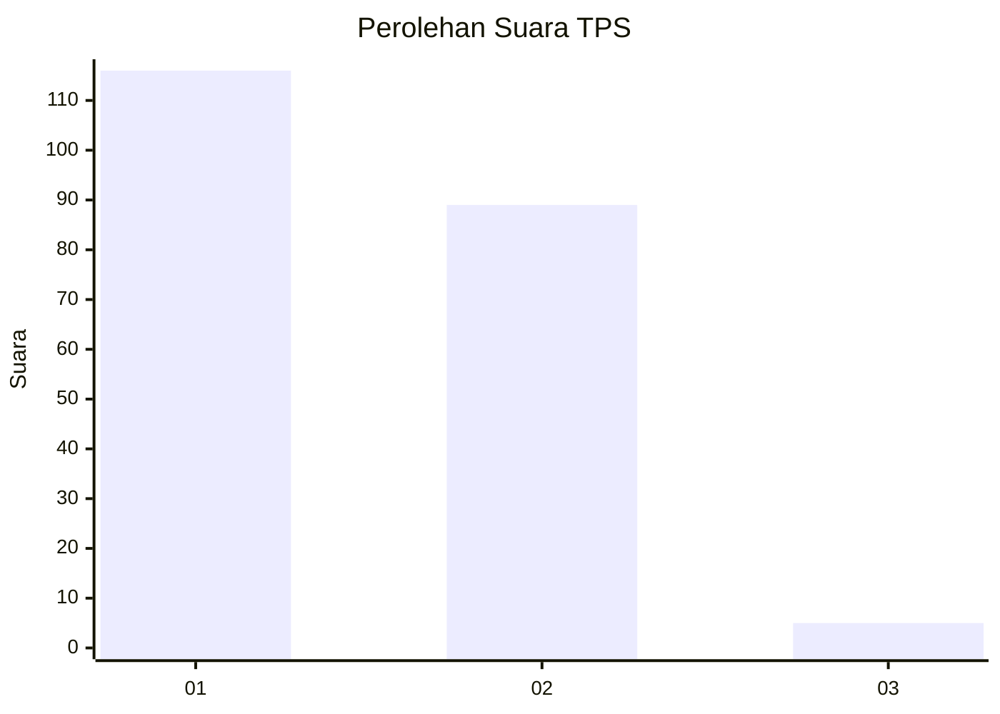
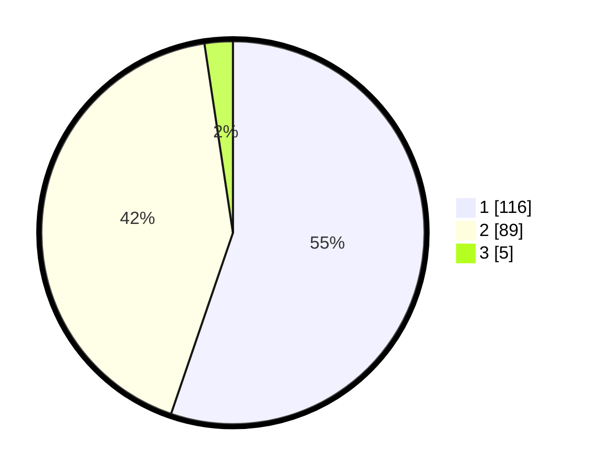

# Hasil

## Grafik

## Tabel

| No. | Nama Paslon    | Suara | Suara (raw) | Persentase |
|:--- |:-------------- | -----:| -----------:| ----------:|
| 1   | ANIES MUHAIMIN | 116   | [116][p-1]  | 55,24      |
| 2   | PRABOWO GIBRAN | 89    | [89][p-2]   | 42,38      |
| 3   | GANJAR MAHFUD  | 5     | [5][p-3]    | 2,38       |

[p-1]: https://github.com/gigit-pemilu/pemilu-2024-63-kalimantan-selatan/blob/main/pilpres/hitung-suara/sub/63-kalimantan-selatan/sub/04-barito-kuala/sub/07-rantau-badauh/sub/2001-sungai-pantai/sub/001-tps/sub/paslon-1.txt
[p-2]: https://github.com/gigit-pemilu/pemilu-2024-63-kalimantan-selatan/blob/main/pilpres/hitung-suara/sub/63-kalimantan-selatan/sub/04-barito-kuala/sub/07-rantau-badauh/sub/2001-sungai-pantai/sub/001-tps/sub/paslon-2.txt
[p-3]: https://github.com/gigit-pemilu/pemilu-2024-63-kalimantan-selatan/blob/main/pilpres/hitung-suara/sub/63-kalimantan-selatan/sub/04-barito-kuala/sub/07-rantau-badauh/sub/2001-sungai-pantai/sub/001-tps/sub/paslon-3.txt

## Foto C Plano

https://sirekap-obj-formc.kpu.go.id/acfa/pemilu/ppwp/63/04/07/20/01/6304072001001-20240215-014934--0b12515b-8ab6-477d-96f8-c36827ca782e.jpg

https://sirekap-obj-formc.kpu.go.id/acfa/pemilu/ppwp/63/04/07/20/01/6304072001001-20240215-012143--3f0525f8-96dd-42e6-8043-afd1f1111e3f.jpg

https://sirekap-obj-formc.kpu.go.id/acfa/pemilu/ppwp/63/04/07/20/01/6304072001001-20240215-012342--62691467-7f74-4d37-bc80-043f303910bb.jpg

## Metadata

| Key        | Value               |
| ---------- | ------------------- |
| Time Stamp | 2024-02-15 23:29:50 |

