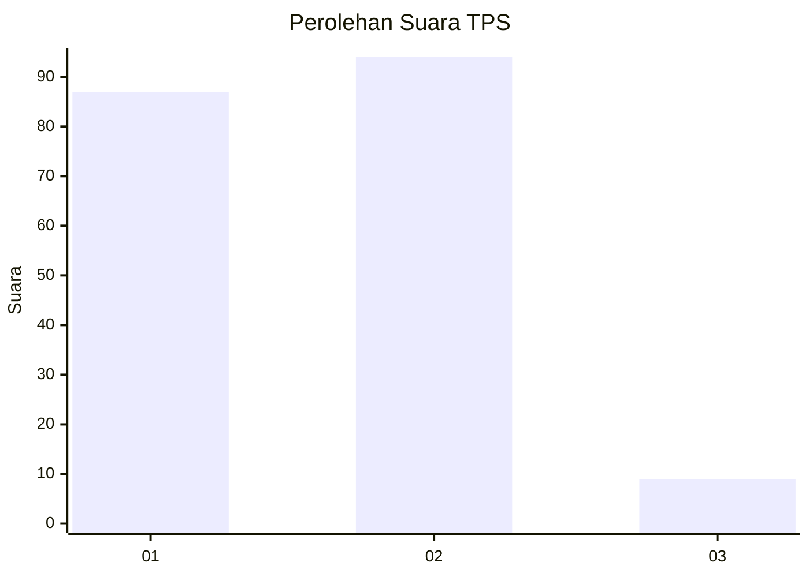
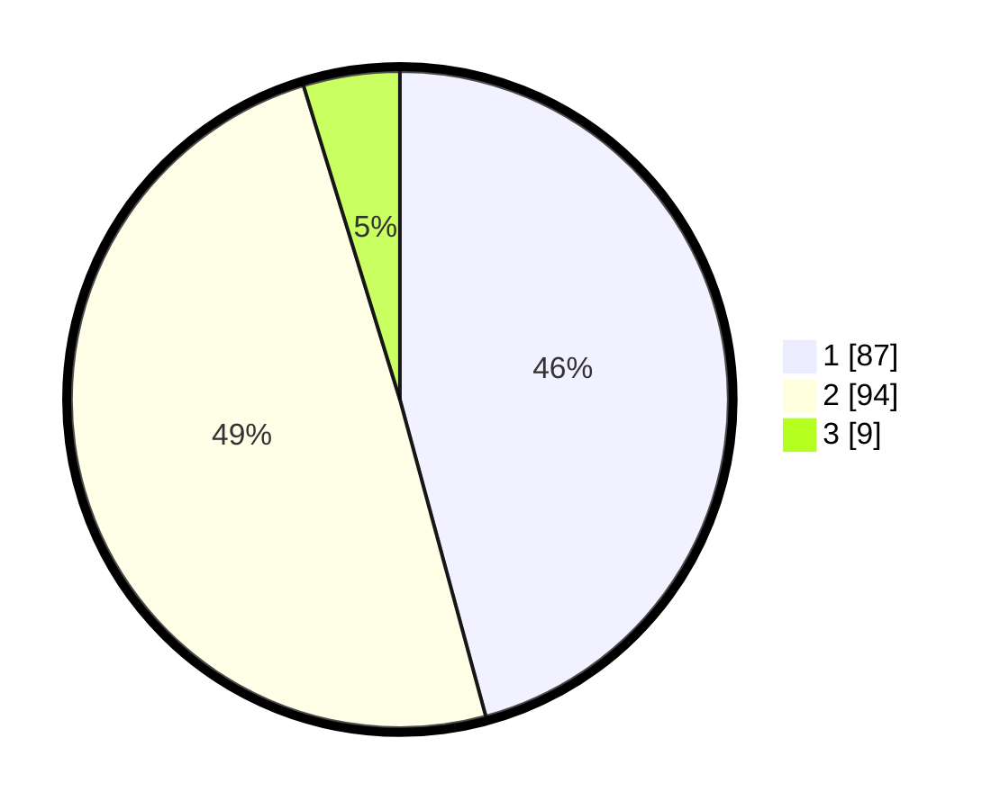

# Hasil

## Grafik

## Tabel

| No. | Nama Paslon    | Suara | Suara (raw) | Persentase |
|:--- |:-------------- | -----:| -----------:| ----------:|
| 1   | ANIES MUHAIMIN | 87    | [87][p-1]   | 45,79      |
| 2   | PRABOWO GIBRAN | 94    | [94][p-2]   | 49,47      |
| 3   | GANJAR MAHFUD  | 9     | [9][p-3]    | 4,74       |

[p-1]: https://github.com/gigit-pemilu/pemilu-2024-63-kalimantan-selatan/blob/main/pilpres/hitung-suara/sub/63-kalimantan-selatan/sub/04-barito-kuala/sub/07-rantau-badauh/sub/2001-sungai-pantai/sub/002-tps/sub/paslon-1.txt
[p-2]: https://github.com/gigit-pemilu/pemilu-2024-63-kalimantan-selatan/blob/main/pilpres/hitung-suara/sub/63-kalimantan-selatan/sub/04-barito-kuala/sub/07-rantau-badauh/sub/2001-sungai-pantai/sub/002-tps/sub/paslon-2.txt
[p-3]: https://github.com/gigit-pemilu/pemilu-2024-63-kalimantan-selatan/blob/main/pilpres/hitung-suara/sub/63-kalimantan-selatan/sub/04-barito-kuala/sub/07-rantau-badauh/sub/2001-sungai-pantai/sub/002-tps/sub/paslon-3.txt

## Foto C Plano

https://sirekap-obj-formc.kpu.go.id/c77c/pemilu/ppwp/63/04/07/20/01/6304072001002-20240214-230021--4d9ef262-f3aa-4e39-9dff-6134c296f53d.jpg

https://sirekap-obj-formc.kpu.go.id/c77c/pemilu/ppwp/63/04/07/20/01/6304072001002-20240214-230328--41a6184a-93d4-475b-b86f-3be7b9e24f61.jpg

https://sirekap-obj-formc.kpu.go.id/c77c/pemilu/ppwp/63/04/07/20/01/6304072001002-20240214-230549--e631dbe9-a9f4-4800-8864-abf6c4d1eaa7.jpg

## Metadata

| Key        | Value               |
| ---------- | ------------------- |
| Time Stamp | 2024-02-16 04:00:27 |

