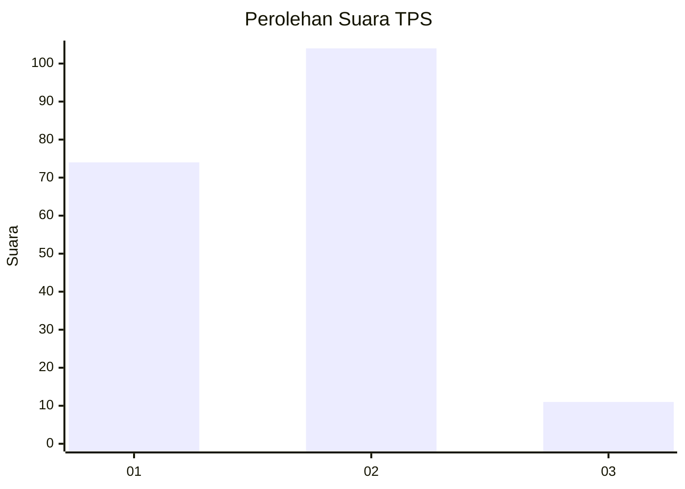
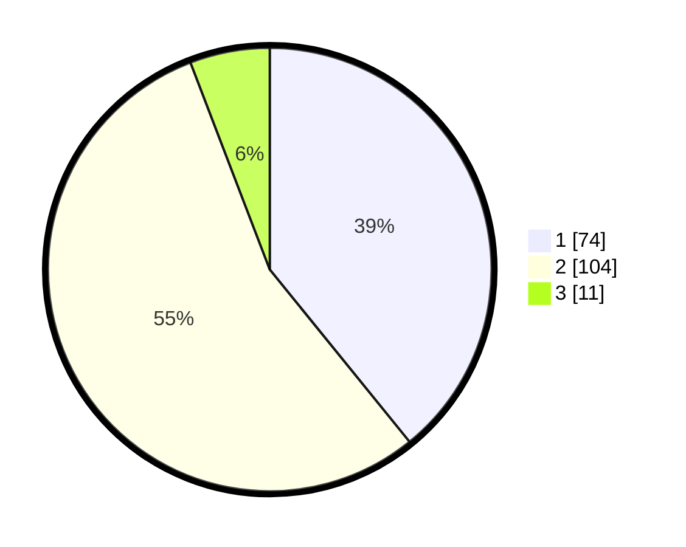

# Hasil

## Grafik

## Tabel

| No. | Nama Paslon    | Suara | Suara (raw) | Persentase |
|:--- |:-------------- | -----:| -----------:| ----------:|
| 1   | ANIES MUHAIMIN | 74    | [74][p-1]   | 39,15      |
| 2   | PRABOWO GIBRAN | 104   | [104][p-2]  | 55,03      |
| 3   | GANJAR MAHFUD  | 11    | [11][p-3]   | 5,82       |

[p-1]: https://github.com/gigit-pemilu/pemilu-2024/blob/main/pilpres/hitung-suara/sub/63-kalimantan-selatan/sub/04-barito-kuala/sub/08-belawang/sub/2002-sungai-seluang/sub/001-tps/sub/paslon-1.txt
[p-2]: https://github.com/gigit-pemilu/pemilu-2024/blob/main/pilpres/hitung-suara/sub/63-kalimantan-selatan/sub/04-barito-kuala/sub/08-belawang/sub/2002-sungai-seluang/sub/001-tps/sub/paslon-2.txt
[p-3]: https://github.com/gigit-pemilu/pemilu-2024/blob/main/pilpres/hitung-suara/sub/63-kalimantan-selatan/sub/04-barito-kuala/sub/08-belawang/sub/2002-sungai-seluang/sub/001-tps/sub/paslon-3.txt

## Foto C Plano

https://sirekap-obj-formc.kpu.go.id/6a50/pemilu/ppwp/63/04/08/20/02/6304082002001-20240218-145108--581d2eb7-ca2b-4994-b44e-745dc5f8ebb8.jpg

https://sirekap-obj-formc.kpu.go.id/6a50/pemilu/ppwp/63/04/08/20/02/6304082002001-20240218-145205--dcbeeb4e-7154-4fcc-ae8f-cc1aaf9beafa.jpg

https://sirekap-obj-formc.kpu.go.id/6a50/pemilu/ppwp/63/04/08/20/02/6304082002001-20240218-145308--e8bee5ce-c192-4abd-8a1b-5d5e43fb84cd.jpg

## Metadata

| Key        | Value               |
| ---------- | ------------------- |
| Time Stamp | 2024-02-19 09:00:00 |

