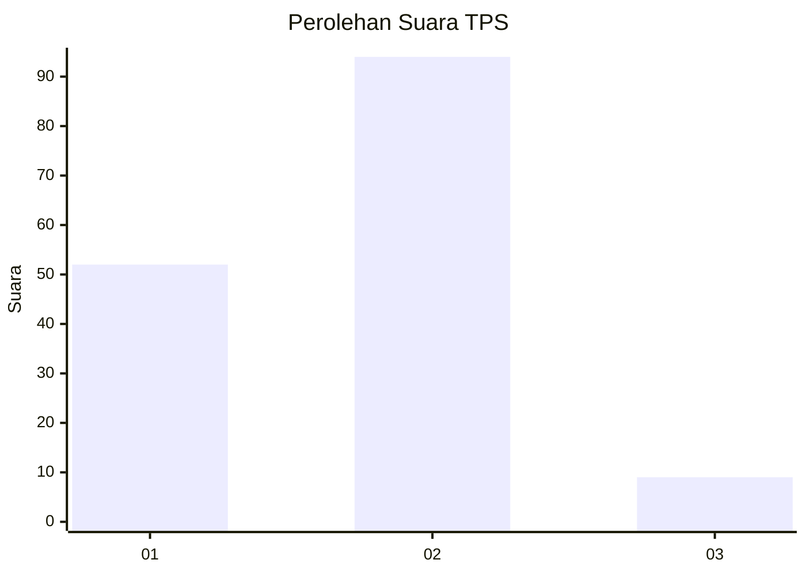
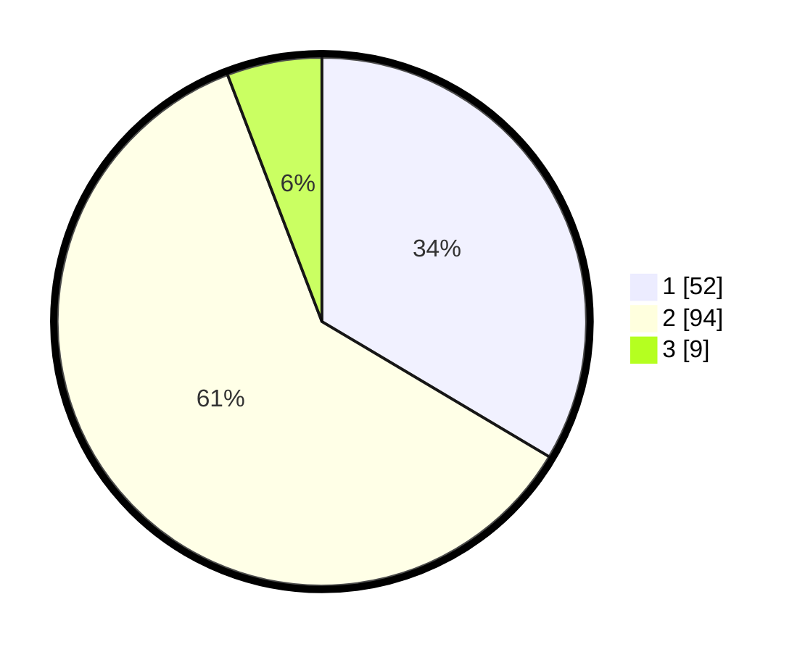

# Hasil

## Grafik

## Tabel

| No. | Nama Paslon    | Suara | Suara (raw) | Persentase |
|:--- |:-------------- | -----:| -----------:| ----------:|
| 1   | ANIES MUHAIMIN | 52    | [52][p-1]   | 33,55      |
| 2   | PRABOWO GIBRAN | 94    | [94][p-2]   | 60,65      |
| 3   | GANJAR MAHFUD  | 9     | [9][p-3]    | 5,81       |

[p-1]: https://github.com/gigit-pemilu/pemilu-2024/blob/main/pilpres/hitung-suara/sub/63-kalimantan-selatan/sub/04-barito-kuala/sub/08-belawang/sub/2003-belawang/sub/001-tps/sub/paslon-1.txt
[p-2]: https://github.com/gigit-pemilu/pemilu-2024/blob/main/pilpres/hitung-suara/sub/63-kalimantan-selatan/sub/04-barito-kuala/sub/08-belawang/sub/2003-belawang/sub/001-tps/sub/paslon-2.txt
[p-3]: https://github.com/gigit-pemilu/pemilu-2024/blob/main/pilpres/hitung-suara/sub/63-kalimantan-selatan/sub/04-barito-kuala/sub/08-belawang/sub/2003-belawang/sub/001-tps/sub/paslon-3.txt

## Foto C Plano

https://sirekap-obj-formc.kpu.go.id/2c42/pemilu/ppwp/63/04/08/20/03/6304082003001-20240218-193711--61c107b1-8e04-4276-a1ad-b105a474b7c3.jpg

https://sirekap-obj-formc.kpu.go.id/2c42/pemilu/ppwp/63/04/08/20/03/6304082003001-20240218-193823--55787cbe-4280-4183-afc0-a1d989ea4642.jpg

https://sirekap-obj-formc.kpu.go.id/2c42/pemilu/ppwp/63/04/08/20/03/6304082003001-20240218-193948--ab2f09c9-b169-4982-b03c-d112ec1d9fab.jpg

## Metadata

| Key        | Value               |
| ---------- | ------------------- |
| Time Stamp | 2024-02-19 06:16:00 |

