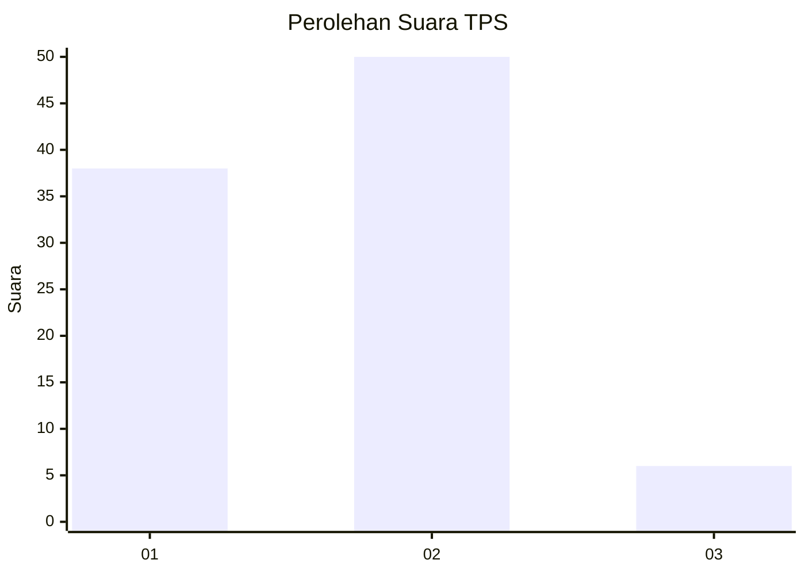
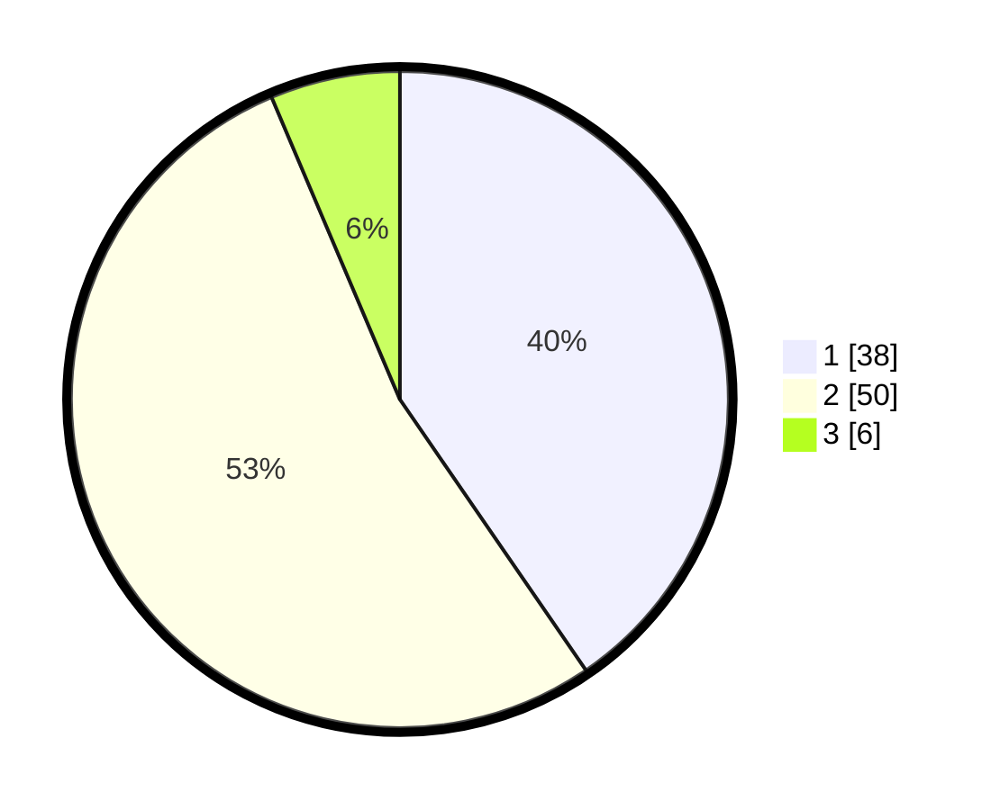

# Hasil

## Grafik

## Tabel

| No. | Nama Paslon    | Suara | Suara (raw) | Persentase |
|:--- |:-------------- | -----:| -----------:| ----------:|
| 1   | ANIES MUHAIMIN | 38    | [38][p-1]   | 40,43      |
| 2   | PRABOWO GIBRAN | 50    | [50][p-2]   | 53,19      |
| 3   | GANJAR MAHFUD  | 6     | [6][p-3]    | 6,38       |

[p-1]: https://github.com/gigit-pemilu/pemilu-2024/blob/main/pilpres/hitung-suara/sub/63-kalimantan-selatan/sub/04-barito-kuala/sub/08-belawang/sub/2003-belawang/sub/002-tps/sub/paslon-1.txt
[p-2]: https://github.com/gigit-pemilu/pemilu-2024/blob/main/pilpres/hitung-suara/sub/63-kalimantan-selatan/sub/04-barito-kuala/sub/08-belawang/sub/2003-belawang/sub/002-tps/sub/paslon-2.txt
[p-3]: https://github.com/gigit-pemilu/pemilu-2024/blob/main/pilpres/hitung-suara/sub/63-kalimantan-selatan/sub/04-barito-kuala/sub/08-belawang/sub/2003-belawang/sub/002-tps/sub/paslon-3.txt

## Foto C Plano

https://sirekap-obj-formc.kpu.go.id/a9c8/pemilu/ppwp/63/04/08/20/03/6304082003002-20240218-204102--4e6e4b25-1e1e-4766-9173-c94fe884faef.jpg

https://sirekap-obj-formc.kpu.go.id/a9c8/pemilu/ppwp/63/04/08/20/03/6304082003002-20240218-204212--88f49218-762a-44f1-9883-3e779080fa89.jpg

https://sirekap-obj-formc.kpu.go.id/a9c8/pemilu/ppwp/63/04/08/20/03/6304082003002-20240218-204306--063105e3-fec8-454e-928d-8087f8c3ab16.jpg

## Metadata

| Key        | Value               |
| ---------- | ------------------- |
| Time Stamp | 2024-02-19 06:16:00 |

