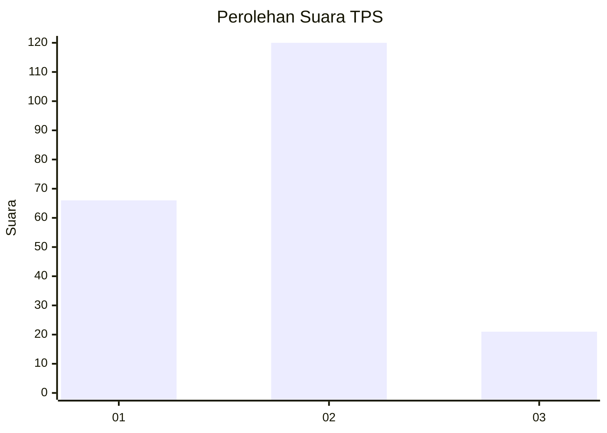
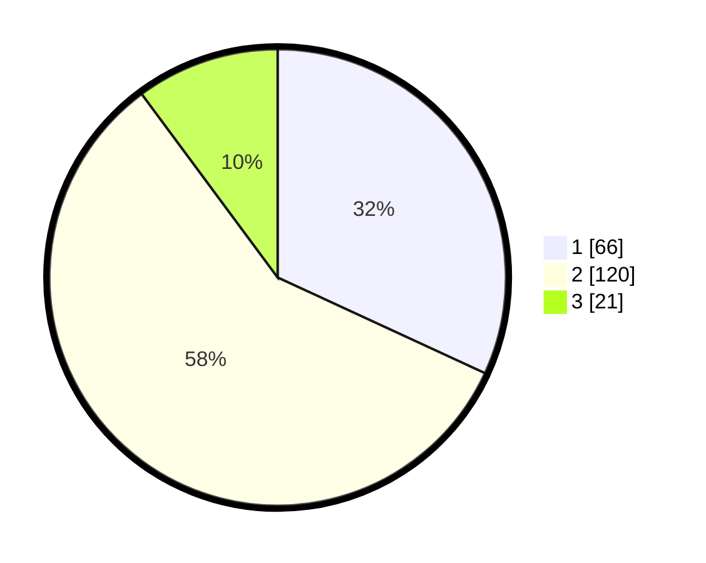

# Hasil

## Grafik

## Tabel

| No. | Nama Paslon    | Suara | Suara (raw) | Persentase |
|:--- |:-------------- | -----:| -----------:| ----------:|
| 1   | ANIES MUHAIMIN | 66    | [66][p-1]   | 31,88      |
| 2   | PRABOWO GIBRAN | 120   | [120][p-2]  | 57,97      |
| 3   | GANJAR MAHFUD  | 21    | [21][p-3]   | 10,14      |

[p-1]: https://github.com/gigit-pemilu/pemilu-2024-63-kalimantan-selatan/blob/main/pilpres/hitung-suara/sub/63-kalimantan-selatan/sub/04-barito-kuala/sub/09-cerbon/sub/2001-sungai-kambat/sub/001-tps/sub/paslon-1.txt
[p-2]: https://github.com/gigit-pemilu/pemilu-2024-63-kalimantan-selatan/blob/main/pilpres/hitung-suara/sub/63-kalimantan-selatan/sub/04-barito-kuala/sub/09-cerbon/sub/2001-sungai-kambat/sub/001-tps/sub/paslon-2.txt
[p-3]: https://github.com/gigit-pemilu/pemilu-2024-63-kalimantan-selatan/blob/main/pilpres/hitung-suara/sub/63-kalimantan-selatan/sub/04-barito-kuala/sub/09-cerbon/sub/2001-sungai-kambat/sub/001-tps/sub/paslon-3.txt

## Foto C Plano

https://sirekap-obj-formc.kpu.go.id/5d2a/pemilu/ppwp/63/04/09/20/01/6304092001001-20240219-223553--15e7e686-28c7-4abb-a075-50e578d978ce.jpg

https://sirekap-obj-formc.kpu.go.id/5d2a/pemilu/ppwp/63/04/09/20/01/6304092001001-20240219-223703--2799fbe7-1511-4e15-82b5-4a1a07125d3f.jpg

https://sirekap-obj-formc.kpu.go.id/5d2a/pemilu/ppwp/63/04/09/20/01/6304092001001-20240219-223821--6b718eec-1c50-4bd4-bd25-81e086dc5c28.jpg

## Metadata

| Key        | Value               |
| ---------- | ------------------- |
| Time Stamp | 2024-02-25 12:00:00 |

