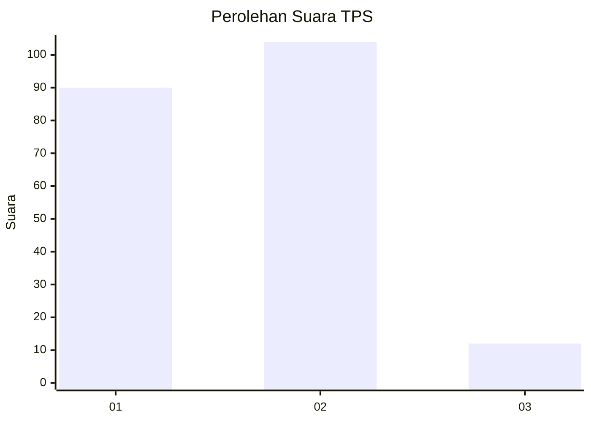
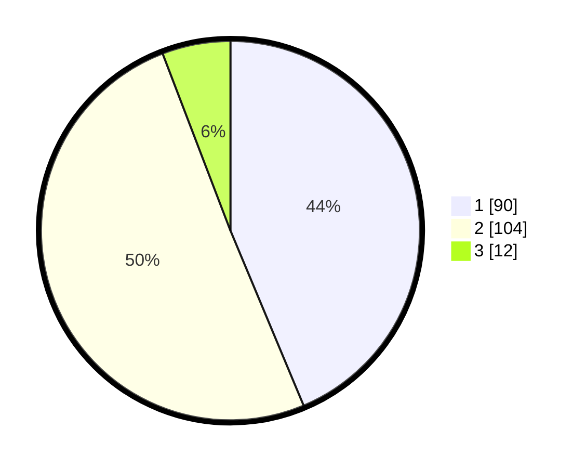

# Hasil

## Grafik

## Tabel

| No. | Nama Paslon    | Suara | Suara (raw) | Persentase |
|:--- |:-------------- | -----:| -----------:| ----------:|
| 1   | ANIES MUHAIMIN | 90    | [90][p-1]   | 43,69      |
| 2   | PRABOWO GIBRAN | 104   | [104][p-2]  | 50,49      |
| 3   | GANJAR MAHFUD  | 12    | [12][p-3]   | 5,83       |

[p-1]: https://github.com/gigit-pemilu/pemilu-2024/blob/main/pilpres/hitung-suara/sub/63-kalimantan-selatan/sub/04-barito-kuala/sub/09-cerbon/sub/2001-sungai-kambat/sub/002-tps/sub/paslon-1.txt
[p-2]: https://github.com/gigit-pemilu/pemilu-2024/blob/main/pilpres/hitung-suara/sub/63-kalimantan-selatan/sub/04-barito-kuala/sub/09-cerbon/sub/2001-sungai-kambat/sub/002-tps/sub/paslon-2.txt
[p-3]: https://github.com/gigit-pemilu/pemilu-2024/blob/main/pilpres/hitung-suara/sub/63-kalimantan-selatan/sub/04-barito-kuala/sub/09-cerbon/sub/2001-sungai-kambat/sub/002-tps/sub/paslon-3.txt

## Foto C Plano

https://sirekap-obj-formc.kpu.go.id/e303/pemilu/ppwp/63/04/09/20/01/6304092001002-20240220-085112--24494b49-29c7-41b5-a388-30f708e36d4d.jpg

https://sirekap-obj-formc.kpu.go.id/e303/pemilu/ppwp/63/04/09/20/01/6304092001002-20240220-084803--aa3841cb-56b0-470f-a0c1-73ce054a5972.jpg

https://sirekap-obj-formc.kpu.go.id/e303/pemilu/ppwp/63/04/09/20/01/6304092001002-20240220-083302--4f128418-5555-4cef-9f43-c6d55e7b11bf.jpg

## Metadata

| Key        | Value               |
| ---------- | ------------------- |
| Time Stamp | 2024-02-24 22:31:28 |

