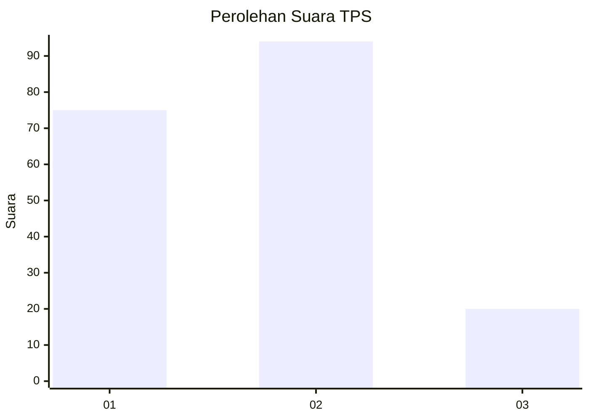
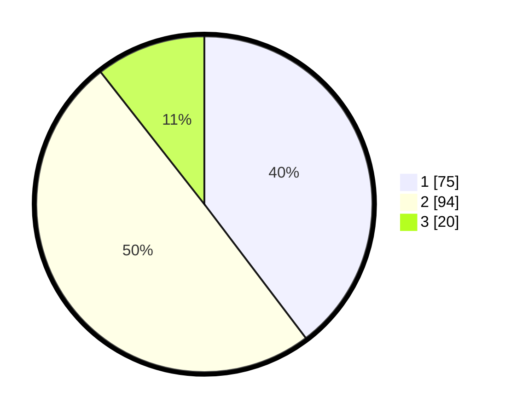

# Hasil

## Grafik

## Tabel

| No. | Nama Paslon    | Suara | Suara (raw) | Persentase |
|:--- |:-------------- | -----:| -----------:| ----------:|
| 1   | ANIES MUHAIMIN | 75    | [75][p-1]   | 39,68      |
| 2   | PRABOWO GIBRAN | 94    | [94][p-2]   | 49,74      |
| 3   | GANJAR MAHFUD  | 20    | [20][p-3]   | 10,58      |

[p-1]: https://github.com/gigit-pemilu/pemilu-2024-63-kalimantan-selatan/blob/main/pilpres/hitung-suara/sub/63-kalimantan-selatan/sub/04-barito-kuala/sub/09-cerbon/sub/2001-sungai-kambat/sub/004-tps/sub/paslon-1.txt
[p-2]: https://github.com/gigit-pemilu/pemilu-2024-63-kalimantan-selatan/blob/main/pilpres/hitung-suara/sub/63-kalimantan-selatan/sub/04-barito-kuala/sub/09-cerbon/sub/2001-sungai-kambat/sub/004-tps/sub/paslon-2.txt
[p-3]: https://github.com/gigit-pemilu/pemilu-2024-63-kalimantan-selatan/blob/main/pilpres/hitung-suara/sub/63-kalimantan-selatan/sub/04-barito-kuala/sub/09-cerbon/sub/2001-sungai-kambat/sub/004-tps/sub/paslon-3.txt

## Foto C Plano

https://sirekap-obj-formc.kpu.go.id/7d86/pemilu/ppwp/63/04/09/20/01/6304092001004-20240220-100912--d909e7f7-7296-4fa5-a876-5c84ee75fd74.jpg

https://sirekap-obj-formc.kpu.go.id/7d86/pemilu/ppwp/63/04/09/20/01/6304092001004-20240220-100937--61f0fd03-fcbe-41b2-ae06-4c461509836e.jpg

https://sirekap-obj-formc.kpu.go.id/7d86/pemilu/ppwp/63/04/09/20/01/6304092001004-20240220-101000--25a24472-d258-40c5-a581-923fed7f52ab.jpg

## Metadata

| Key        | Value               |
| ---------- | ------------------- |
| Time Stamp | 2024-02-25 15:00:00 |

