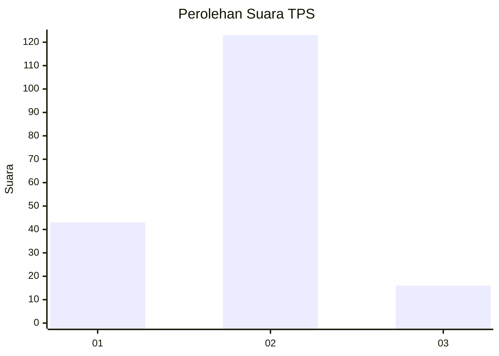

# Hasil

## Grafik

## Tabel

| No. | Nama Paslon    | Suara | Suara (raw) | Persentase |
|:--- |:-------------- | -----:| -----------:| ----------:|
| 1   | ANIES MUHAIMIN | 43    | [43][p-1]   | 23,63      |
| 2   | PRABOWO GIBRAN | 123   | [123][p-2]  | 67,58      |
| 3   | GANJAR MAHFUD  | 16    | [16][p-3]   | 8,79       |

[p-1]: https://github.com/gigit-pemilu/pemilu-2024/blob/main/pilpres/hitung-suara/sub/63-kalimantan-selatan/sub/04-barito-kuala/sub/10-bakumpai/sub/1001-lepasan/sub/002-tps/sub/paslon-1.txt
[p-2]: https://github.com/gigit-pemilu/pemilu-2024/blob/main/pilpres/hitung-suara/sub/63-kalimantan-selatan/sub/04-barito-kuala/sub/10-bakumpai/sub/1001-lepasan/sub/002-tps/sub/paslon-2.txt
[p-3]: https://github.com/gigit-pemilu/pemilu-2024/blob/main/pilpres/hitung-suara/sub/63-kalimantan-selatan/sub/04-barito-kuala/sub/10-bakumpai/sub/1001-lepasan/sub/002-tps/sub/paslon-3.txt

## Foto C Plano

https://sirekap-obj-formc.kpu.go.id/246b/pemilu/ppwp/63/04/10/10/01/6304101001002-20240214-141249--96f079d6-0575-4437-98b0-46e59b8f7f6b.jpg

https://sirekap-obj-formc.kpu.go.id/246b/pemilu/ppwp/63/04/10/10/01/6304101001002-20240214-141235--981316df-30b1-4010-8ac5-b64b5de90fa1.jpg

https://sirekap-obj-formc.kpu.go.id/246b/pemilu/ppwp/63/04/10/10/01/6304101001002-20240214-141647--77b3c8d7-cf29-44aa-9e05-69e8915d3789.jpg

## Metadata

| Key        | Value               |
| ---------- | ------------------- |
| Time Stamp | 2024-02-15 15:00:29 |

