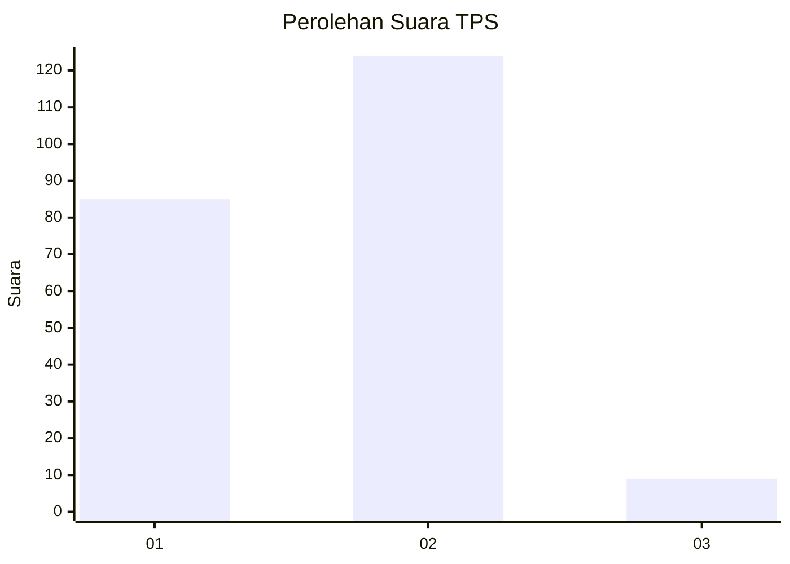
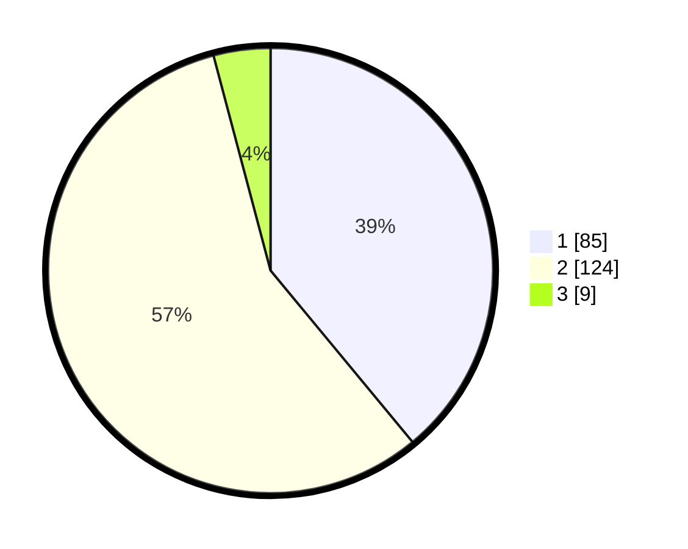

# Hasil

## Grafik

## Tabel

| No. | Nama Paslon    | Suara | Suara (raw) | Persentase |
|:--- |:-------------- | -----:| -----------:| ----------:|
| 1   | ANIES MUHAIMIN | 85    | [85][p-1]   | 38,99      |
| 2   | PRABOWO GIBRAN | 124   | [124][p-2]  | 56,88      |
| 3   | GANJAR MAHFUD  | 9     | [9][p-3]    | 4,13       |

[p-1]: https://github.com/gigit-pemilu/pemilu-2024/blob/main/pilpres/hitung-suara/sub/63-kalimantan-selatan/sub/04-barito-kuala/sub/10-bakumpai/sub/1001-lepasan/sub/009-tps/sub/paslon-1.txt
[p-2]: https://github.com/gigit-pemilu/pemilu-2024/blob/main/pilpres/hitung-suara/sub/63-kalimantan-selatan/sub/04-barito-kuala/sub/10-bakumpai/sub/1001-lepasan/sub/009-tps/sub/paslon-2.txt
[p-3]: https://github.com/gigit-pemilu/pemilu-2024/blob/main/pilpres/hitung-suara/sub/63-kalimantan-selatan/sub/04-barito-kuala/sub/10-bakumpai/sub/1001-lepasan/sub/009-tps/sub/paslon-3.txt

## Foto C Plano

https://sirekap-obj-formc.kpu.go.id/ba69/pemilu/ppwp/63/04/10/10/01/6304101001009-20240214-214205--c92866e4-91d9-4c8c-871c-3b463df8fa53.jpg

https://sirekap-obj-formc.kpu.go.id/ba69/pemilu/ppwp/63/04/10/10/01/6304101001009-20240214-214322--4de92b95-35d1-4ec9-8c14-e9655cbcace4.jpg

https://sirekap-obj-formc.kpu.go.id/ba69/pemilu/ppwp/63/04/10/10/01/6304101001009-20240214-214444--9961b838-59ed-46c9-bb19-9584f9d7c758.jpg

## Metadata

| Key        | Value               |
| ---------- | ------------------- |
| Time Stamp | 2024-02-15 16:30:25 |

