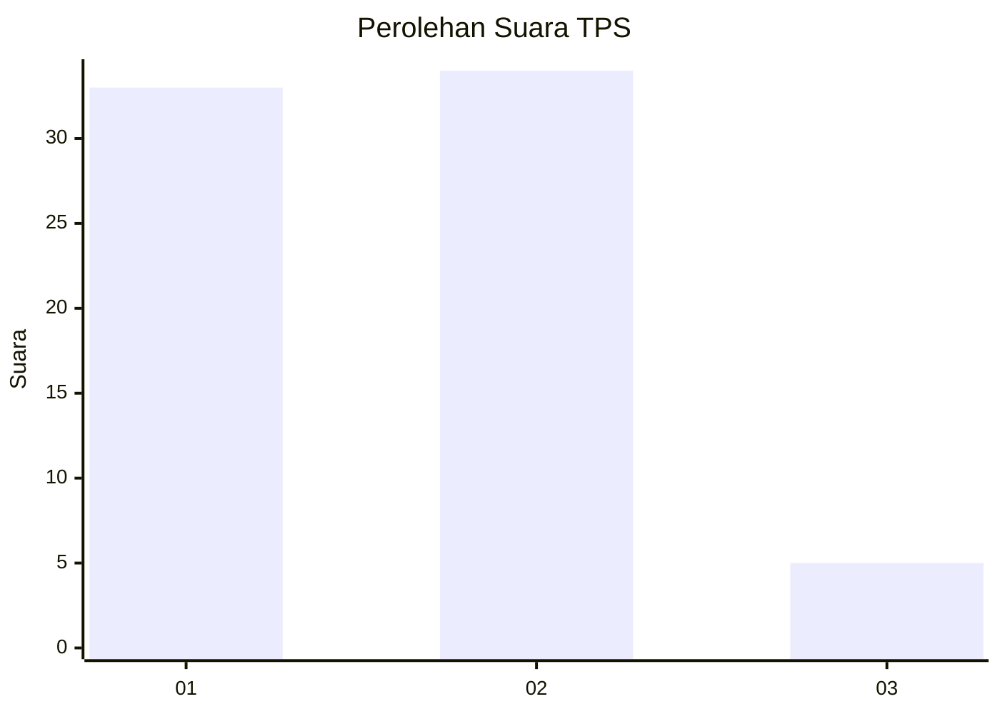
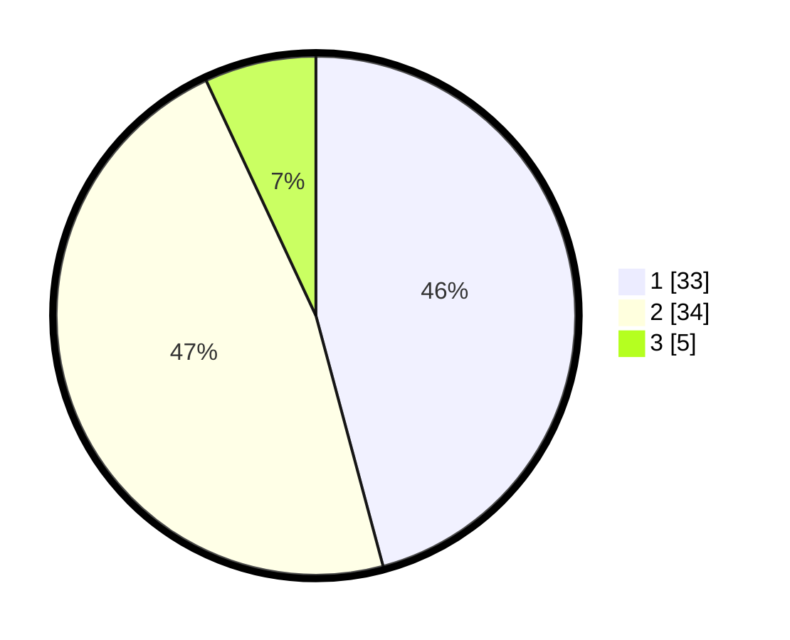

# Hasil

## Grafik

## Tabel

| No. | Nama Paslon    | Suara | Suara (raw) | Persentase |
|:--- |:-------------- | -----:| -----------:| ----------:|
| 1   | ANIES MUHAIMIN | 33    | [33][p-1]   | 45,83      |
| 2   | PRABOWO GIBRAN | 34    | [34][p-2]   | 47,22      |
| 3   | GANJAR MAHFUD  | 5     | [5][p-3]    | 6,94       |

[p-1]: https://github.com/gigit-pemilu/pemilu-2024-63-kalimantan-selatan/blob/main/pilpres/hitung-suara/sub/63-kalimantan-selatan/sub/04-barito-kuala/sub/10-bakumpai/sub/2003-murung-raya/sub/004-tps/sub/paslon-1.txt
[p-2]: https://github.com/gigit-pemilu/pemilu-2024-63-kalimantan-selatan/blob/main/pilpres/hitung-suara/sub/63-kalimantan-selatan/sub/04-barito-kuala/sub/10-bakumpai/sub/2003-murung-raya/sub/004-tps/sub/paslon-2.txt
[p-3]: https://github.com/gigit-pemilu/pemilu-2024-63-kalimantan-selatan/blob/main/pilpres/hitung-suara/sub/63-kalimantan-selatan/sub/04-barito-kuala/sub/10-bakumpai/sub/2003-murung-raya/sub/004-tps/sub/paslon-3.txt

## Foto C Plano

https://sirekap-obj-formc.kpu.go.id/7008/pemilu/ppwp/63/04/10/20/03/6304102003004-20240218-152816--92085beb-b0fd-4c7d-ab7c-b82cd292493d.jpg

https://sirekap-obj-formc.kpu.go.id/7008/pemilu/ppwp/63/04/10/20/03/6304102003004-20240218-152925--9c1597a7-a004-4c95-bd6d-01051cc3dff6.jpg

https://sirekap-obj-formc.kpu.go.id/7008/pemilu/ppwp/63/04/10/20/03/6304102003004-20240218-153000--f3aa3a48-9c6b-47b4-b4ab-513bbe39e7cd.jpg

## Metadata

| Key        | Value               |
| ---------- | ------------------- |
| Time Stamp | 2024-02-19 06:16:00 |

