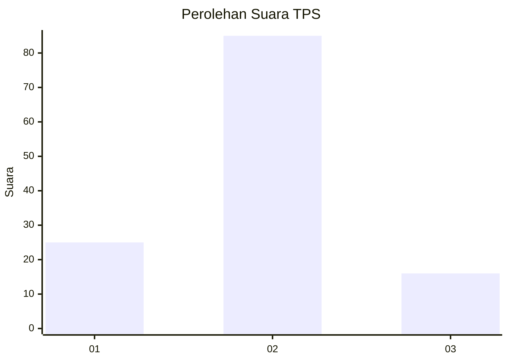
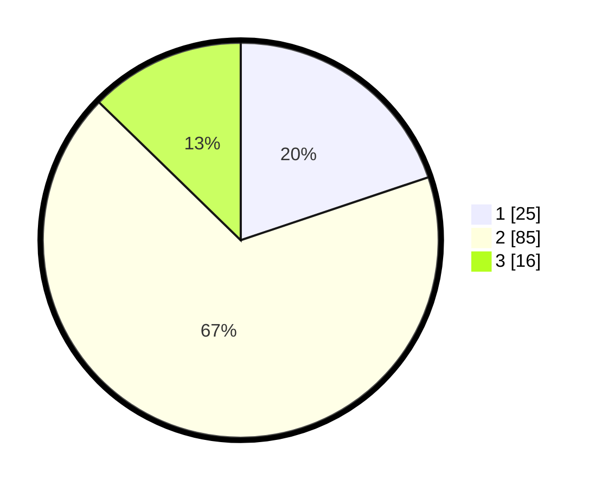

# Hasil

## Grafik

## Tabel

| No. | Nama Paslon    | Suara | Suara (raw) | Persentase |
|:--- |:-------------- | -----:| -----------:| ----------:|
| 1   | ANIES MUHAIMIN | 25    | [25][p-1]   | 19,84      |
| 2   | PRABOWO GIBRAN | 85    | [85][p-2]   | 67,46      |
| 3   | GANJAR MAHFUD  | 16    | [16][p-3]   | 12,70      |

[p-1]: https://github.com/gigit-pemilu/pemilu-2024/blob/main/pilpres/hitung-suara/sub/63-kalimantan-selatan/sub/04-barito-kuala/sub/11-kuripan/sub/2001-jambu-baru/sub/002-tps/sub/paslon-1.txt
[p-2]: https://github.com/gigit-pemilu/pemilu-2024/blob/main/pilpres/hitung-suara/sub/63-kalimantan-selatan/sub/04-barito-kuala/sub/11-kuripan/sub/2001-jambu-baru/sub/002-tps/sub/paslon-2.txt
[p-3]: https://github.com/gigit-pemilu/pemilu-2024/blob/main/pilpres/hitung-suara/sub/63-kalimantan-selatan/sub/04-barito-kuala/sub/11-kuripan/sub/2001-jambu-baru/sub/002-tps/sub/paslon-3.txt

## Foto C Plano

https://sirekap-obj-formc.kpu.go.id/4dcc/pemilu/ppwp/63/04/11/20/01/6304112001002-20240218-131839--5b374e7b-b734-464f-b21d-26370b3a21c6.jpg

https://sirekap-obj-formc.kpu.go.id/4dcc/pemilu/ppwp/63/04/11/20/01/6304112001002-20240218-131957--67e94e99-c156-4404-99a5-b5e752440a66.jpg

https://sirekap-obj-formc.kpu.go.id/4dcc/pemilu/ppwp/63/04/11/20/01/6304112001002-20240218-132049--244248a5-ba18-41d7-925b-341495dcc480.jpg

## Metadata

| Key        | Value               |
| ---------- | ------------------- |
| Time Stamp | 2024-02-19 06:16:00 |

