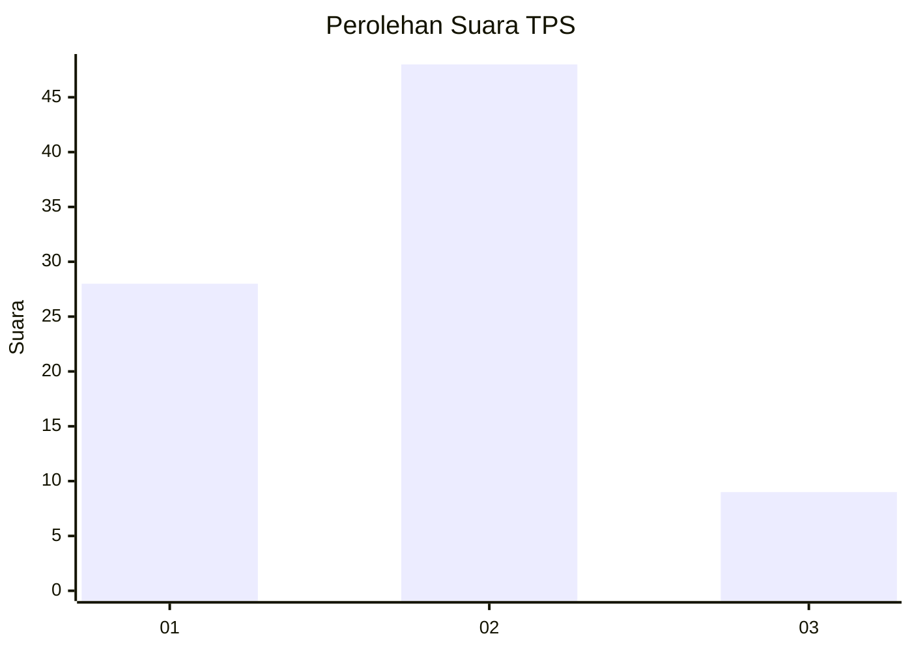
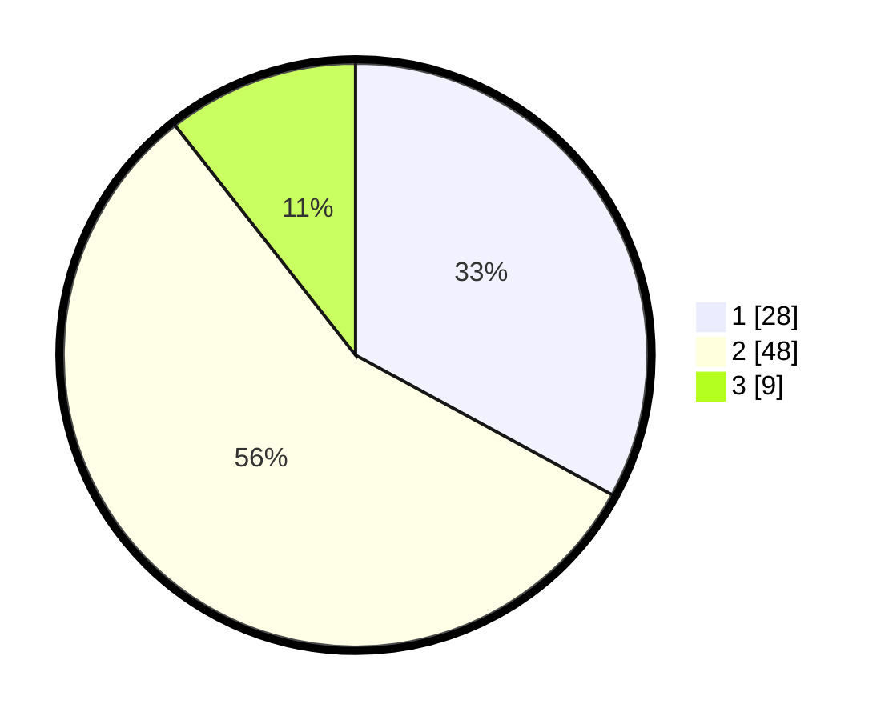

# Hasil

## Grafik

## Tabel

| No. | Nama Paslon    | Suara | Suara (raw) | Persentase |
|:--- |:-------------- | -----:| -----------:| ----------:|
| 1   | ANIES MUHAIMIN | 28    | [28][p-1]   | 32,94      |
| 2   | PRABOWO GIBRAN | 48    | [48][p-2]   | 56,47      |
| 3   | GANJAR MAHFUD  | 9     | [9][p-3]    | 10,59      |

[p-1]: https://github.com/gigit-pemilu/pemilu-2024-63-kalimantan-selatan/blob/main/pilpres/hitung-suara/sub/63-kalimantan-selatan/sub/04-barito-kuala/sub/11-kuripan/sub/2001-jambu-baru/sub/003-tps/sub/paslon-1.txt
[p-2]: https://github.com/gigit-pemilu/pemilu-2024-63-kalimantan-selatan/blob/main/pilpres/hitung-suara/sub/63-kalimantan-selatan/sub/04-barito-kuala/sub/11-kuripan/sub/2001-jambu-baru/sub/003-tps/sub/paslon-2.txt
[p-3]: https://github.com/gigit-pemilu/pemilu-2024-63-kalimantan-selatan/blob/main/pilpres/hitung-suara/sub/63-kalimantan-selatan/sub/04-barito-kuala/sub/11-kuripan/sub/2001-jambu-baru/sub/003-tps/sub/paslon-3.txt

## Foto C Plano

https://sirekap-obj-formc.kpu.go.id/9c7e/pemilu/ppwp/63/04/11/20/01/6304112001003-20240218-145249--c48cfcb0-4f84-4195-a5cf-c19a3e5d17a2.jpg

https://sirekap-obj-formc.kpu.go.id/9c7e/pemilu/ppwp/63/04/11/20/01/6304112001003-20240218-145344--f4ca3279-6835-4545-8d5e-d743cc3bf785.jpg

https://sirekap-obj-formc.kpu.go.id/9c7e/pemilu/ppwp/63/04/11/20/01/6304112001003-20240218-145433--1314e38a-7f58-44d3-b88e-0d998431f379.jpg

## Metadata

| Key        | Value               |
| ---------- | ------------------- |
| Time Stamp | 2024-02-19 06:16:00 |

