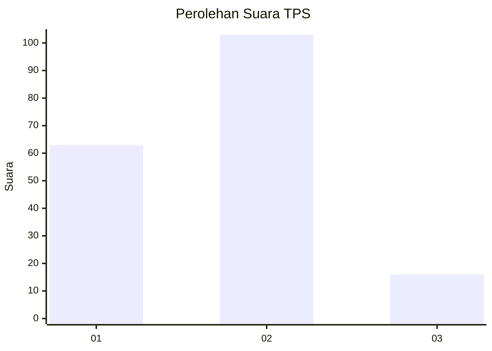
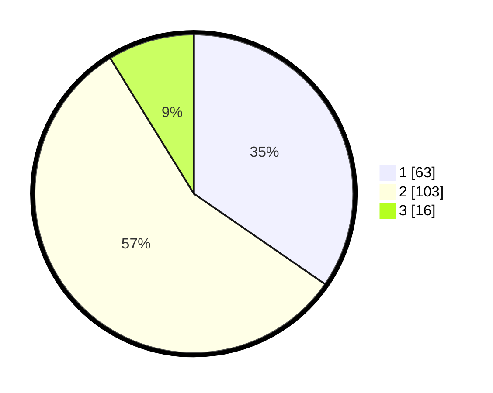

# Hasil

## Grafik

## Tabel

| No. | Nama Paslon    | Suara | Suara (raw) | Persentase |
|:--- |:-------------- | -----:| -----------:| ----------:|
| 1   | ANIES MUHAIMIN | 63    | [63][p-1]   | 34,62      |
| 2   | PRABOWO GIBRAN | 103   | [103][p-2]  | 56,59      |
| 3   | GANJAR MAHFUD  | 16    | [16][p-3]   | 8,79       |

[p-1]: https://github.com/gigit-pemilu/pemilu-2024/blob/main/pilpres/hitung-suara/sub/63-kalimantan-selatan/sub/04-barito-kuala/sub/11-kuripan/sub/2002-jambu/sub/002-tps/sub/paslon-1.txt
[p-2]: https://github.com/gigit-pemilu/pemilu-2024/blob/main/pilpres/hitung-suara/sub/63-kalimantan-selatan/sub/04-barito-kuala/sub/11-kuripan/sub/2002-jambu/sub/002-tps/sub/paslon-2.txt
[p-3]: https://github.com/gigit-pemilu/pemilu-2024/blob/main/pilpres/hitung-suara/sub/63-kalimantan-selatan/sub/04-barito-kuala/sub/11-kuripan/sub/2002-jambu/sub/002-tps/sub/paslon-3.txt

## Foto C Plano

https://sirekap-obj-formc.kpu.go.id/e3f4/pemilu/ppwp/63/04/11/20/02/6304112002002-20240218-190553--c2e1dbfa-7921-4502-8bac-1888e7452704.jpg

https://sirekap-obj-formc.kpu.go.id/e3f4/pemilu/ppwp/63/04/11/20/02/6304112002002-20240218-190652--e96ff23a-e5df-495e-bfc9-579794d705a6.jpg

https://sirekap-obj-formc.kpu.go.id/e3f4/pemilu/ppwp/63/04/11/20/02/6304112002002-20240218-190739--2d2c660f-dd83-42f7-8b70-411955877afd.jpg

## Metadata

| Key        | Value               |
| ---------- | ------------------- |
| Time Stamp | 2024-02-19 06:16:00 |

