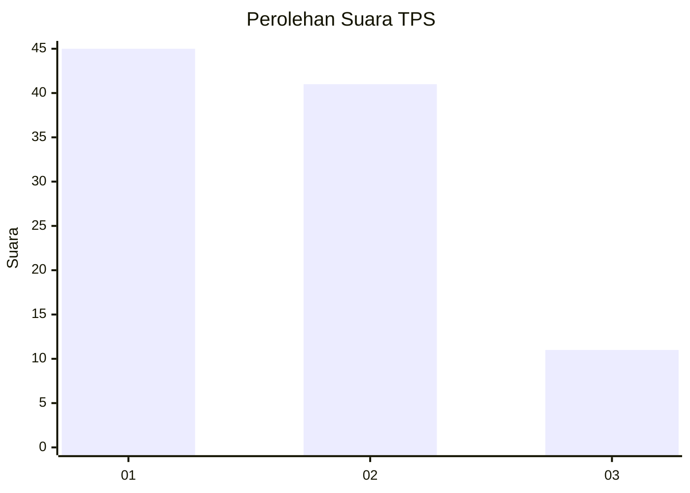
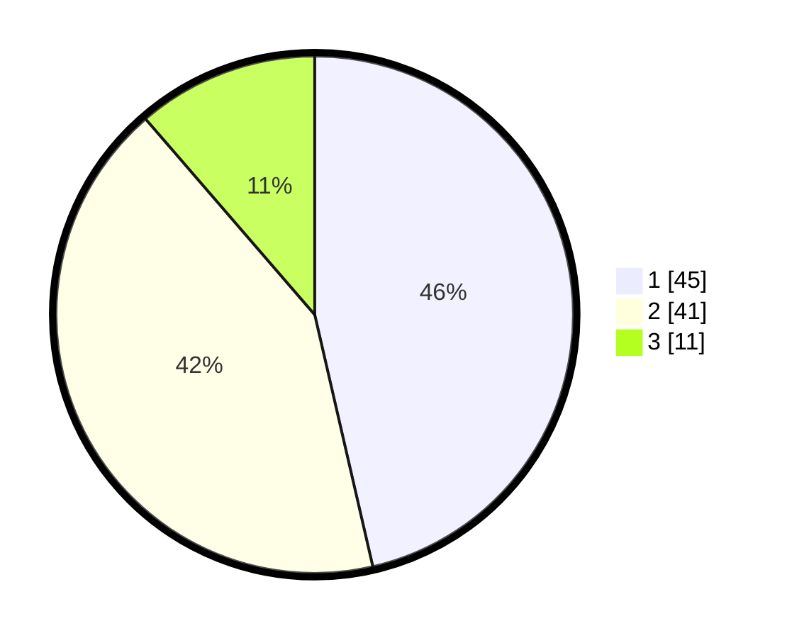

# Hasil

## Grafik

## Tabel

| No. | Nama Paslon    | Suara | Suara (raw) | Persentase |
|:--- |:-------------- | -----:| -----------:| ----------:|
| 1   | ANIES MUHAIMIN | 45    | [45][p-1]   | 46,39      |
| 2   | PRABOWO GIBRAN | 41    | [41][p-2]   | 42,27      |
| 3   | GANJAR MAHFUD  | 11    | [11][p-3]   | 11,34      |

[p-1]: https://github.com/gigit-pemilu/pemilu-2024-63-kalimantan-selatan/blob/main/pilpres/hitung-suara/sub/63-kalimantan-selatan/sub/04-barito-kuala/sub/12-tabukan/sub/2002-tabukan-raya/sub/001-tps/sub/paslon-1.txt
[p-2]: https://github.com/gigit-pemilu/pemilu-2024-63-kalimantan-selatan/blob/main/pilpres/hitung-suara/sub/63-kalimantan-selatan/sub/04-barito-kuala/sub/12-tabukan/sub/2002-tabukan-raya/sub/001-tps/sub/paslon-2.txt
[p-3]: https://github.com/gigit-pemilu/pemilu-2024-63-kalimantan-selatan/blob/main/pilpres/hitung-suara/sub/63-kalimantan-selatan/sub/04-barito-kuala/sub/12-tabukan/sub/2002-tabukan-raya/sub/001-tps/sub/paslon-3.txt

## Foto C Plano

https://sirekap-obj-formc.kpu.go.id/d33a/pemilu/ppwp/63/04/12/20/02/6304122002001-20240217-144524--4ca23e55-4670-466d-8985-87bbf58ad8a7.jpg

https://sirekap-obj-formc.kpu.go.id/d33a/pemilu/ppwp/63/04/12/20/02/6304122002001-20240217-144527--f2d0825b-322e-44e0-b786-e1cbb3f1ea92.jpg

https://sirekap-obj-formc.kpu.go.id/d33a/pemilu/ppwp/63/04/12/20/02/6304122002001-20240217-144713--17ac9d9a-f17c-4086-9f34-c0b53aceb04d.jpg

## Metadata

| Key        | Value               |
| ---------- | ------------------- |
| Time Stamp | 2024-02-19 06:16:00 |

