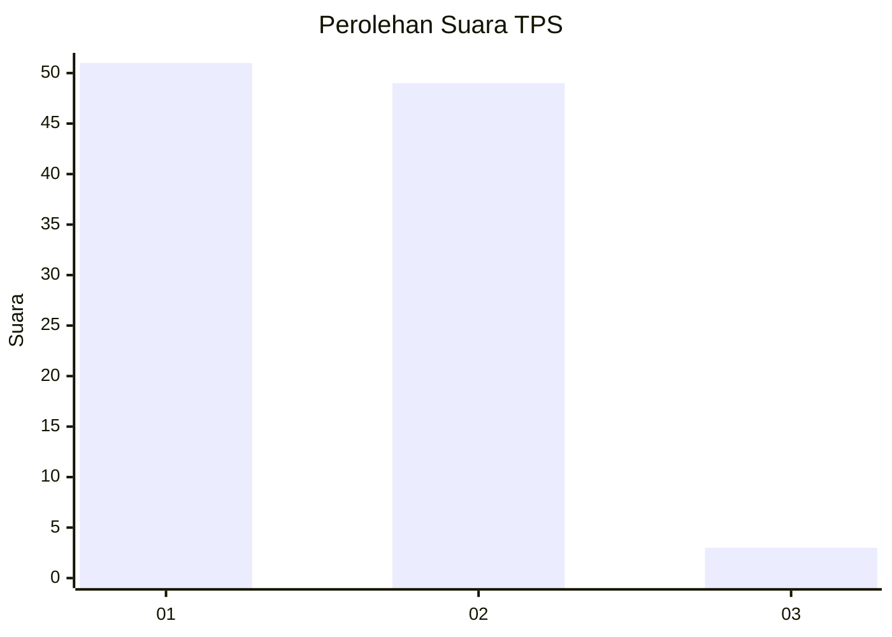
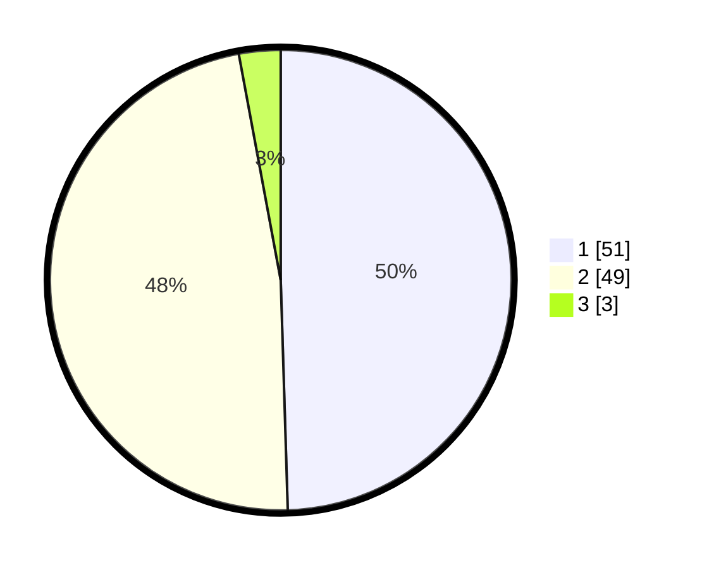

# Hasil

## Grafik

## Tabel

| No. | Nama Paslon    | Suara | Suara (raw) | Persentase |
|:--- |:-------------- | -----:| -----------:| ----------:|
| 1   | ANIES MUHAIMIN | 51    | [51][p-1]   | 49,51      |
| 2   | PRABOWO GIBRAN | 49    | [49][p-2]   | 47,57      |
| 3   | GANJAR MAHFUD  | 3     | [3][p-3]    | 2,91       |

[p-1]: https://github.com/gigit-pemilu/pemilu-2024-63-kalimantan-selatan/blob/main/pilpres/hitung-suara/sub/63-kalimantan-selatan/sub/04-barito-kuala/sub/13-mekarsari/sub/2001-mekarsari/sub/008-tps/sub/paslon-1.txt
[p-2]: https://github.com/gigit-pemilu/pemilu-2024-63-kalimantan-selatan/blob/main/pilpres/hitung-suara/sub/63-kalimantan-selatan/sub/04-barito-kuala/sub/13-mekarsari/sub/2001-mekarsari/sub/008-tps/sub/paslon-2.txt
[p-3]: https://github.com/gigit-pemilu/pemilu-2024-63-kalimantan-selatan/blob/main/pilpres/hitung-suara/sub/63-kalimantan-selatan/sub/04-barito-kuala/sub/13-mekarsari/sub/2001-mekarsari/sub/008-tps/sub/paslon-3.txt

## Foto C Plano

https://sirekap-obj-formc.kpu.go.id/18f5/pemilu/ppwp/63/04/13/20/01/6304132001008-20240215-021552--ea7a7f0a-9a0c-4f71-8aa5-892ea1a7e09e.jpg

https://sirekap-obj-formc.kpu.go.id/18f5/pemilu/ppwp/63/04/13/20/01/6304132001008-20240215-021643--96aca751-0149-470e-a979-ee173c5c03ac.jpg

https://sirekap-obj-formc.kpu.go.id/18f5/pemilu/ppwp/63/04/13/20/01/6304132001008-20240215-021737--65bc3e08-cfb5-4e4d-b3c9-8c7dd40ed6b1.jpg

## Metadata

| Key        | Value               |
| ---------- | ------------------- |
| Time Stamp | 2024-02-15 23:29:50 |

