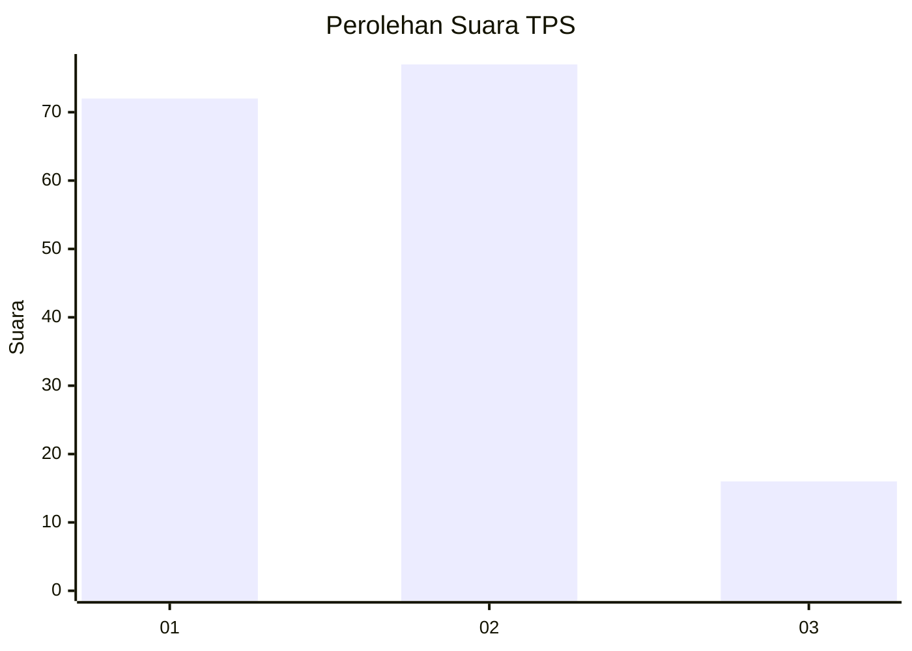
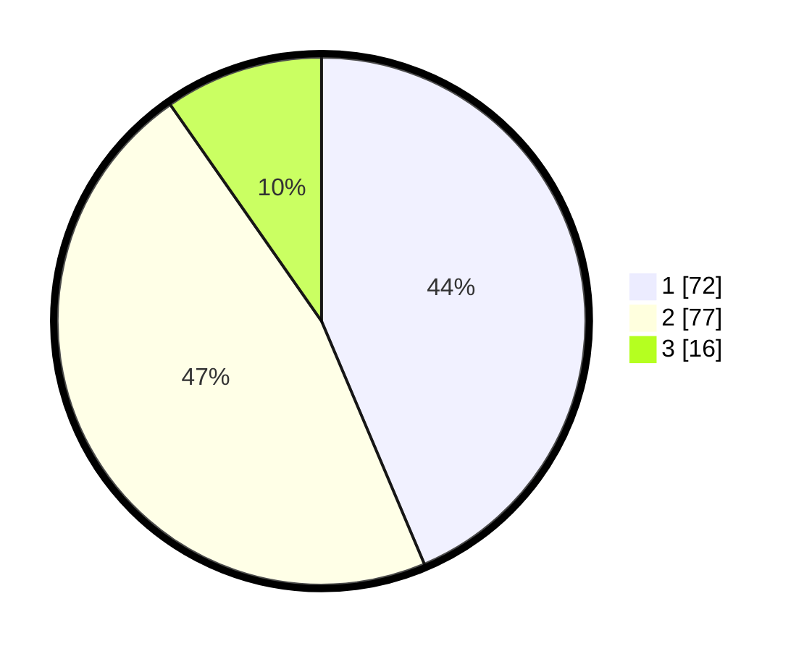

# Hasil

## Grafik

## Tabel

| No. | Nama Paslon    | Suara | Suara (raw) | Persentase |
|:--- |:-------------- | -----:| -----------:| ----------:|
| 1   | ANIES MUHAIMIN | 72    | [72][p-1]   | 43,64      |
| 2   | PRABOWO GIBRAN | 77    | [77][p-2]   | 46,67      |
| 3   | GANJAR MAHFUD  | 16    | [16][p-3]   | 9,70       |

[p-1]: https://github.com/gigit-pemilu/pemilu-2024/blob/main/pilpres/hitung-suara/sub/63-kalimantan-selatan/sub/04-barito-kuala/sub/14-barambai/sub/2001-barambai/sub/001-tps/sub/paslon-1.txt
[p-2]: https://github.com/gigit-pemilu/pemilu-2024/blob/main/pilpres/hitung-suara/sub/63-kalimantan-selatan/sub/04-barito-kuala/sub/14-barambai/sub/2001-barambai/sub/001-tps/sub/paslon-2.txt
[p-3]: https://github.com/gigit-pemilu/pemilu-2024/blob/main/pilpres/hitung-suara/sub/63-kalimantan-selatan/sub/04-barito-kuala/sub/14-barambai/sub/2001-barambai/sub/001-tps/sub/paslon-3.txt

## Foto C Plano

https://sirekap-obj-formc.kpu.go.id/9215/pemilu/ppwp/63/04/14/20/01/6304142001001-20240218-134551--aeb5cc19-0faf-45ee-b701-d920ee1a9b59.jpg

https://sirekap-obj-formc.kpu.go.id/9215/pemilu/ppwp/63/04/14/20/01/6304142001001-20240218-134612--82139a80-ff0f-4891-a342-46aebf3e7f7a.jpg

https://sirekap-obj-formc.kpu.go.id/9215/pemilu/ppwp/63/04/14/20/01/6304142001001-20240218-134634--b12061f9-f6f2-4575-9355-55e29bddb17f.jpg

## Metadata

| Key        | Value               |
| ---------- | ------------------- |
| Time Stamp | 2024-02-19 06:16:00 |

