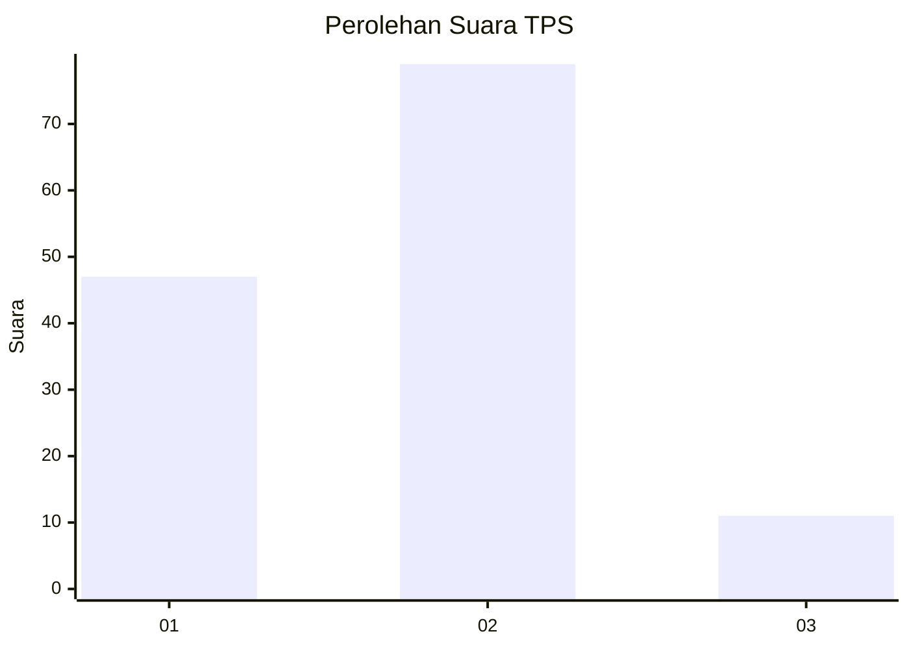
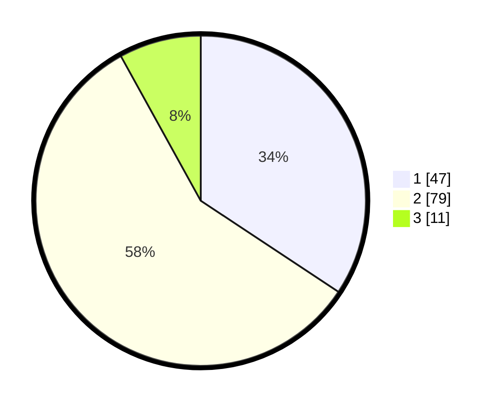

# Hasil

## Grafik

## Tabel

| No. | Nama Paslon    | Suara | Suara (raw) | Persentase |
|:--- |:-------------- | -----:| -----------:| ----------:|
| 1   | ANIES MUHAIMIN | 47    | [47][p-1]   | 34,31      |
| 2   | PRABOWO GIBRAN | 79    | [79][p-2]   | 57,66      |
| 3   | GANJAR MAHFUD  | 11    | [11][p-3]   | 8,03       |

[p-1]: https://github.com/gigit-pemilu/pemilu-2024/blob/main/pilpres/hitung-suara/sub/63-kalimantan-selatan/sub/04-barito-kuala/sub/14-barambai/sub/2001-barambai/sub/004-tps/sub/paslon-1.txt
[p-2]: https://github.com/gigit-pemilu/pemilu-2024/blob/main/pilpres/hitung-suara/sub/63-kalimantan-selatan/sub/04-barito-kuala/sub/14-barambai/sub/2001-barambai/sub/004-tps/sub/paslon-2.txt
[p-3]: https://github.com/gigit-pemilu/pemilu-2024/blob/main/pilpres/hitung-suara/sub/63-kalimantan-selatan/sub/04-barito-kuala/sub/14-barambai/sub/2001-barambai/sub/004-tps/sub/paslon-3.txt

## Foto C Plano

https://sirekap-obj-formc.kpu.go.id/1512/pemilu/ppwp/63/04/14/20/01/6304142001004-20240218-165158--d7037c2d-fb5e-472b-a242-86bcf9562468.jpg

https://sirekap-obj-formc.kpu.go.id/1512/pemilu/ppwp/63/04/14/20/01/6304142001004-20240218-165232--583649ff-0534-44d5-988b-9cd04849730b.jpg

https://sirekap-obj-formc.kpu.go.id/1512/pemilu/ppwp/63/04/14/20/01/6304142001004-20240218-165300--67ff97ad-d99e-4293-9a8b-336d84adb589.jpg

## Metadata

| Key        | Value               |
| ---------- | ------------------- |
| Time Stamp | 2024-02-19 06:16:00 |

