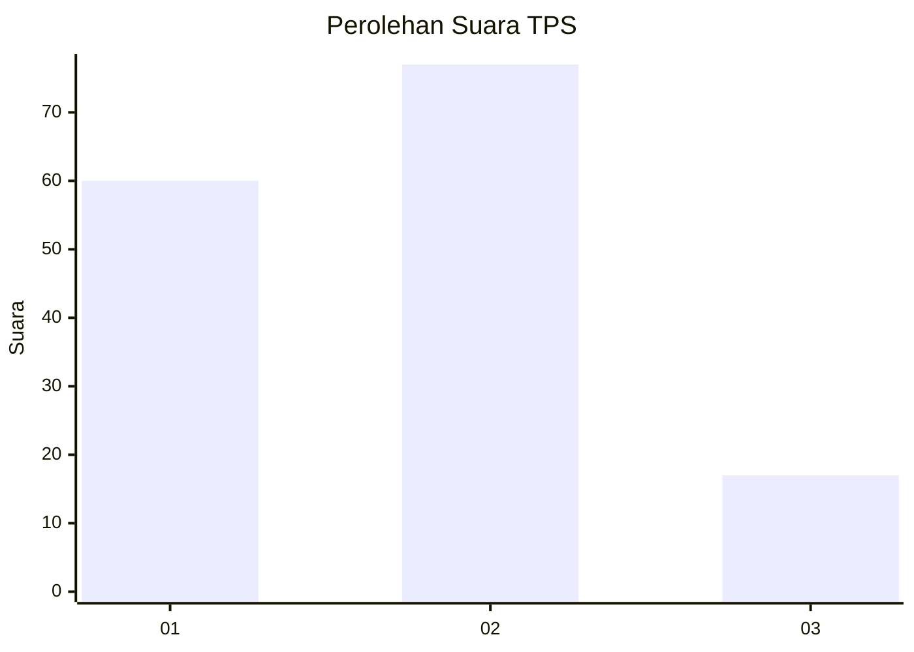
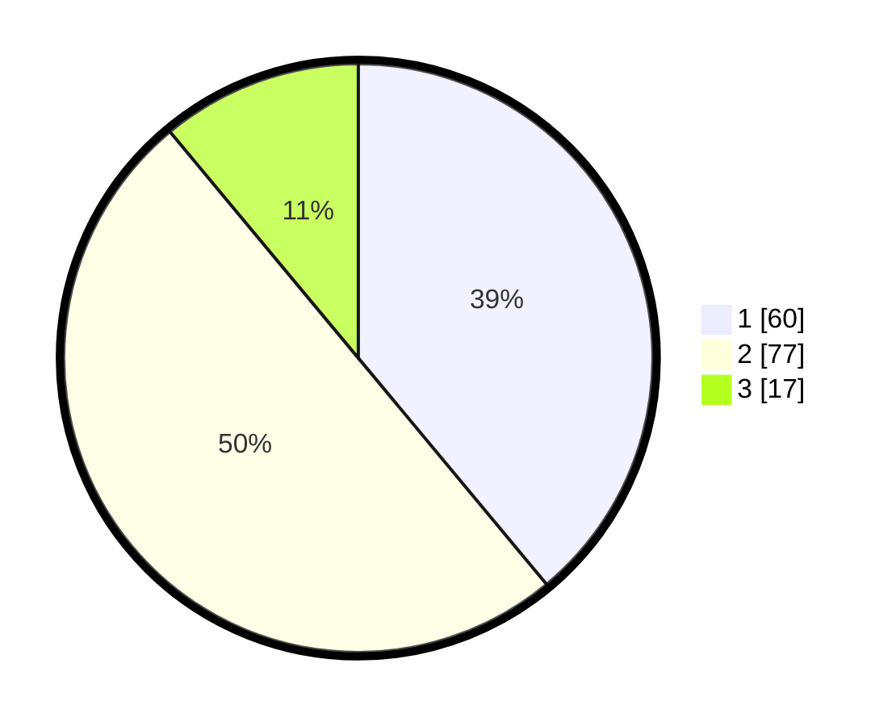

# Hasil

## Grafik

## Tabel

| No. | Nama Paslon    | Suara | Suara (raw) | Persentase |
|:--- |:-------------- | -----:| -----------:| ----------:|
| 1   | ANIES MUHAIMIN | 60    | [60][p-1]   | 38,96      |
| 2   | PRABOWO GIBRAN | 77    | [77][p-2]   | 50,00      |
| 3   | GANJAR MAHFUD  | 17    | [17][p-3]   | 11,04      |

[p-1]: https://github.com/gigit-pemilu/pemilu-2024-63-kalimantan-selatan/blob/main/pilpres/hitung-suara/sub/63-kalimantan-selatan/sub/04-barito-kuala/sub/14-barambai/sub/2002-sungai-kali/sub/002-tps/sub/paslon-1.txt
[p-2]: https://github.com/gigit-pemilu/pemilu-2024-63-kalimantan-selatan/blob/main/pilpres/hitung-suara/sub/63-kalimantan-selatan/sub/04-barito-kuala/sub/14-barambai/sub/2002-sungai-kali/sub/002-tps/sub/paslon-2.txt
[p-3]: https://github.com/gigit-pemilu/pemilu-2024-63-kalimantan-selatan/blob/main/pilpres/hitung-suara/sub/63-kalimantan-selatan/sub/04-barito-kuala/sub/14-barambai/sub/2002-sungai-kali/sub/002-tps/sub/paslon-3.txt

## Foto C Plano

https://sirekap-obj-formc.kpu.go.id/0808/pemilu/ppwp/63/04/14/20/02/6304142002002-20240215-164841--8a7574f2-560c-4914-8b5e-3f215c37430c.jpg

https://sirekap-obj-formc.kpu.go.id/0808/pemilu/ppwp/63/04/14/20/02/6304142002002-20240215-164944--9fe31793-9671-446f-b4dc-e04311b9942a.jpg

https://sirekap-obj-formc.kpu.go.id/0808/pemilu/ppwp/63/04/14/20/02/6304142002002-20240215-165036--38bf68d0-de52-4788-af30-d3cfed946c87.jpg

## Metadata

| Key        | Value               |
| ---------- | ------------------- |
| Time Stamp | 2024-02-15 22:00:27 |

