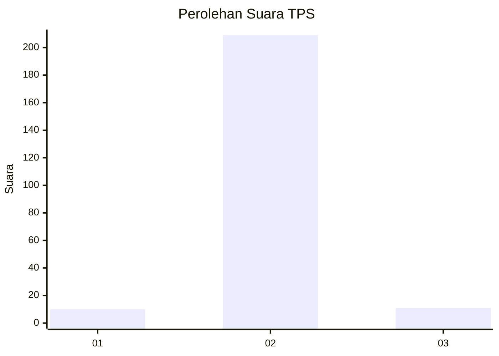
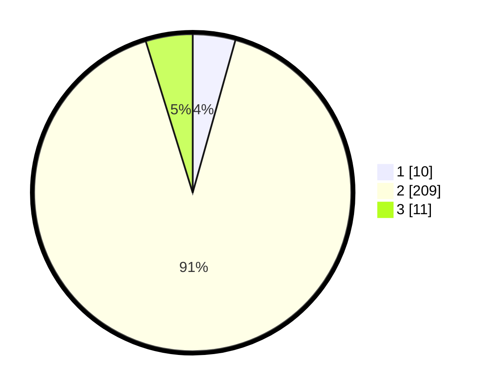

# Hasil

## Grafik

## Tabel

| No. | Nama Paslon    | Suara | Suara (raw) | Persentase |
|:--- |:-------------- | -----:| -----------:| ----------:|
| 1   | ANIES MUHAIMIN | 10    | [10][p-1]   | 4,35       |
| 2   | PRABOWO GIBRAN | 209   | [209][p-2]  | 90,87      |
| 3   | GANJAR MAHFUD  | 11    | [11][p-3]   | 4,78       |

[p-1]: https://github.com/gigit-pemilu/pemilu-2024/blob/main/pilpres/hitung-suara/sub/63-kalimantan-selatan/sub/04-barito-kuala/sub/14-barambai/sub/2010-barambai-kolam-kanan/sub/002-tps/sub/paslon-1.txt
[p-2]: https://github.com/gigit-pemilu/pemilu-2024/blob/main/pilpres/hitung-suara/sub/63-kalimantan-selatan/sub/04-barito-kuala/sub/14-barambai/sub/2010-barambai-kolam-kanan/sub/002-tps/sub/paslon-2.txt
[p-3]: https://github.com/gigit-pemilu/pemilu-2024/blob/main/pilpres/hitung-suara/sub/63-kalimantan-selatan/sub/04-barito-kuala/sub/14-barambai/sub/2010-barambai-kolam-kanan/sub/002-tps/sub/paslon-3.txt

## Foto C Plano

https://sirekap-obj-formc.kpu.go.id/9974/pemilu/ppwp/63/04/14/20/10/6304142010002-20240214-184924--ccd439e1-af26-4283-bff0-41bb6f4430c3.jpg

https://sirekap-obj-formc.kpu.go.id/9974/pemilu/ppwp/63/04/14/20/10/6304142010002-20240214-185320--ccebfd0e-8671-4afc-a520-722f60f2d68e.jpg

https://sirekap-obj-formc.kpu.go.id/9974/pemilu/ppwp/63/04/14/20/10/6304142010002-20240214-185726--6c87b2f7-b441-4d0b-afa0-ec3f9a8a6def.jpg

## Metadata

| Key        | Value               |
| ---------- | ------------------- |
| Time Stamp | 2024-02-16 04:00:27 |

