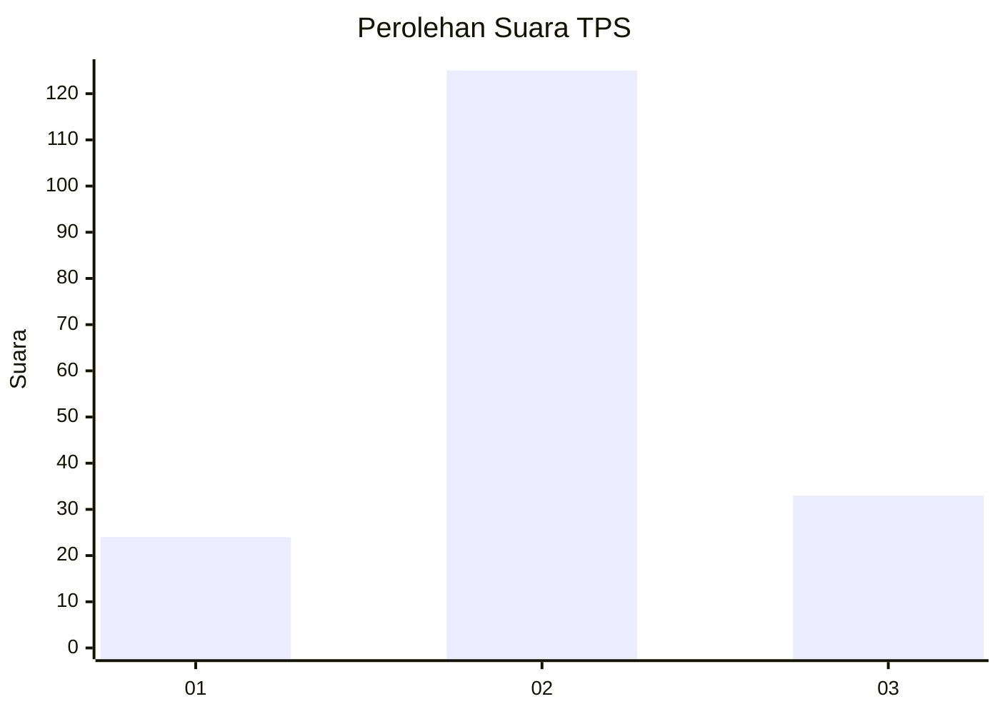
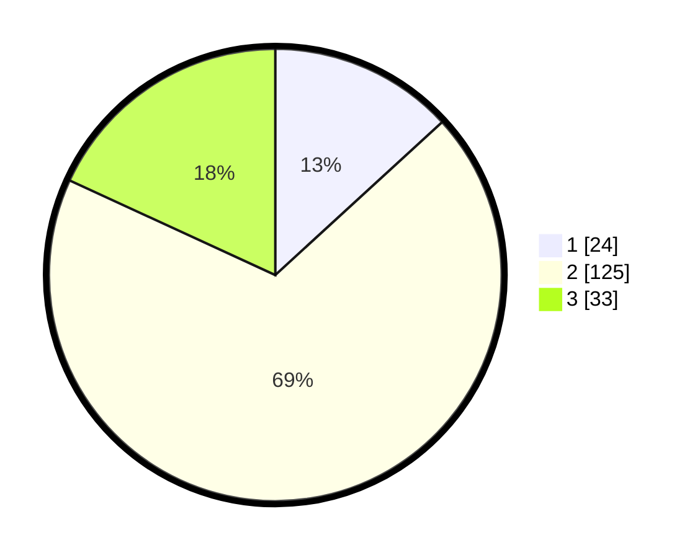

# Hasil

## Grafik

## Tabel

| No. | Nama Paslon    | Suara | Suara (raw) | Persentase |
|:--- |:-------------- | -----:| -----------:| ----------:|
| 1   | ANIES MUHAIMIN | 24    | [24][p-1]   | 13,19      |
| 2   | PRABOWO GIBRAN | 125   | [125][p-2]  | 68,68      |
| 3   | GANJAR MAHFUD  | 33    | [33][p-3]   | 18,13      |

[p-1]: https://github.com/gigit-pemilu/pemilu-2024/blob/main/pilpres/hitung-suara/sub/63-kalimantan-selatan/sub/04-barito-kuala/sub/14-barambai/sub/2011-barambai-kolam-kiri-dalam/sub/001-tps/sub/paslon-1.txt
[p-2]: https://github.com/gigit-pemilu/pemilu-2024/blob/main/pilpres/hitung-suara/sub/63-kalimantan-selatan/sub/04-barito-kuala/sub/14-barambai/sub/2011-barambai-kolam-kiri-dalam/sub/001-tps/sub/paslon-2.txt
[p-3]: https://github.com/gigit-pemilu/pemilu-2024/blob/main/pilpres/hitung-suara/sub/63-kalimantan-selatan/sub/04-barito-kuala/sub/14-barambai/sub/2011-barambai-kolam-kiri-dalam/sub/001-tps/sub/paslon-3.txt

## Foto C Plano

https://sirekap-obj-formc.kpu.go.id/a0bc/pemilu/ppwp/63/04/14/20/11/6304142011001-20240214-223053--78efd776-b6e5-4241-8db4-89c1862c22ff.jpg

https://sirekap-obj-formc.kpu.go.id/a0bc/pemilu/ppwp/63/04/14/20/11/6304142011001-20240214-223124--ef9e03af-8c32-4180-bdd8-f751e605b8a8.jpg

https://sirekap-obj-formc.kpu.go.id/a0bc/pemilu/ppwp/63/04/14/20/11/6304142011001-20240214-223217--1f51baf8-17a3-49fb-a1b5-ba15b6ef533b.jpg

## Metadata

| Key        | Value               |
| ---------- | ------------------- |
| Time Stamp | 2024-02-16 10:00:28 |

## DATA PEMILIH TETAP

Jumlah pemilih dalam DPT: **220**.
 * L: **116**.
 * P: **104**.

## DATA PENGGUNA HAK PILIH

Jumlah pengguna hak pilih dalam DPT: **135**.
 * L: **755**.
 * P: **90**.

Jumlah pengguna hak pilih dalam DPTb: **1**.
 * L: **104**.
 * P: **8**.

Jumlah pengguna hak pilih dalam DPK: **0**.
 * L: **400**.
 * P: **0**.

Jumlah pengguna hak pilih: **135**.
 * L: **757**.
 * P: **51**.

## JUMLAH SUARA SAH DAN TIDAK SAH

JUMLAH SELURUH SUARA SAH: **182**.

JUMLAH SUARA TIDAK SAH: **4**.

JUMLAH SELURUH SUARA SAH DAN SUARA TIDAK SAH: **186**.

