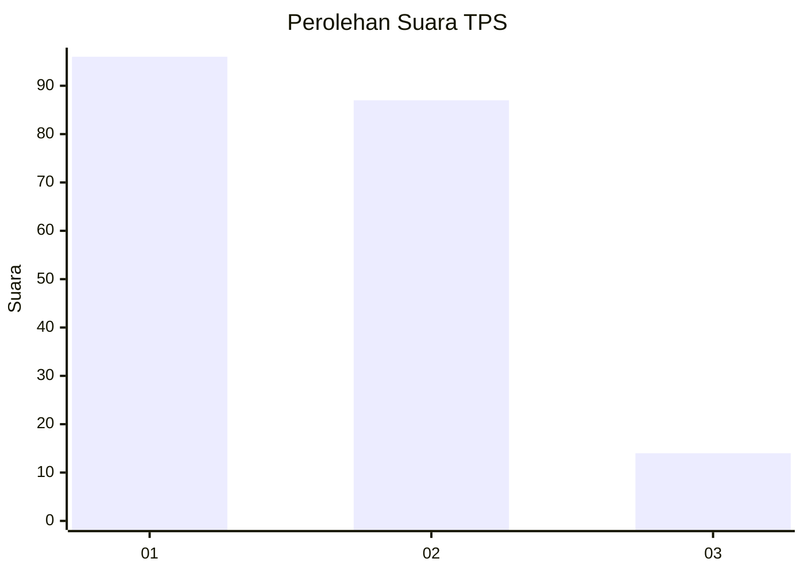
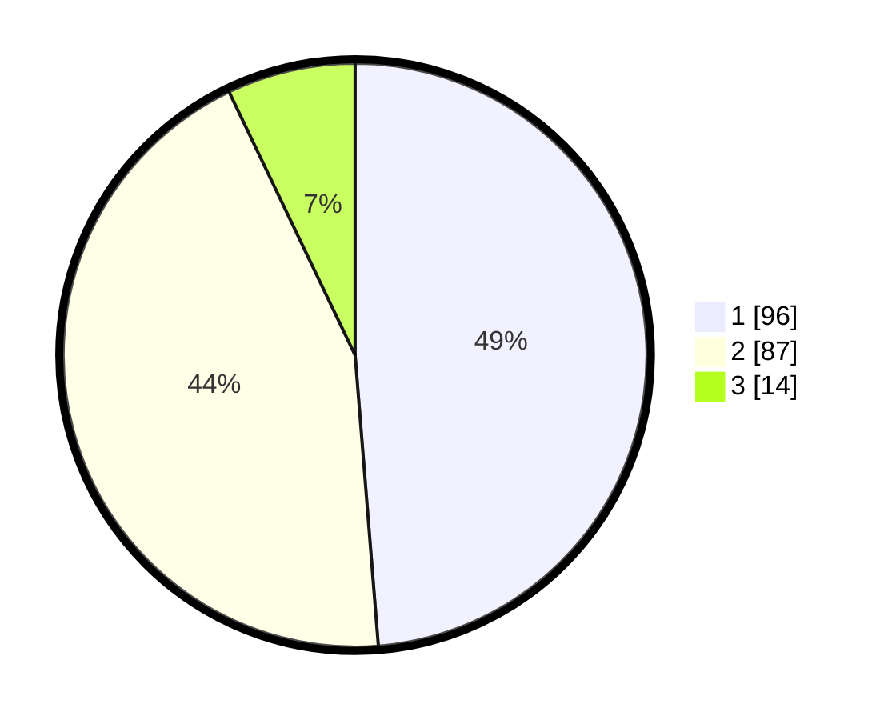

# Hasil

## Grafik

## Tabel

| No. | Nama Paslon    | Suara | Suara (raw) | Persentase |
|:--- |:-------------- | -----:| -----------:| ----------:|
| 1   | ANIES MUHAIMIN | 96    | [96][p-1]   | 48,73      |
| 2   | PRABOWO GIBRAN | 87    | [87][p-2]   | 44,16      |
| 3   | GANJAR MAHFUD  | 14    | [14][p-3]   | 7,11       |

[p-1]: https://github.com/gigit-pemilu/pemilu-2024-63-kalimantan-selatan/blob/main/pilpres/hitung-suara/sub/63-kalimantan-selatan/sub/04-barito-kuala/sub/15-marabahan/sub/1001-marabahan-kota/sub/001-tps/sub/paslon-1.txt
[p-2]: https://github.com/gigit-pemilu/pemilu-2024-63-kalimantan-selatan/blob/main/pilpres/hitung-suara/sub/63-kalimantan-selatan/sub/04-barito-kuala/sub/15-marabahan/sub/1001-marabahan-kota/sub/001-tps/sub/paslon-2.txt
[p-3]: https://github.com/gigit-pemilu/pemilu-2024-63-kalimantan-selatan/blob/main/pilpres/hitung-suara/sub/63-kalimantan-selatan/sub/04-barito-kuala/sub/15-marabahan/sub/1001-marabahan-kota/sub/001-tps/sub/paslon-3.txt

## Foto C Plano

https://sirekap-obj-formc.kpu.go.id/5da9/pemilu/ppwp/63/04/15/10/01/6304151001001-20240219-090738--d8cef5cc-4264-40f3-a0f5-d8c332a6f050.jpg

https://sirekap-obj-formc.kpu.go.id/5da9/pemilu/ppwp/63/04/15/10/01/6304151001001-20240219-090809--5eddeb09-81de-4743-8859-8a4fda87c6ff.jpg

https://sirekap-obj-formc.kpu.go.id/5da9/pemilu/ppwp/63/04/15/10/01/6304151001001-20240219-090834--b3a28834-e18a-4960-adae-038cab5652ef.jpg

## Metadata

| Key        | Value               |
| ---------- | ------------------- |
| Time Stamp | 2024-02-19 15:00:00 |

