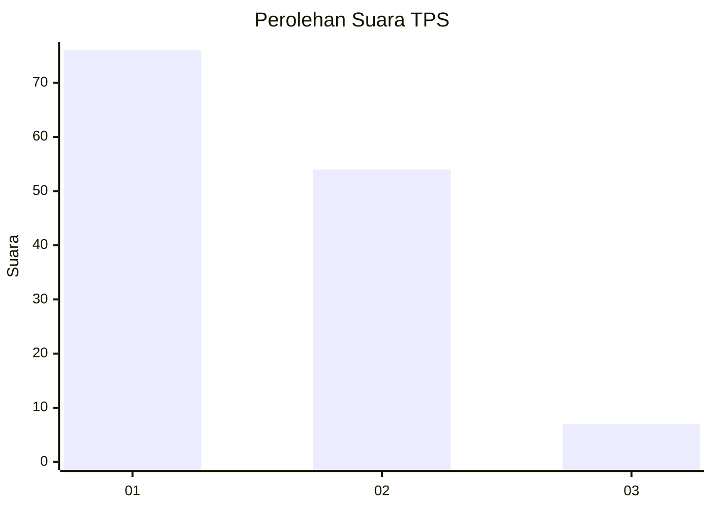
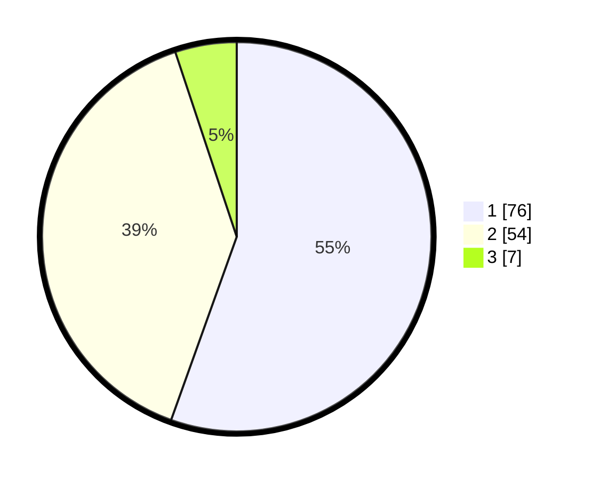

# Hasil

## Grafik

## Tabel

| No. | Nama Paslon    | Suara | Suara (raw) | Persentase |
|:--- |:-------------- | -----:| -----------:| ----------:|
| 1   | ANIES MUHAIMIN | 76    | [76][p-1]   | 55,47      |
| 2   | PRABOWO GIBRAN | 54    | [54][p-2]   | 39,42      |
| 3   | GANJAR MAHFUD  | 7     | [7][p-3]    | 5,11       |

[p-1]: https://github.com/gigit-pemilu/pemilu-2024/blob/main/pilpres/hitung-suara/sub/63-kalimantan-selatan/sub/04-barito-kuala/sub/15-marabahan/sub/1001-marabahan-kota/sub/002-tps/sub/paslon-1.txt
[p-2]: https://github.com/gigit-pemilu/pemilu-2024/blob/main/pilpres/hitung-suara/sub/63-kalimantan-selatan/sub/04-barito-kuala/sub/15-marabahan/sub/1001-marabahan-kota/sub/002-tps/sub/paslon-2.txt
[p-3]: https://github.com/gigit-pemilu/pemilu-2024/blob/main/pilpres/hitung-suara/sub/63-kalimantan-selatan/sub/04-barito-kuala/sub/15-marabahan/sub/1001-marabahan-kota/sub/002-tps/sub/paslon-3.txt

## Foto C Plano

https://sirekap-obj-formc.kpu.go.id/41de/pemilu/ppwp/63/04/15/10/01/6304151001002-20240219-105335--69ba2a29-18e7-4cf4-9a2d-2bee8ba9bf68.jpg

https://sirekap-obj-formc.kpu.go.id/41de/pemilu/ppwp/63/04/15/10/01/6304151001002-20240219-105405--80f9f23c-af38-40c9-96b8-5dc027590b85.jpg

https://sirekap-obj-formc.kpu.go.id/41de/pemilu/ppwp/63/04/15/10/01/6304151001002-20240219-105431--b6dfd2fb-6932-491f-93fe-53a6751ed232.jpg

## Metadata

| Key        | Value               |
| ---------- | ------------------- |
| Time Stamp | 2024-02-19 15:00:00 |

