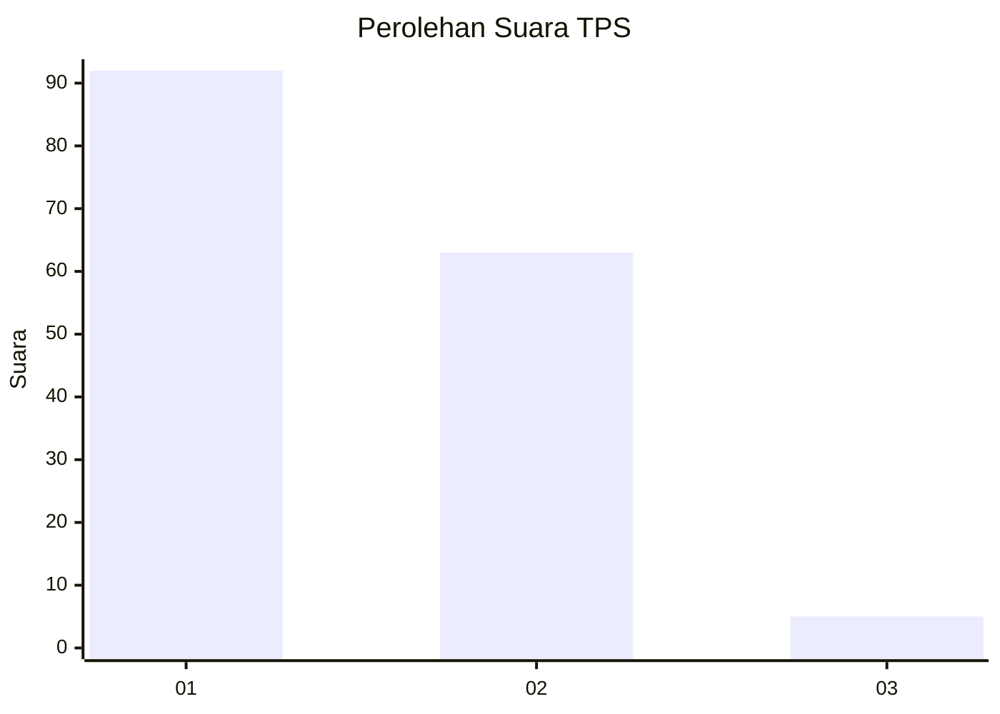
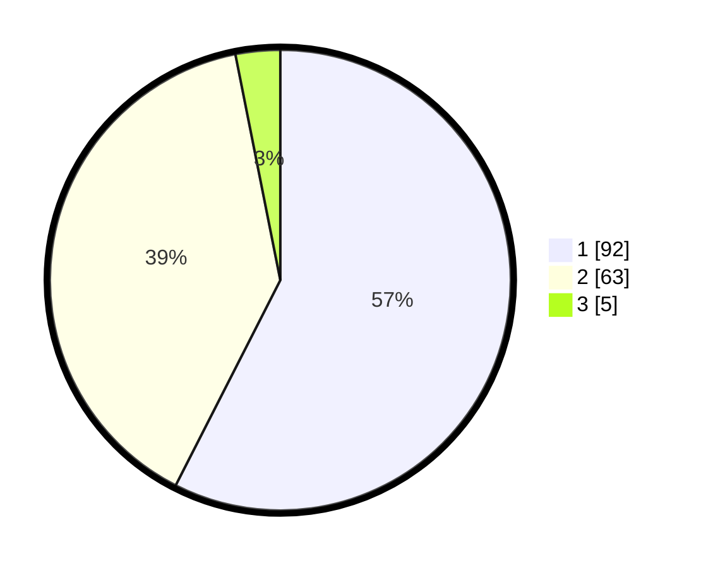

# Hasil

## Grafik

## Tabel

| No. | Nama Paslon    | Suara | Suara (raw) | Persentase |
|:--- |:-------------- | -----:| -----------:| ----------:|
| 1   | ANIES MUHAIMIN | 92    | [92][p-1]   | 57,50      |
| 2   | PRABOWO GIBRAN | 63    | [63][p-2]   | 39,38      |
| 3   | GANJAR MAHFUD  | 5     | [5][p-3]    | 3,13       |

[p-1]: https://github.com/gigit-pemilu/pemilu-2024/blob/main/pilpres/hitung-suara/sub/63-kalimantan-selatan/sub/04-barito-kuala/sub/15-marabahan/sub/1001-marabahan-kota/sub/004-tps/sub/paslon-1.txt
[p-2]: https://github.com/gigit-pemilu/pemilu-2024/blob/main/pilpres/hitung-suara/sub/63-kalimantan-selatan/sub/04-barito-kuala/sub/15-marabahan/sub/1001-marabahan-kota/sub/004-tps/sub/paslon-2.txt
[p-3]: https://github.com/gigit-pemilu/pemilu-2024/blob/main/pilpres/hitung-suara/sub/63-kalimantan-selatan/sub/04-barito-kuala/sub/15-marabahan/sub/1001-marabahan-kota/sub/004-tps/sub/paslon-3.txt

## Foto C Plano

https://sirekap-obj-formc.kpu.go.id/81a6/pemilu/ppwp/63/04/15/10/01/6304151001004-20240219-140928--9618ca4a-c443-44ce-9a12-27f0f3d556b4.jpg

https://sirekap-obj-formc.kpu.go.id/81a6/pemilu/ppwp/63/04/15/10/01/6304151001004-20240219-141037--bef20f97-54c9-4f7d-b763-1507acee7094.jpg

https://sirekap-obj-formc.kpu.go.id/81a6/pemilu/ppwp/63/04/15/10/01/6304151001004-20240219-140952--1f1012b1-0699-4e9b-a99c-48094f91f114.jpg

## Metadata

| Key        | Value               |
| ---------- | ------------------- |
| Time Stamp | 2024-02-24 22:31:28 |

