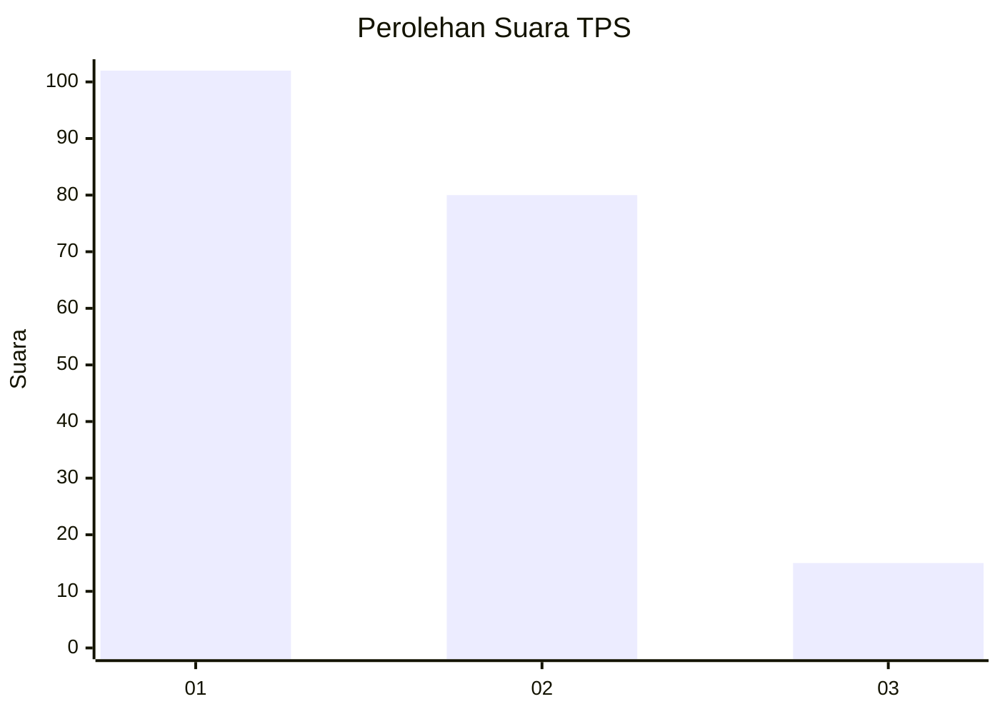
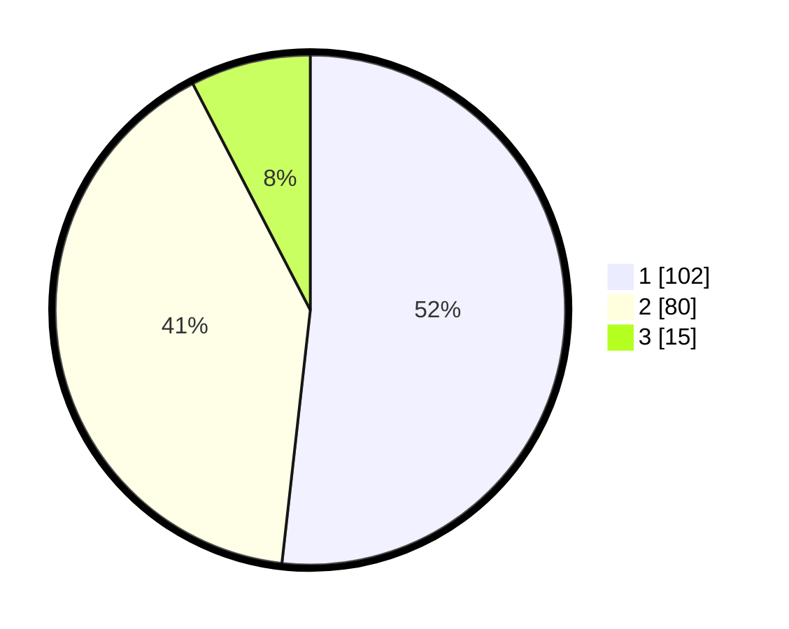

# Hasil

## Grafik

## Tabel

| No. | Nama Paslon    | Suara | Suara (raw) | Persentase |
|:--- |:-------------- | -----:| -----------:| ----------:|
| 1   | ANIES MUHAIMIN | 102   | [102][p-1]  | 51,78      |
| 2   | PRABOWO GIBRAN | 80    | [80][p-2]   | 40,61      |
| 3   | GANJAR MAHFUD  | 15    | [15][p-3]   | 7,61       |

[p-1]: https://github.com/gigit-pemilu/pemilu-2024/blob/main/pilpres/hitung-suara/sub/63-kalimantan-selatan/sub/04-barito-kuala/sub/15-marabahan/sub/1001-marabahan-kota/sub/005-tps/sub/paslon-1.txt
[p-2]: https://github.com/gigit-pemilu/pemilu-2024/blob/main/pilpres/hitung-suara/sub/63-kalimantan-selatan/sub/04-barito-kuala/sub/15-marabahan/sub/1001-marabahan-kota/sub/005-tps/sub/paslon-2.txt
[p-3]: https://github.com/gigit-pemilu/pemilu-2024/blob/main/pilpres/hitung-suara/sub/63-kalimantan-selatan/sub/04-barito-kuala/sub/15-marabahan/sub/1001-marabahan-kota/sub/005-tps/sub/paslon-3.txt

## Foto C Plano

https://sirekap-obj-formc.kpu.go.id/bb34/pemilu/ppwp/63/04/15/10/01/6304151001005-20240219-154630--c21e2ddd-1800-486a-bc12-110b06c99128.jpg

https://sirekap-obj-formc.kpu.go.id/bb34/pemilu/ppwp/63/04/15/10/01/6304151001005-20240214-211428--b831ec51-aa47-4047-bb49-9afa19886d7d.jpg

https://sirekap-obj-formc.kpu.go.id/bb34/pemilu/ppwp/63/04/15/10/01/6304151001005-20240219-154749--be676cbb-44f1-4ec3-a612-c20cc24a53af.jpg

## Metadata

| Key        | Value               |
| ---------- | ------------------- |
| Time Stamp | 2024-02-19 16:00:00 |

