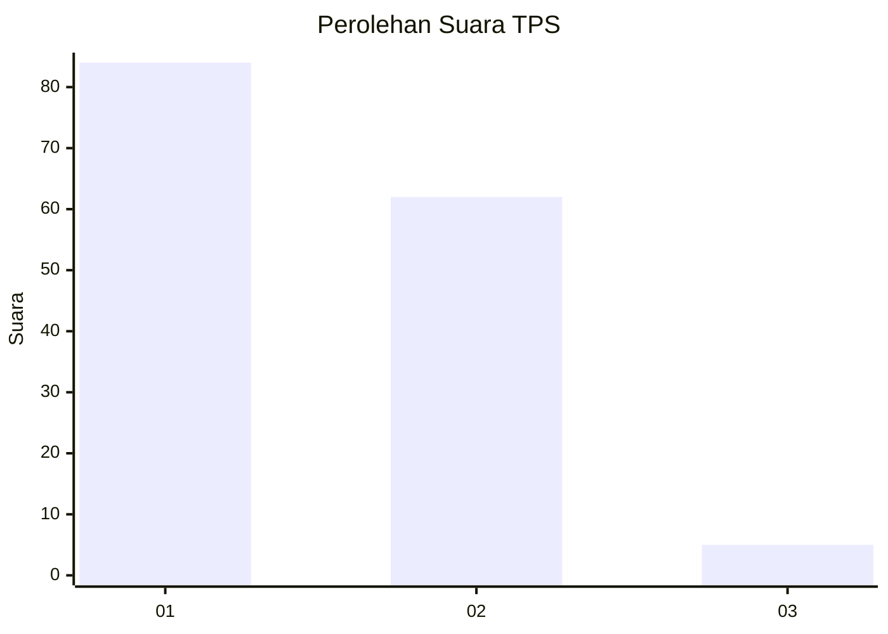
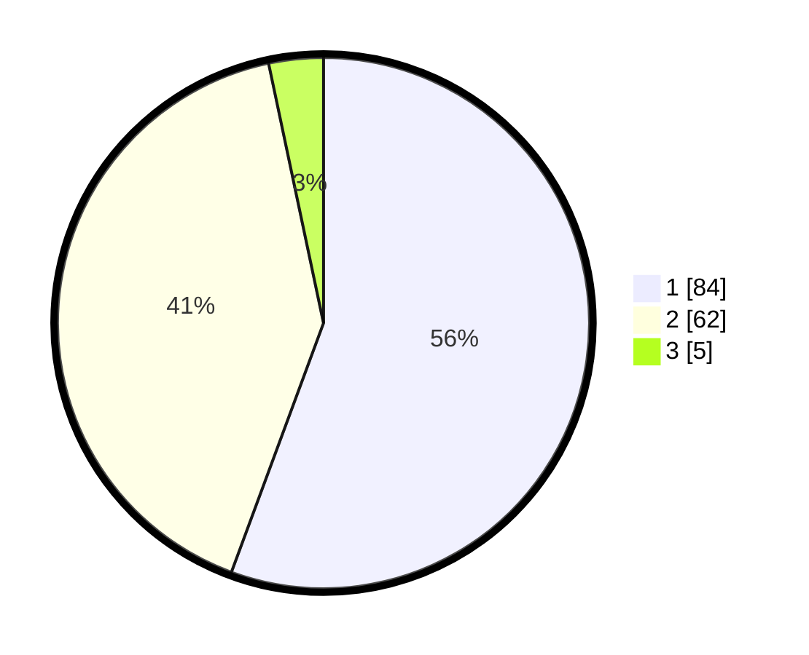

# Hasil

## Grafik

## Tabel

| No. | Nama Paslon    | Suara | Suara (raw) | Persentase |
|:--- |:-------------- | -----:| -----------:| ----------:|
| 1   | ANIES MUHAIMIN | 84    | [84][p-1]   | 55,63      |
| 2   | PRABOWO GIBRAN | 62    | [62][p-2]   | 41,06      |
| 3   | GANJAR MAHFUD  | 5     | [5][p-3]    | 3,31       |

[p-1]: https://github.com/gigit-pemilu/pemilu-2024-63-kalimantan-selatan/blob/main/pilpres/hitung-suara/sub/63-kalimantan-selatan/sub/04-barito-kuala/sub/15-marabahan/sub/1001-marabahan-kota/sub/007-tps/sub/paslon-1.txt
[p-2]: https://github.com/gigit-pemilu/pemilu-2024-63-kalimantan-selatan/blob/main/pilpres/hitung-suara/sub/63-kalimantan-selatan/sub/04-barito-kuala/sub/15-marabahan/sub/1001-marabahan-kota/sub/007-tps/sub/paslon-2.txt
[p-3]: https://github.com/gigit-pemilu/pemilu-2024-63-kalimantan-selatan/blob/main/pilpres/hitung-suara/sub/63-kalimantan-selatan/sub/04-barito-kuala/sub/15-marabahan/sub/1001-marabahan-kota/sub/007-tps/sub/paslon-3.txt

## Foto C Plano

https://sirekap-obj-formc.kpu.go.id/4d22/pemilu/ppwp/63/04/15/10/01/6304151001007-20240219-164021--cdfcc862-526a-40ec-aa73-f70ecfc5f995.jpg

https://sirekap-obj-formc.kpu.go.id/4d22/pemilu/ppwp/63/04/15/10/01/6304151001007-20240219-164044--cf5f28fe-40f4-4fe0-b693-e0afa8caa236.jpg

https://sirekap-obj-formc.kpu.go.id/4d22/pemilu/ppwp/63/04/15/10/01/6304151001007-20240219-164105--5df40390-d2cd-4b1b-a389-0a8909e4677d.jpg

## Metadata

| Key        | Value               |
| ---------- | ------------------- |
| Time Stamp | 2024-02-24 22:31:28 |

