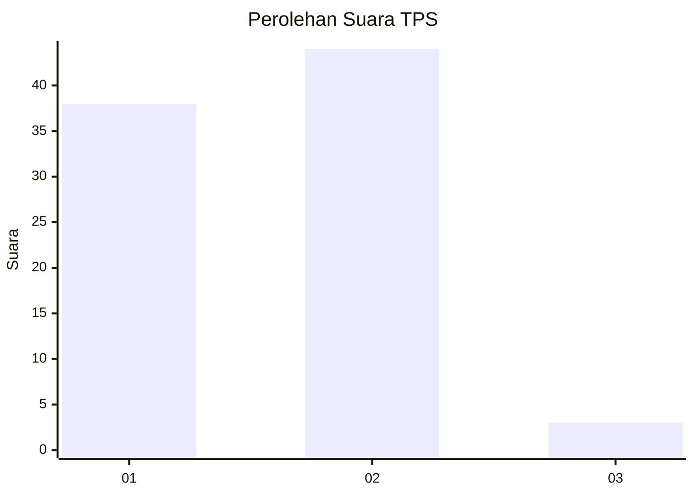
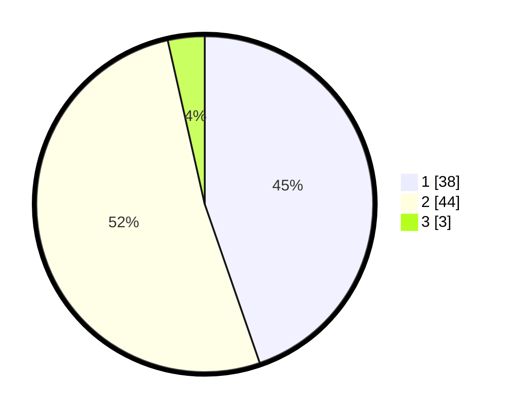

# Hasil

## Grafik

## Tabel

| No. | Nama Paslon    | Suara | Suara (raw) | Persentase |
|:--- |:-------------- | -----:| -----------:| ----------:|
| 1   | ANIES MUHAIMIN | 38    | [38][p-1]   | 44,71      |
| 2   | PRABOWO GIBRAN | 44    | [44][p-2]   | 51,76      |
| 3   | GANJAR MAHFUD  | 3     | [3][p-3]    | 3,53       |

[p-1]: https://github.com/gigit-pemilu/pemilu-2024-63-kalimantan-selatan/blob/main/pilpres/hitung-suara/sub/63-kalimantan-selatan/sub/05-tapin/sub/02-tapin-selatan/sub/2017-hatiwin/sub/002-tps/sub/paslon-1.txt
[p-2]: https://github.com/gigit-pemilu/pemilu-2024-63-kalimantan-selatan/blob/main/pilpres/hitung-suara/sub/63-kalimantan-selatan/sub/05-tapin/sub/02-tapin-selatan/sub/2017-hatiwin/sub/002-tps/sub/paslon-2.txt
[p-3]: https://github.com/gigit-pemilu/pemilu-2024-63-kalimantan-selatan/blob/main/pilpres/hitung-suara/sub/63-kalimantan-selatan/sub/05-tapin/sub/02-tapin-selatan/sub/2017-hatiwin/sub/002-tps/sub/paslon-3.txt

## Foto C Plano

https://sirekap-obj-formc.kpu.go.id/9ed0/pemilu/ppwp/63/05/02/20/17/6305022017002-20240220-153543--e0d360dd-6cb0-47fb-b929-e1bb68449552.jpg

https://sirekap-obj-formc.kpu.go.id/9ed0/pemilu/ppwp/63/05/02/20/17/6305022017002-20240220-154509--956911ad-cd79-4caa-bed0-953c334c9ed7.jpg

https://sirekap-obj-formc.kpu.go.id/9ed0/pemilu/ppwp/63/05/02/20/17/6305022017002-20240220-154843--7723ac38-4bba-49a2-a9bf-b01a411572cd.jpg

## Metadata

| Key        | Value               |
| ---------- | ------------------- |
| Time Stamp | 2024-02-20 16:00:00 |

## DATA PEMILIH TETAP

Jumlah pemilih dalam DPT: **225**.
 * L: **460**.
 * P: **815**.

## DATA PENGGUNA HAK PILIH

Jumlah pengguna hak pilih dalam DPT: **692**.
 * L: **94**.
 * P: **98**.

Jumlah pengguna hak pilih dalam DPTb: **855**.
 * L: **0**.
 * P: **0**.

Jumlah pengguna hak pilih dalam DPK: **0**.
 * L: **0**.
 * P: **0**.

Jumlah pengguna hak pilih: **92**.
 * L: **94**.
 * P: **98**.

## JUMLAH SUARA SAH DAN TIDAK SAH

JUMLAH SELURUH SUARA SAH: **186**.

JUMLAH SUARA TIDAK SAH: **572**.

JUMLAH SELURUH SUARA SAH DAN SUARA TIDAK SAH: **57**.

