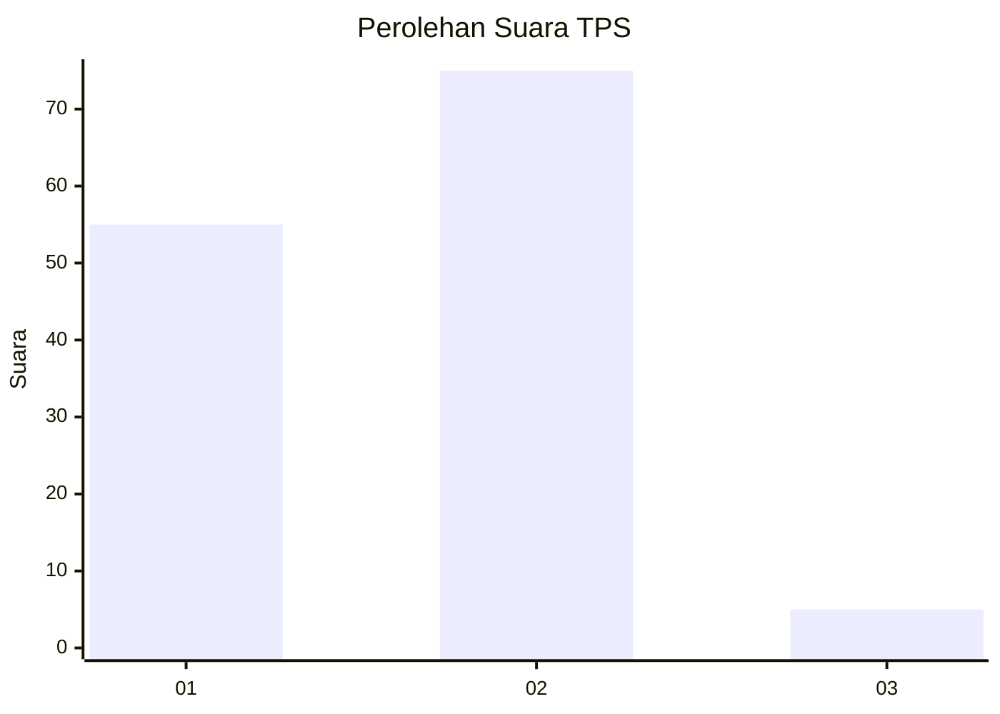
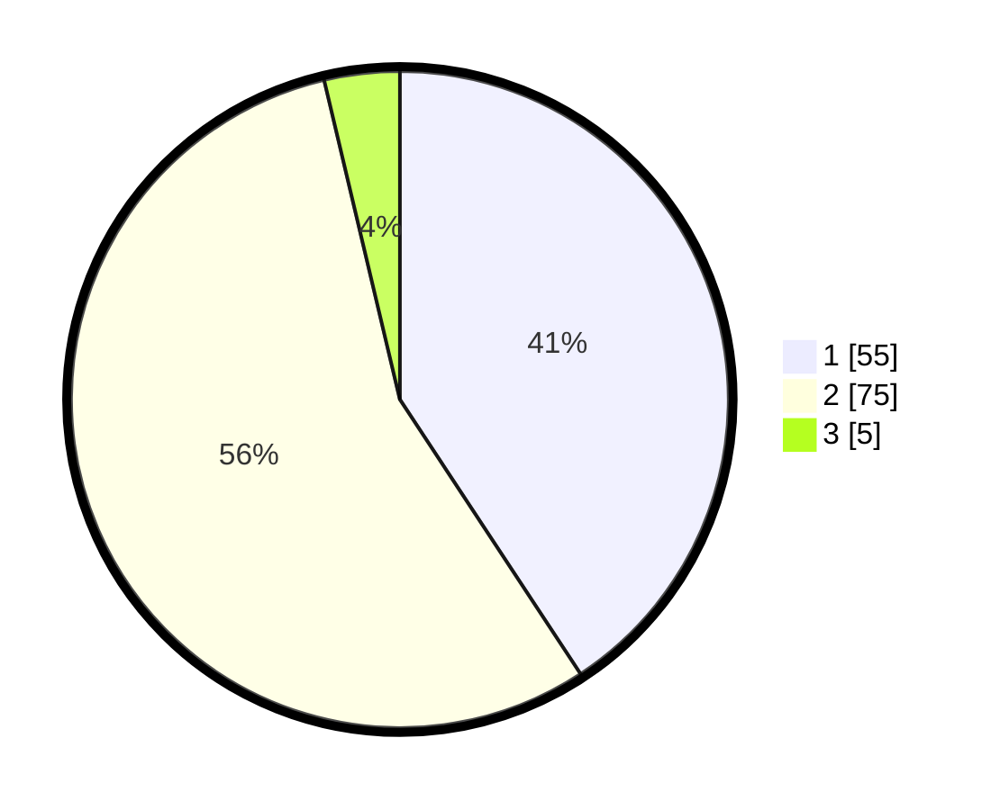

# Hasil

## Grafik

## Tabel

| No. | Nama Paslon    | Suara | Suara (raw) | Persentase |
|:--- |:-------------- | -----:| -----------:| ----------:|
| 1   | ANIES MUHAIMIN | 55    | [55][p-1]   | 40,74      |
| 2   | PRABOWO GIBRAN | 75    | [75][p-2]   | 55,56      |
| 3   | GANJAR MAHFUD  | 5     | [5][p-3]    | 3,70       |

[p-1]: https://github.com/gigit-pemilu/pemilu-2024/blob/main/pilpres/hitung-suara/sub/63-kalimantan-selatan/sub/05-tapin/sub/04-tapin-utara/sub/1001-rangda-malingkung/sub/001-tps/sub/paslon-1.txt
[p-2]: https://github.com/gigit-pemilu/pemilu-2024/blob/main/pilpres/hitung-suara/sub/63-kalimantan-selatan/sub/05-tapin/sub/04-tapin-utara/sub/1001-rangda-malingkung/sub/001-tps/sub/paslon-2.txt
[p-3]: https://github.com/gigit-pemilu/pemilu-2024/blob/main/pilpres/hitung-suara/sub/63-kalimantan-selatan/sub/05-tapin/sub/04-tapin-utara/sub/1001-rangda-malingkung/sub/001-tps/sub/paslon-3.txt

## Foto C Plano

https://sirekap-obj-formc.kpu.go.id/34e4/pemilu/ppwp/63/05/04/10/01/6305041001001-20240217-163616--00306d99-60a4-471b-a008-0fcd12b1a4c3.jpg

https://sirekap-obj-formc.kpu.go.id/34e4/pemilu/ppwp/63/05/04/10/01/6305041001001-20240220-104735--617ea922-51ab-4883-8eb0-f2b601a6291f.jpg

https://sirekap-obj-formc.kpu.go.id/34e4/pemilu/ppwp/63/05/04/10/01/6305041001001-20240220-104858--495f62e1-70d2-4e52-8312-fc86d7e123c2.jpg

## Metadata

| Key        | Value               |
| ---------- | ------------------- |
| Time Stamp | 2024-02-20 11:00:00 |

