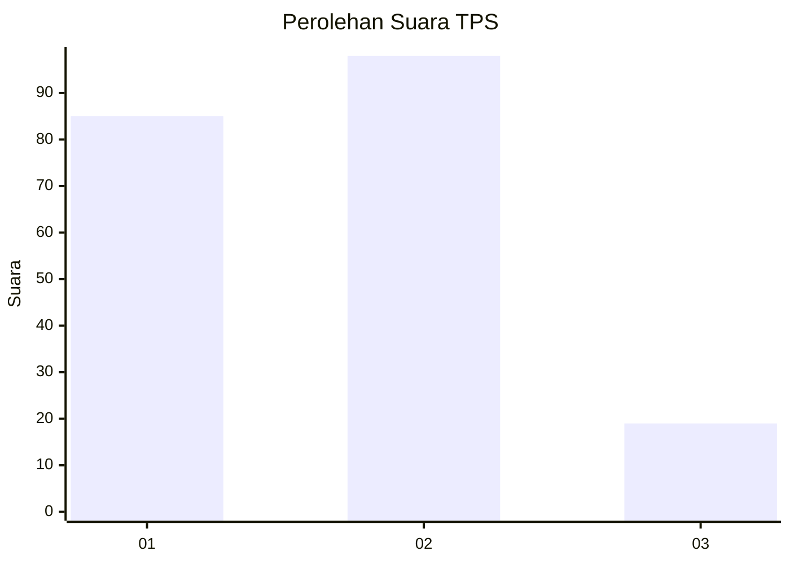
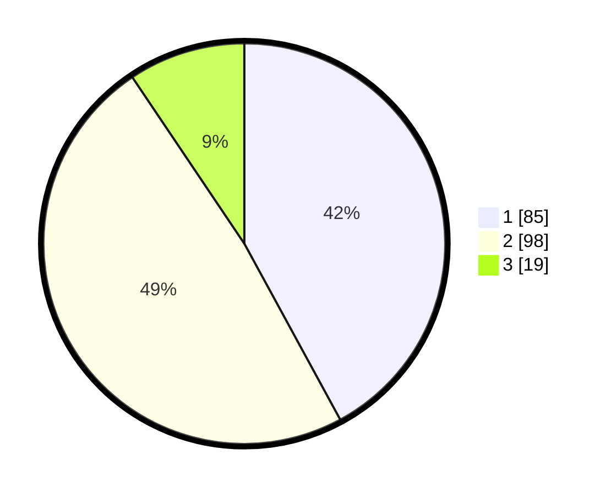

# Hasil

## Grafik

## Tabel

| No. | Nama Paslon    | Suara | Suara (raw) | Persentase |
|:--- |:-------------- | -----:| -----------:| ----------:|
| 1   | ANIES MUHAIMIN | 85    | [85][p-1]   | 42,08      |
| 2   | PRABOWO GIBRAN | 98    | [98][p-2]   | 48,51      |
| 3   | GANJAR MAHFUD  | 19    | [19][p-3]   | 9,41       |

[p-1]: https://github.com/gigit-pemilu/pemilu-2024-63-kalimantan-selatan/blob/main/pilpres/hitung-suara/sub/63-kalimantan-selatan/sub/05-tapin/sub/06-candi-laras-utara/sub/2001-keladan/sub/006-tps/sub/paslon-1.txt
[p-2]: https://github.com/gigit-pemilu/pemilu-2024-63-kalimantan-selatan/blob/main/pilpres/hitung-suara/sub/63-kalimantan-selatan/sub/05-tapin/sub/06-candi-laras-utara/sub/2001-keladan/sub/006-tps/sub/paslon-2.txt
[p-3]: https://github.com/gigit-pemilu/pemilu-2024-63-kalimantan-selatan/blob/main/pilpres/hitung-suara/sub/63-kalimantan-selatan/sub/05-tapin/sub/06-candi-laras-utara/sub/2001-keladan/sub/006-tps/sub/paslon-3.txt

## Foto C Plano

https://sirekap-obj-formc.kpu.go.id/e7c7/pemilu/ppwp/63/05/06/20/01/6305062001006-20240218-124541--b41fb14c-72f8-4fda-b487-8daa122bab86.jpg

https://sirekap-obj-formc.kpu.go.id/e7c7/pemilu/ppwp/63/05/06/20/01/6305062001006-20240215-035717--09f5b804-c726-4c73-a275-26d0beb1c9d0.jpg

https://sirekap-obj-formc.kpu.go.id/e7c7/pemilu/ppwp/63/05/06/20/01/6305062001006-20240215-035831--87d02ed5-69f3-43c1-af16-c55ab700521f.jpg

## Metadata

| Key        | Value               |
| ---------- | ------------------- |
| Time Stamp | 2024-02-19 06:16:00 |

