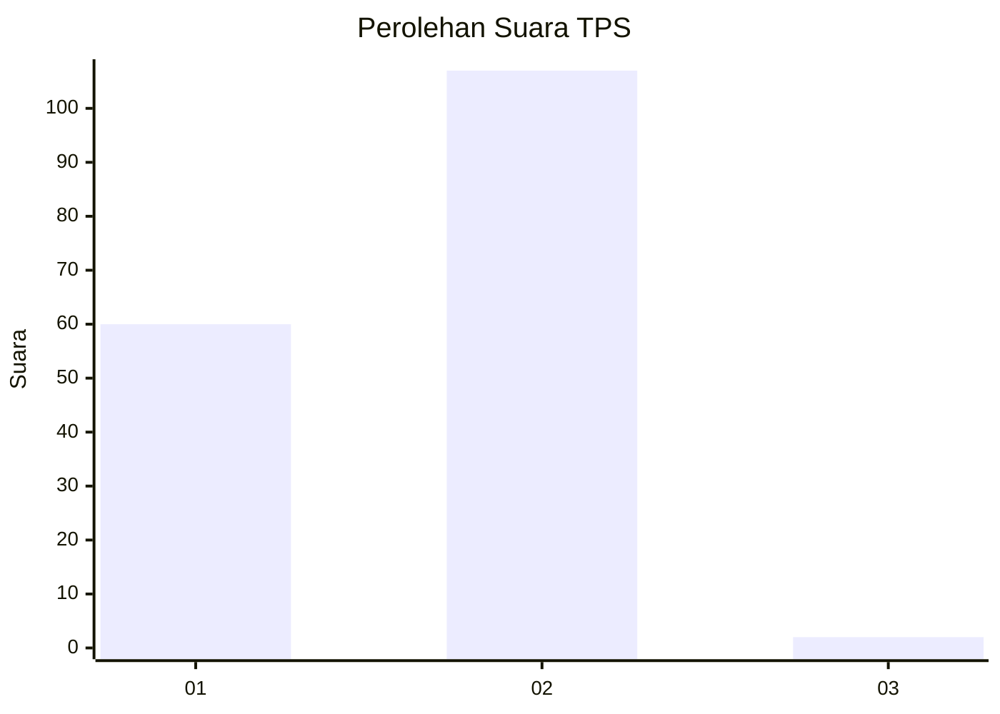
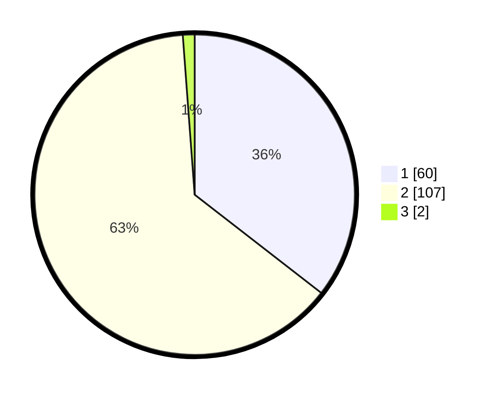

# Hasil

## Grafik

## Tabel

| No. | Nama Paslon    | Suara | Suara (raw) | Persentase |
|:--- |:-------------- | -----:| -----------:| ----------:|
| 1   | ANIES MUHAIMIN | 60    | [60][p-1]   | 35,50      |
| 2   | PRABOWO GIBRAN | 107   | [107][p-2]  | 63,31      |
| 3   | GANJAR MAHFUD  | 2     | [2][p-3]    | 1,18       |

[p-1]: https://github.com/gigit-pemilu/pemilu-2024-63-kalimantan-selatan/blob/main/pilpres/hitung-suara/sub/63-kalimantan-selatan/sub/05-tapin/sub/07-bakarangan/sub/2001-parigi-kecil/sub/001-tps/sub/paslon-1.txt
[p-2]: https://github.com/gigit-pemilu/pemilu-2024-63-kalimantan-selatan/blob/main/pilpres/hitung-suara/sub/63-kalimantan-selatan/sub/05-tapin/sub/07-bakarangan/sub/2001-parigi-kecil/sub/001-tps/sub/paslon-2.txt
[p-3]: https://github.com/gigit-pemilu/pemilu-2024-63-kalimantan-selatan/blob/main/pilpres/hitung-suara/sub/63-kalimantan-selatan/sub/05-tapin/sub/07-bakarangan/sub/2001-parigi-kecil/sub/001-tps/sub/paslon-3.txt

## Foto C Plano

https://sirekap-obj-formc.kpu.go.id/148e/pemilu/ppwp/63/05/07/20/01/6305072001001-20240214-141509--438a46ac-8444-4bcd-8fcb-0882462f944c.jpg

https://sirekap-obj-formc.kpu.go.id/148e/pemilu/ppwp/63/05/07/20/01/6305072001001-20240214-141809--7a8579ee-dbc7-460d-8027-a6905c3b78db.jpg

https://sirekap-obj-formc.kpu.go.id/148e/pemilu/ppwp/63/05/07/20/01/6305072001001-20240214-141916--27d55444-ddf9-480b-b6b3-2754c84dc6b3.jpg

## Metadata

| Key        | Value               |
| ---------- | ------------------- |
| Time Stamp | 2024-02-25 16:00:00 |

