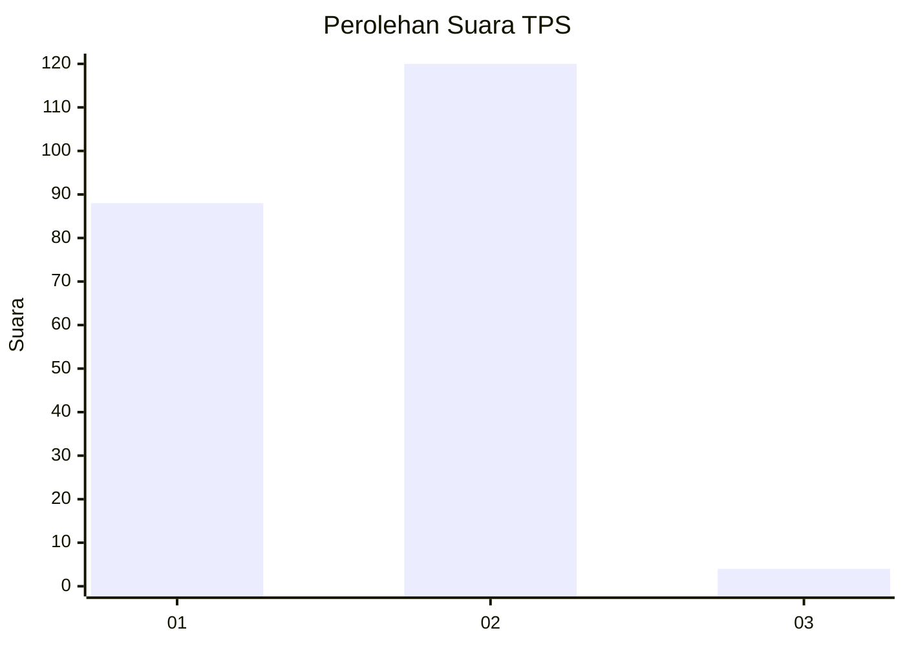
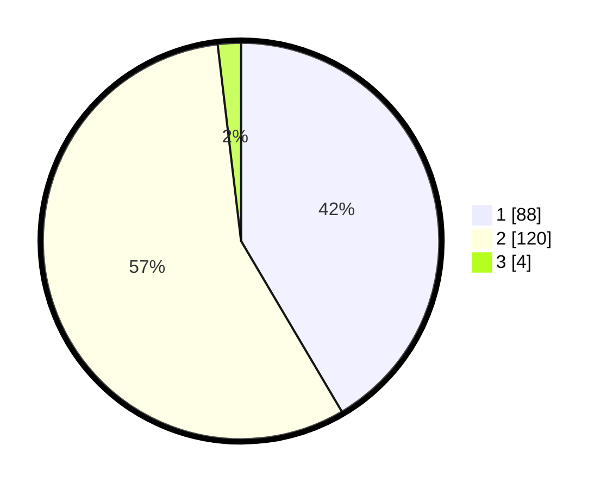

# Hasil

## Grafik

## Tabel

| No. | Nama Paslon    | Suara | Suara (raw) | Persentase |
|:--- |:-------------- | -----:| -----------:| ----------:|
| 1   | ANIES MUHAIMIN | 88    | [88][p-1]   | 41,51      |
| 2   | PRABOWO GIBRAN | 120   | [120][p-2]  | 56,60      |
| 3   | GANJAR MAHFUD  | 4     | [4][p-3]    | 1,89       |

[p-1]: https://github.com/gigit-pemilu/pemilu-2024-63-kalimantan-selatan/blob/main/pilpres/hitung-suara/sub/63-kalimantan-selatan/sub/05-tapin/sub/07-bakarangan/sub/2001-parigi-kecil/sub/002-tps/sub/paslon-1.txt
[p-2]: https://github.com/gigit-pemilu/pemilu-2024-63-kalimantan-selatan/blob/main/pilpres/hitung-suara/sub/63-kalimantan-selatan/sub/05-tapin/sub/07-bakarangan/sub/2001-parigi-kecil/sub/002-tps/sub/paslon-2.txt
[p-3]: https://github.com/gigit-pemilu/pemilu-2024-63-kalimantan-selatan/blob/main/pilpres/hitung-suara/sub/63-kalimantan-selatan/sub/05-tapin/sub/07-bakarangan/sub/2001-parigi-kecil/sub/002-tps/sub/paslon-3.txt

## Foto C Plano

https://sirekap-obj-formc.kpu.go.id/6edf/pemilu/ppwp/63/05/07/20/01/6305072001002-20240215-001111--ced6ed51-18c4-4124-967c-eaa553c4eac2.jpg

https://sirekap-obj-formc.kpu.go.id/6edf/pemilu/ppwp/63/05/07/20/01/6305072001002-20240215-001307--246b0394-52d6-42a5-b279-53f7c6a148ac.jpg

https://sirekap-obj-formc.kpu.go.id/6edf/pemilu/ppwp/63/05/07/20/01/6305072001002-20240215-001520--ade9514b-9425-44dd-9c1c-5cc8f02718a4.jpg

## Metadata

| Key        | Value               |
| ---------- | ------------------- |
| Time Stamp | 2024-02-22 10:00:00 |

