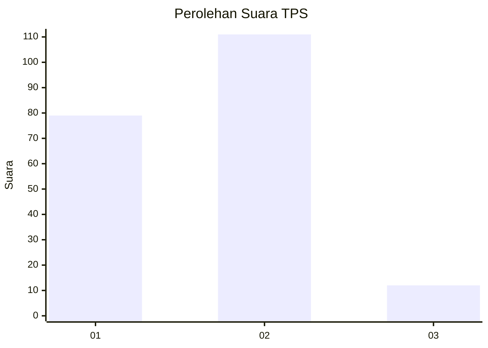

# Hasil

## Grafik

## Tabel

| No. | Nama Paslon    | Suara | Suara (raw) | Persentase |
|:--- |:-------------- | -----:| -----------:| ----------:|
| 1   | ANIES MUHAIMIN | 79    | [79][p-1]   | 39,11      |
| 2   | PRABOWO GIBRAN | 111   | [111][p-2]  | 54,95      |
| 3   | GANJAR MAHFUD  | 12    | [12][p-3]   | 5,94       |

[p-1]: https://github.com/gigit-pemilu/pemilu-2024/blob/main/pilpres/hitung-suara/sub/63-kalimantan-selatan/sub/05-tapin/sub/07-bakarangan/sub/2002-bakarangan/sub/003-tps/sub/paslon-1.txt
[p-2]: https://github.com/gigit-pemilu/pemilu-2024/blob/main/pilpres/hitung-suara/sub/63-kalimantan-selatan/sub/05-tapin/sub/07-bakarangan/sub/2002-bakarangan/sub/003-tps/sub/paslon-2.txt
[p-3]: https://github.com/gigit-pemilu/pemilu-2024/blob/main/pilpres/hitung-suara/sub/63-kalimantan-selatan/sub/05-tapin/sub/07-bakarangan/sub/2002-bakarangan/sub/003-tps/sub/paslon-3.txt

## Foto C Plano

https://sirekap-obj-formc.kpu.go.id/4ffb/pemilu/ppwp/63/05/07/20/02/6305072002003-20240214-211103--fe7bce8d-ed77-4a90-87f7-24f6d615e506.jpg

https://sirekap-obj-formc.kpu.go.id/4ffb/pemilu/ppwp/63/05/07/20/02/6305072002003-20240214-211444--bec1c5fd-7ab6-4023-b8ba-e9b73a3001ad.jpg

https://sirekap-obj-formc.kpu.go.id/4ffb/pemilu/ppwp/63/05/07/20/02/6305072002003-20240215-004513--87379fab-8014-46f6-9d68-3f843f0eac70.jpg

## Metadata

| Key        | Value               |
| ---------- | ------------------- |
| Time Stamp | 2024-02-15 15:00:29 |

