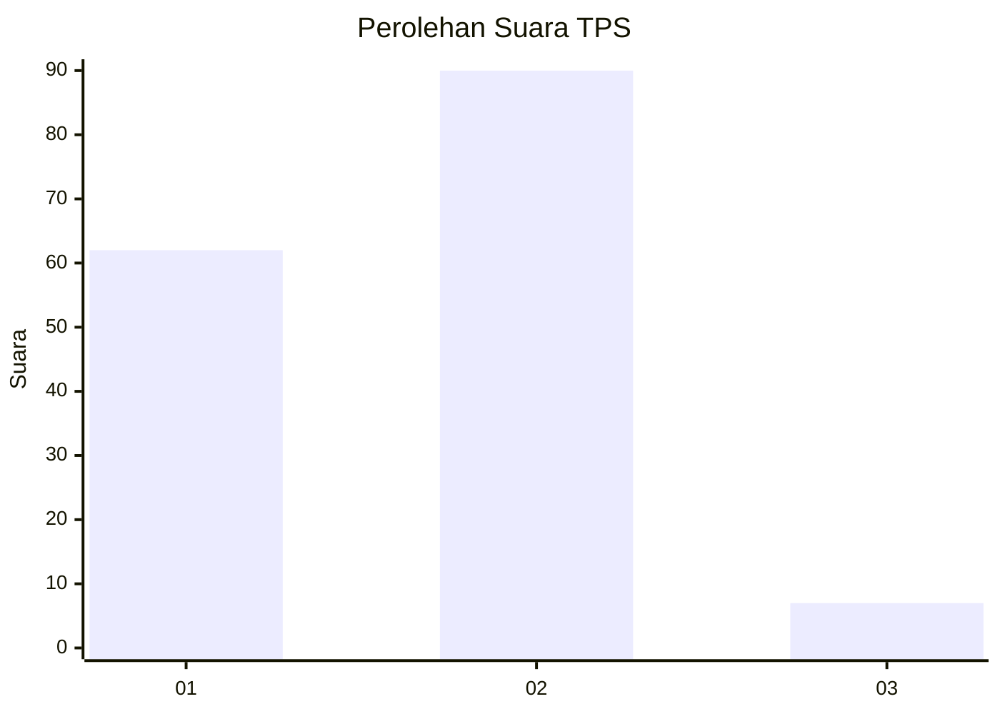
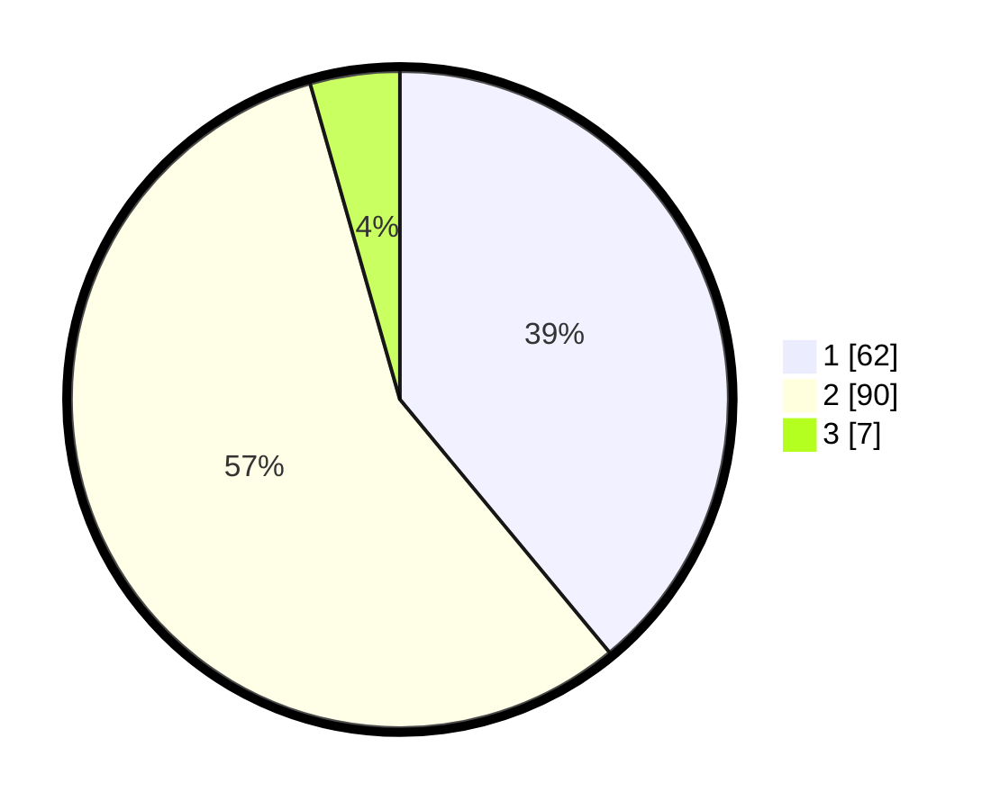

# Hasil

## Grafik

## Tabel

| No. | Nama Paslon    | Suara | Suara (raw) | Persentase |
|:--- |:-------------- | -----:| -----------:| ----------:|
| 1   | ANIES MUHAIMIN | 62    | [62][p-1]   | 38,99      |
| 2   | PRABOWO GIBRAN | 90    | [90][p-2]   | 56,60      |
| 3   | GANJAR MAHFUD  | 7     | [7][p-3]    | 4,40       |

[p-1]: https://github.com/gigit-pemilu/pemilu-2024/blob/main/pilpres/hitung-suara/sub/63-kalimantan-selatan/sub/05-tapin/sub/09-bungur/sub/2003-bungur/sub/003-tps/sub/paslon-1.txt
[p-2]: https://github.com/gigit-pemilu/pemilu-2024/blob/main/pilpres/hitung-suara/sub/63-kalimantan-selatan/sub/05-tapin/sub/09-bungur/sub/2003-bungur/sub/003-tps/sub/paslon-2.txt
[p-3]: https://github.com/gigit-pemilu/pemilu-2024/blob/main/pilpres/hitung-suara/sub/63-kalimantan-selatan/sub/05-tapin/sub/09-bungur/sub/2003-bungur/sub/003-tps/sub/paslon-3.txt

## Foto C Plano

https://sirekap-obj-formc.kpu.go.id/7219/pemilu/ppwp/63/05/09/20/03/6305092003003-20240221-135459--ce6ba43a-a308-4a10-a99d-065feb6e4655.jpg

https://sirekap-obj-formc.kpu.go.id/7219/pemilu/ppwp/63/05/09/20/03/6305092003003-20240221-135609--72b40530-9af5-414f-88c6-b0179381713b.jpg

https://sirekap-obj-formc.kpu.go.id/7219/pemilu/ppwp/63/05/09/20/03/6305092003003-20240221-135729--34c16728-d4ad-46da-bf47-44b01fa92f68.jpg

## Metadata

| Key        | Value               |
| ---------- | ------------------- |
| Time Stamp | 2024-02-21 14:00:00 |

## DATA PEMILIH TETAP

Jumlah pemilih dalam DPT: **325**.
 * L: **408**.
 * P: **44**.

## DATA PENGGUNA HAK PILIH

Jumlah pengguna hak pilih dalam DPT: **552**.
 * L: **870**.
 * P: **884**.

Jumlah pengguna hak pilih dalam DPTb: **354**.
 * L: **884**.
 * P: **888**.

Jumlah pengguna hak pilih dalam DPK: **855**.
 * L: **882**.
 * P: **884**.

Jumlah pengguna hak pilih: **772**.
 * L: **884**.
 * P: **828**.

## JUMLAH SUARA SAH DAN TIDAK SAH

JUMLAH SELURUH SUARA SAH: **55**.

JUMLAH SUARA TIDAK SAH: **87**.

JUMLAH SELURUH SUARA SAH DAN SUARA TIDAK SAH: **423**.

