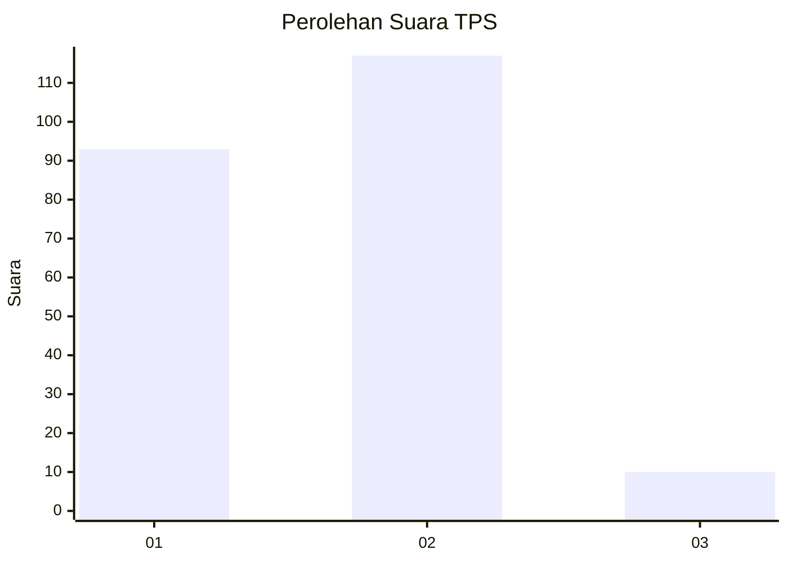
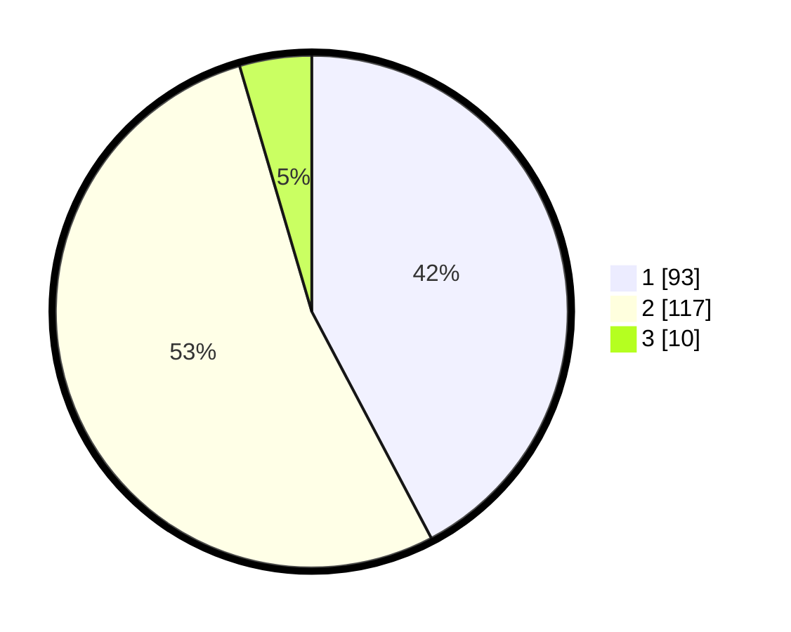

# Hasil

## Grafik

## Tabel

| No. | Nama Paslon    | Suara | Suara (raw) | Persentase |
|:--- |:-------------- | -----:| -----------:| ----------:|
| 1   | ANIES MUHAIMIN | 93    | [93][p-1]   | 42,27      |
| 2   | PRABOWO GIBRAN | 117   | [117][p-2]  | 53,18      |
| 3   | GANJAR MAHFUD  | 10    | [10][p-3]   | 4,55       |

[p-1]: https://github.com/gigit-pemilu/pemilu-2024-63-kalimantan-selatan/blob/main/pilpres/hitung-suara/sub/63-kalimantan-selatan/sub/05-tapin/sub/10-lokpaikat/sub/1007-bitahan/sub/002-tps/sub/paslon-1.txt
[p-2]: https://github.com/gigit-pemilu/pemilu-2024-63-kalimantan-selatan/blob/main/pilpres/hitung-suara/sub/63-kalimantan-selatan/sub/05-tapin/sub/10-lokpaikat/sub/1007-bitahan/sub/002-tps/sub/paslon-2.txt
[p-3]: https://github.com/gigit-pemilu/pemilu-2024-63-kalimantan-selatan/blob/main/pilpres/hitung-suara/sub/63-kalimantan-selatan/sub/05-tapin/sub/10-lokpaikat/sub/1007-bitahan/sub/002-tps/sub/paslon-3.txt

## Foto C Plano

https://sirekap-obj-formc.kpu.go.id/65ce/pemilu/ppwp/63/05/10/10/07/6305101007002-20240214-230823--8b0eff12-a246-43cc-838f-c84e63922659.jpg

https://sirekap-obj-formc.kpu.go.id/65ce/pemilu/ppwp/63/05/10/10/07/6305101007002-20240220-162052--7e434311-790b-4ac2-9459-a72ddd47db1d.jpg

https://sirekap-obj-formc.kpu.go.id/65ce/pemilu/ppwp/63/05/10/10/07/6305101007002-20240220-162309--e1a79d21-906e-4154-8b3b-c40eaf051e9b.jpg

## Metadata

| Key        | Value               |
| ---------- | ------------------- |
| Time Stamp | 2024-02-20 18:00:00 |

