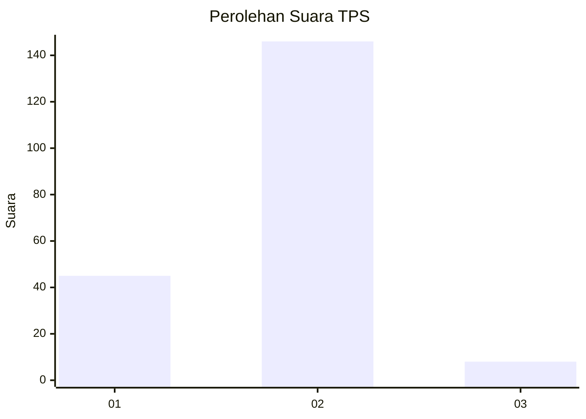

# Hasil

## Grafik

## Tabel

| No. | Nama Paslon    | Suara | Suara (raw) | Persentase |
|:--- |:-------------- | -----:| -----------:| ----------:|
| 1   | ANIES MUHAIMIN | 45    | [45][p-1]   | 22,61      |
| 2   | PRABOWO GIBRAN | 146   | [146][p-2]  | 73,37      |
| 3   | GANJAR MAHFUD  | 8     | [8][p-3]    | 4,02       |

[p-1]: https://github.com/gigit-pemilu/pemilu-2024-63-kalimantan-selatan/blob/main/pilpres/hitung-suara/sub/63-kalimantan-selatan/sub/05-tapin/sub/11-salam-babaris/sub/2001-salam-babaris/sub/004-tps/sub/paslon-1.txt
[p-2]: https://github.com/gigit-pemilu/pemilu-2024-63-kalimantan-selatan/blob/main/pilpres/hitung-suara/sub/63-kalimantan-selatan/sub/05-tapin/sub/11-salam-babaris/sub/2001-salam-babaris/sub/004-tps/sub/paslon-2.txt
[p-3]: https://github.com/gigit-pemilu/pemilu-2024-63-kalimantan-selatan/blob/main/pilpres/hitung-suara/sub/63-kalimantan-selatan/sub/05-tapin/sub/11-salam-babaris/sub/2001-salam-babaris/sub/004-tps/sub/paslon-3.txt

## Foto C Plano

https://sirekap-obj-formc.kpu.go.id/97cf/pemilu/ppwp/63/05/11/20/01/6305112001004-20240221-171109--697fe3b5-60da-4562-a43d-eb8d0f1ae000.jpg

https://sirekap-obj-formc.kpu.go.id/97cf/pemilu/ppwp/63/05/11/20/01/6305112001004-20240221-130439--b8b0a2d5-1a97-4c82-bdfe-e2d8109f8a1d.jpg

https://sirekap-obj-formc.kpu.go.id/97cf/pemilu/ppwp/63/05/11/20/01/6305112001004-20240221-130535--b92f134c-639a-40e1-8aac-f2cc605fde6d.jpg

## Metadata

| Key        | Value               |
| ---------- | ------------------- |
| Time Stamp | 2024-02-22 09:00:00 |

