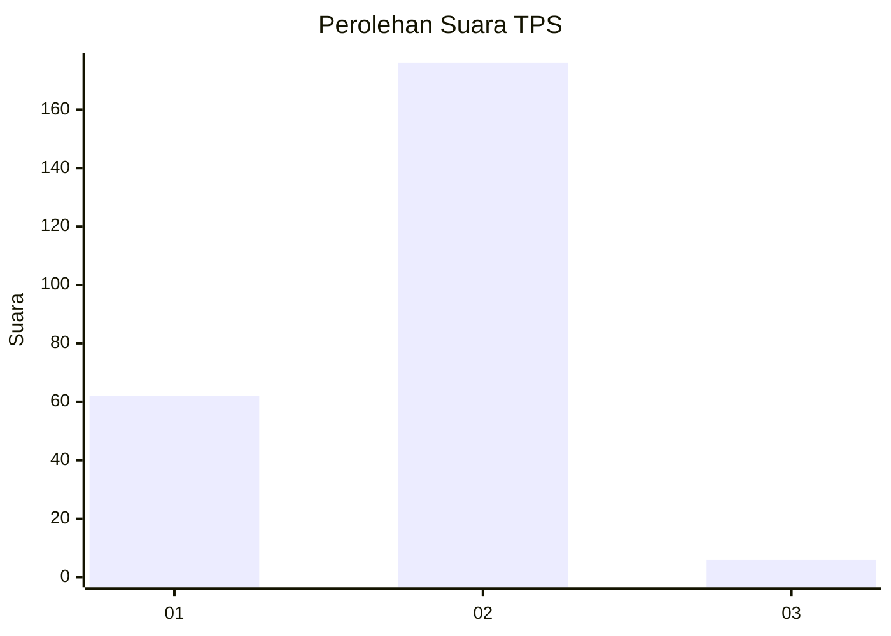
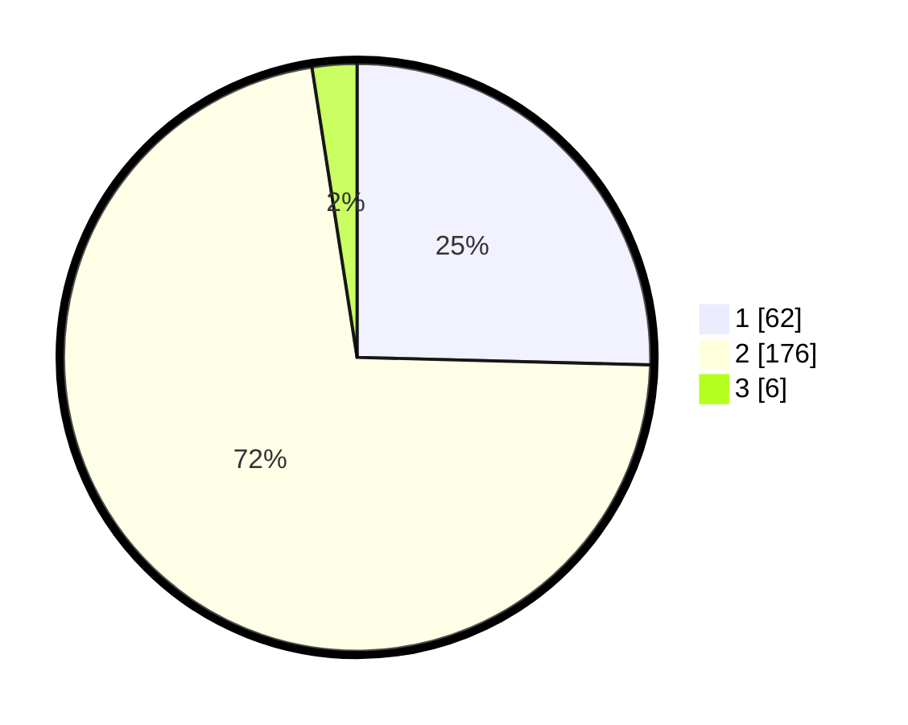

# Hasil

## Grafik

## Tabel

| No. | Nama Paslon    | Suara | Suara (raw) | Persentase |
|:--- |:-------------- | -----:| -----------:| ----------:|
| 1   | ANIES MUHAIMIN | 62    | [62][p-1]   | 25,41      |
| 2   | PRABOWO GIBRAN | 176   | [176][p-2]  | 72,13      |
| 3   | GANJAR MAHFUD  | 6     | [6][p-3]    | 2,46       |

[p-1]: https://github.com/gigit-pemilu/pemilu-2024-63-kalimantan-selatan/blob/main/pilpres/hitung-suara/sub/63-kalimantan-selatan/sub/05-tapin/sub/11-salam-babaris/sub/2001-salam-babaris/sub/006-tps/sub/paslon-1.txt
[p-2]: https://github.com/gigit-pemilu/pemilu-2024-63-kalimantan-selatan/blob/main/pilpres/hitung-suara/sub/63-kalimantan-selatan/sub/05-tapin/sub/11-salam-babaris/sub/2001-salam-babaris/sub/006-tps/sub/paslon-2.txt
[p-3]: https://github.com/gigit-pemilu/pemilu-2024-63-kalimantan-selatan/blob/main/pilpres/hitung-suara/sub/63-kalimantan-selatan/sub/05-tapin/sub/11-salam-babaris/sub/2001-salam-babaris/sub/006-tps/sub/paslon-3.txt

## Foto C Plano

https://sirekap-obj-formc.kpu.go.id/94b1/pemilu/ppwp/63/05/11/20/01/6305112001006-20240214-221216--62ab2fcc-1129-4d95-a191-102d7eb87a42.jpg

https://sirekap-obj-formc.kpu.go.id/94b1/pemilu/ppwp/63/05/11/20/01/6305112001006-20240214-221445--f05d8de6-11cf-47d0-a4fc-b14681636870.jpg

https://sirekap-obj-formc.kpu.go.id/94b1/pemilu/ppwp/63/05/11/20/01/6305112001006-20240214-221701--6d3979a5-7f53-4adb-89fe-828623f62be7.jpg

## Metadata

| Key        | Value               |
| ---------- | ------------------- |
| Time Stamp | 2024-02-25 12:00:00 |

