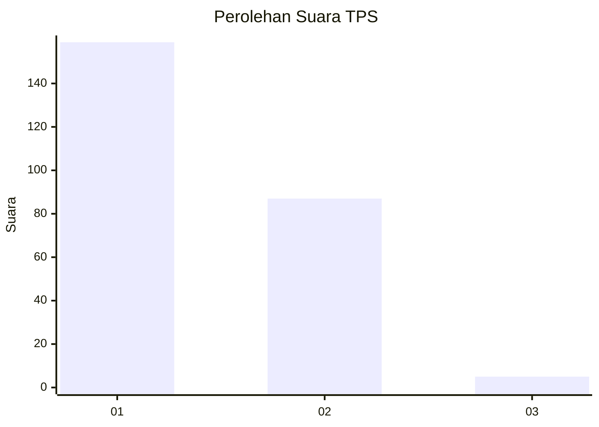
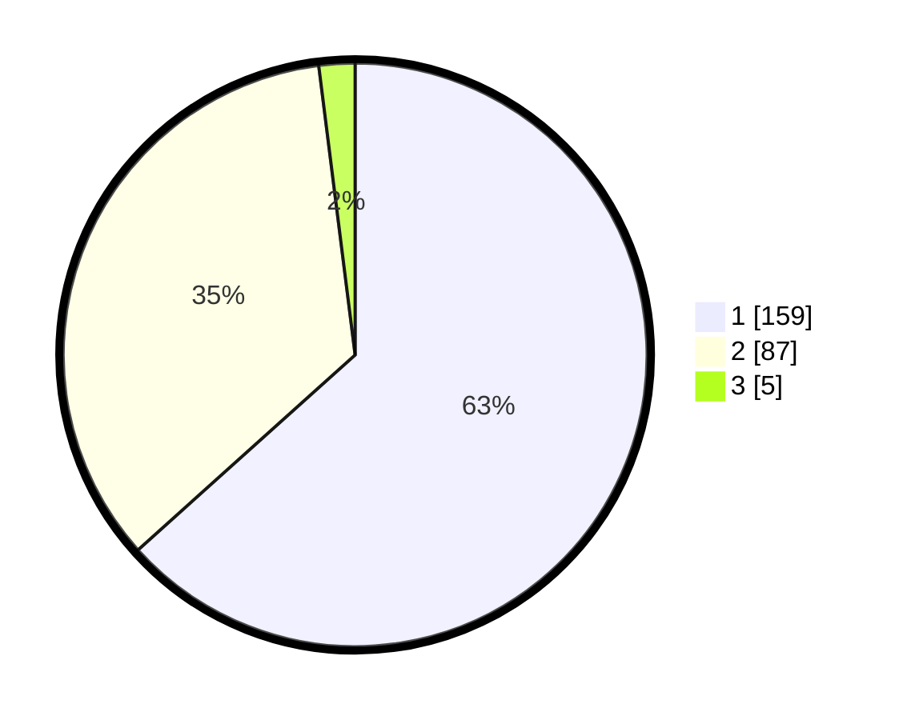

# Hasil

## Grafik

## Tabel

| No. | Nama Paslon    | Suara | Suara (raw) | Persentase |
|:--- |:-------------- | -----:| -----------:| ----------:|
| 1   | ANIES MUHAIMIN | 159   | [159][p-1]  | 63,35      |
| 2   | PRABOWO GIBRAN | 87    | [87][p-2]   | 34,66      |
| 3   | GANJAR MAHFUD  | 5     | [5][p-3]    | 1,99       |

[p-1]: https://github.com/gigit-pemilu/pemilu-2024/blob/main/pilpres/hitung-suara/sub/63-kalimantan-selatan/sub/06-hulu-sungai-selatan/sub/02-padang-batung/sub/2009-jembatan-merah/sub/002-tps/sub/paslon-1.txt
[p-2]: https://github.com/gigit-pemilu/pemilu-2024/blob/main/pilpres/hitung-suara/sub/63-kalimantan-selatan/sub/06-hulu-sungai-selatan/sub/02-padang-batung/sub/2009-jembatan-merah/sub/002-tps/sub/paslon-2.txt
[p-3]: https://github.com/gigit-pemilu/pemilu-2024/blob/main/pilpres/hitung-suara/sub/63-kalimantan-selatan/sub/06-hulu-sungai-selatan/sub/02-padang-batung/sub/2009-jembatan-merah/sub/002-tps/sub/paslon-3.txt

## Foto C Plano

https://sirekap-obj-formc.kpu.go.id/9895/pemilu/ppwp/63/06/02/20/09/6306022009002-20240214-213708--149b03cc-d7f4-4c08-99dd-84bbf3eda827.jpg

https://sirekap-obj-formc.kpu.go.id/9895/pemilu/ppwp/63/06/02/20/09/6306022009002-20240215-042137--7fbde771-3c47-4340-a10a-aade7fdc2677.jpg

https://sirekap-obj-formc.kpu.go.id/9895/pemilu/ppwp/63/06/02/20/09/6306022009002-20240214-214054--28a84869-c7d7-482b-84df-27f9ca78eeb9.jpg

## Metadata

| Key        | Value               |
| ---------- | ------------------- |
| Time Stamp | 2024-02-15 15:00:29 |

