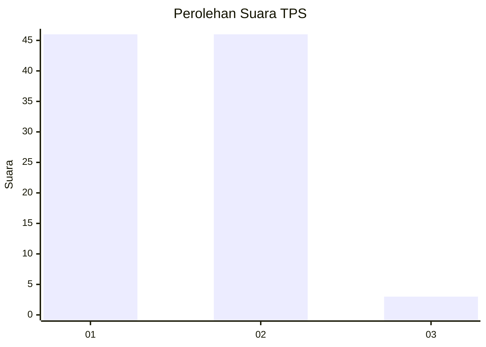
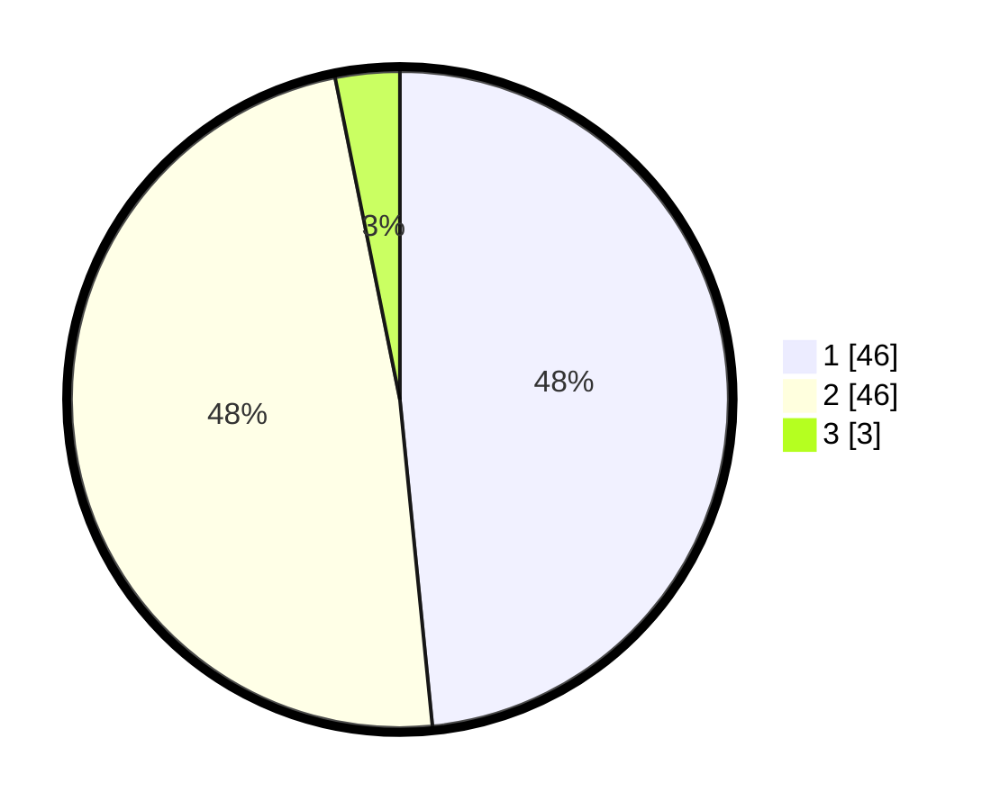

# Hasil

## Grafik

## Tabel

| No. | Nama Paslon    | Suara | Suara (raw) | Persentase |
|:--- |:-------------- | -----:| -----------:| ----------:|
| 1   | ANIES MUHAIMIN | 46    | [46][p-1]   | 48,42      |
| 2   | PRABOWO GIBRAN | 46    | [46][p-2]   | 48,42      |
| 3   | GANJAR MAHFUD  | 3     | [3][p-3]    | 3,16       |

[p-1]: https://github.com/gigit-pemilu/pemilu-2024-63-kalimantan-selatan/blob/main/pilpres/hitung-suara/sub/63-kalimantan-selatan/sub/06-hulu-sungai-selatan/sub/07-daha-selatan/sub/2007-pihanin-raya/sub/003-tps/sub/paslon-1.txt
[p-2]: https://github.com/gigit-pemilu/pemilu-2024-63-kalimantan-selatan/blob/main/pilpres/hitung-suara/sub/63-kalimantan-selatan/sub/06-hulu-sungai-selatan/sub/07-daha-selatan/sub/2007-pihanin-raya/sub/003-tps/sub/paslon-2.txt
[p-3]: https://github.com/gigit-pemilu/pemilu-2024-63-kalimantan-selatan/blob/main/pilpres/hitung-suara/sub/63-kalimantan-selatan/sub/06-hulu-sungai-selatan/sub/07-daha-selatan/sub/2007-pihanin-raya/sub/003-tps/sub/paslon-3.txt

## Foto C Plano

https://sirekap-obj-formc.kpu.go.id/98bd/pemilu/ppwp/63/06/07/20/07/6306072007003-20240214-221406--7d4fe15a-765b-4cfe-8697-2ac252fd0bd5.jpg

https://sirekap-obj-formc.kpu.go.id/98bd/pemilu/ppwp/63/06/07/20/07/6306072007003-20240214-221718--57dbb12a-3d0e-46dd-80e8-b7893d7dc45a.jpg

https://sirekap-obj-formc.kpu.go.id/98bd/pemilu/ppwp/63/06/07/20/07/6306072007003-20240215-045146--e29ecedf-9527-43ad-b2eb-cde71cd8f7d2.jpg

## Metadata

| Key        | Value               |
| ---------- | ------------------- |
| Time Stamp | 2024-02-15 16:00:26 |

