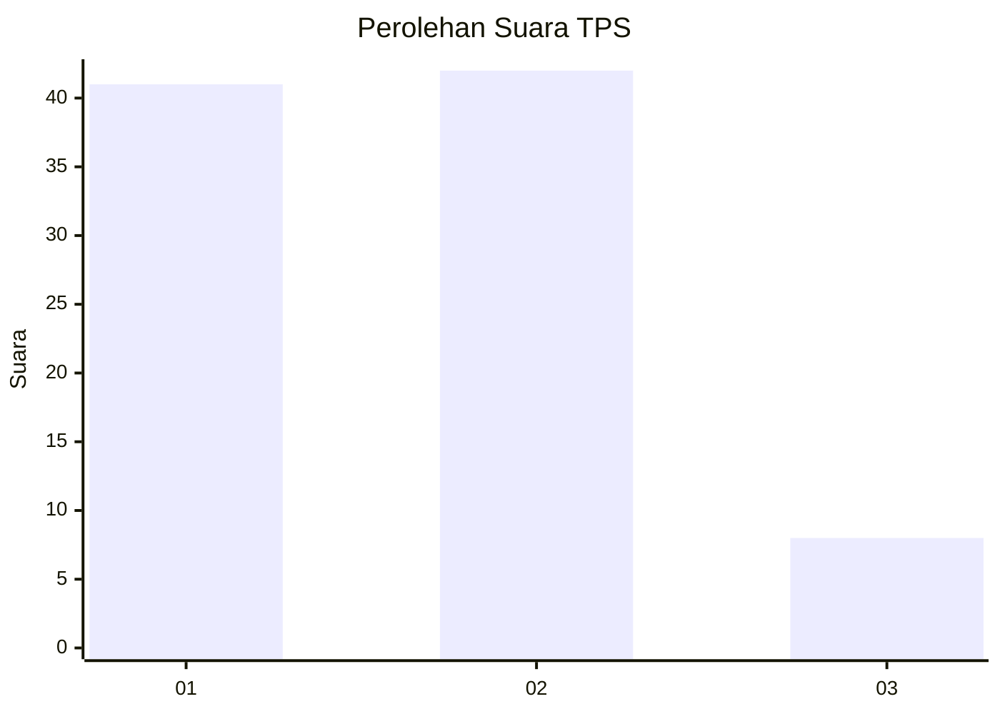
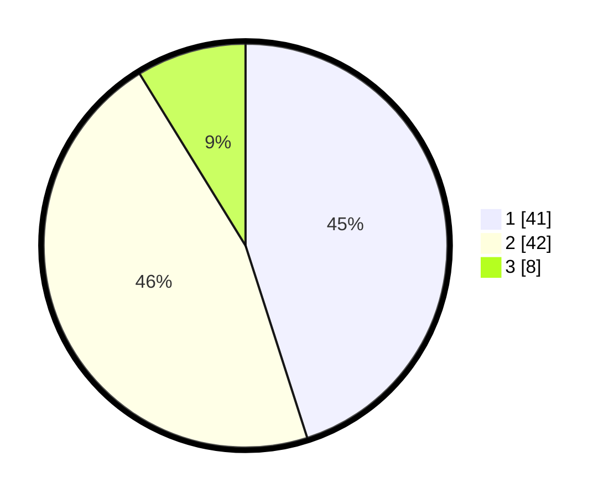

# Hasil

## Grafik

## Tabel

| No. | Nama Paslon    | Suara | Suara (raw) | Persentase |
|:--- |:-------------- | -----:| -----------:| ----------:|
| 1   | ANIES MUHAIMIN | 41    | [41][p-1]   | 45,05      |
| 2   | PRABOWO GIBRAN | 42    | [42][p-2]   | 46,15      |
| 3   | GANJAR MAHFUD  | 8     | [8][p-3]    | 8,79       |

[p-1]: https://github.com/gigit-pemilu/pemilu-2024-63-kalimantan-selatan/blob/main/pilpres/hitung-suara/sub/63-kalimantan-selatan/sub/06-hulu-sungai-selatan/sub/09-kalumpang/sub/2002-karang-paci/sub/002-tps/sub/paslon-1.txt
[p-2]: https://github.com/gigit-pemilu/pemilu-2024-63-kalimantan-selatan/blob/main/pilpres/hitung-suara/sub/63-kalimantan-selatan/sub/06-hulu-sungai-selatan/sub/09-kalumpang/sub/2002-karang-paci/sub/002-tps/sub/paslon-2.txt
[p-3]: https://github.com/gigit-pemilu/pemilu-2024-63-kalimantan-selatan/blob/main/pilpres/hitung-suara/sub/63-kalimantan-selatan/sub/06-hulu-sungai-selatan/sub/09-kalumpang/sub/2002-karang-paci/sub/002-tps/sub/paslon-3.txt

## Foto C Plano

https://sirekap-obj-formc.kpu.go.id/7df7/pemilu/ppwp/63/06/09/20/02/6306092002002-20240215-011426--8258fdcb-abb9-4055-863a-a581ffe037b9.jpg

https://sirekap-obj-formc.kpu.go.id/7df7/pemilu/ppwp/63/06/09/20/02/6306092002002-20240216-102003--6088e630-d716-4121-8f92-a7d7bff3fbdf.jpg

https://sirekap-obj-formc.kpu.go.id/7df7/pemilu/ppwp/63/06/09/20/02/6306092002002-20240216-102001--e806bccc-a288-4aa7-8782-0f427402b117.jpg

## Metadata

| Key        | Value               |
| ---------- | ------------------- |
| Time Stamp | 2024-02-16 21:01:00 |

