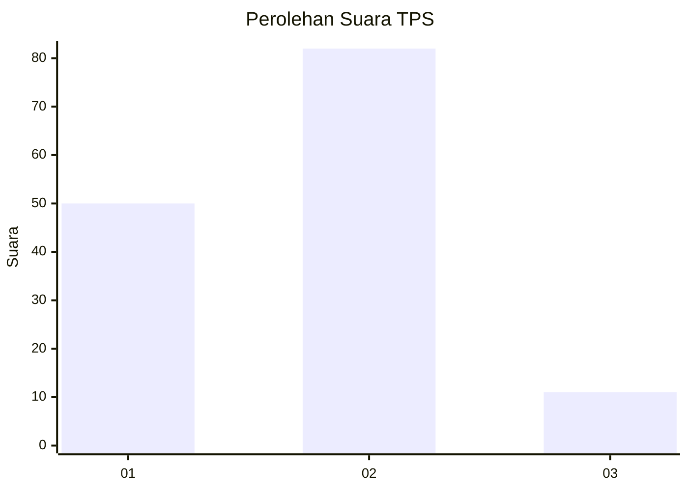
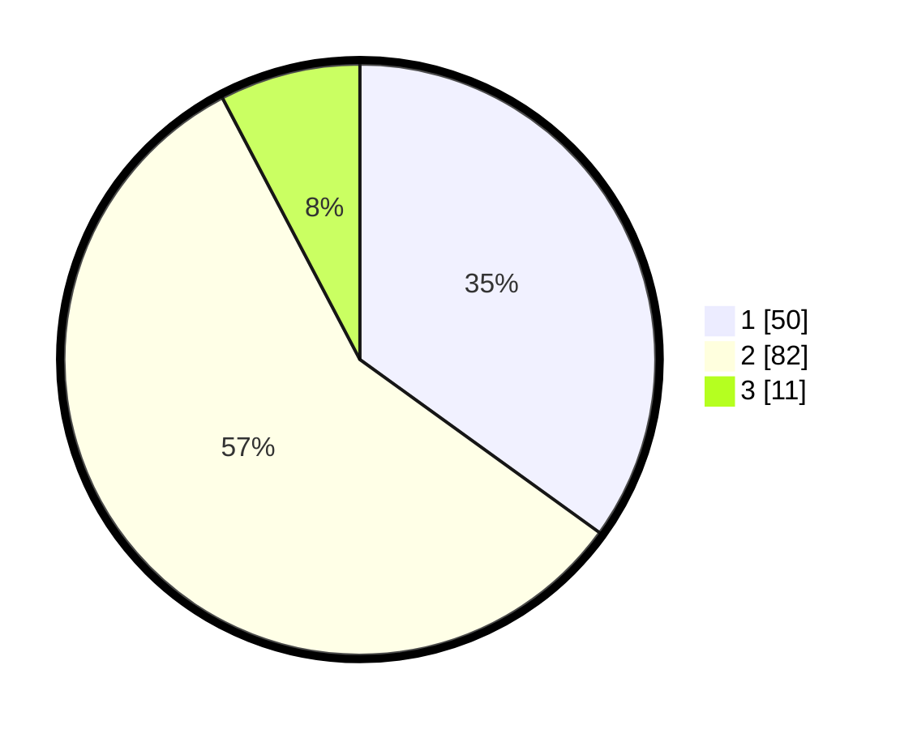

# Hasil

## Grafik

## Tabel

| No. | Nama Paslon    | Suara | Suara (raw) | Persentase |
|:--- |:-------------- | -----:| -----------:| ----------:|
| 1   | ANIES MUHAIMIN | 50    | [50][p-1]   | 34,97      |
| 2   | PRABOWO GIBRAN | 82    | [82][p-2]   | 57,34      |
| 3   | GANJAR MAHFUD  | 11    | [11][p-3]   | 7,69       |

[p-1]: https://github.com/gigit-pemilu/pemilu-2024/blob/main/pilpres/hitung-suara/sub/63-kalimantan-selatan/sub/06-hulu-sungai-selatan/sub/10-loksado/sub/2001-halunuk/sub/001-tps/sub/paslon-1.txt
[p-2]: https://github.com/gigit-pemilu/pemilu-2024/blob/main/pilpres/hitung-suara/sub/63-kalimantan-selatan/sub/06-hulu-sungai-selatan/sub/10-loksado/sub/2001-halunuk/sub/001-tps/sub/paslon-2.txt
[p-3]: https://github.com/gigit-pemilu/pemilu-2024/blob/main/pilpres/hitung-suara/sub/63-kalimantan-selatan/sub/06-hulu-sungai-selatan/sub/10-loksado/sub/2001-halunuk/sub/001-tps/sub/paslon-3.txt

## Foto C Plano

https://sirekap-obj-formc.kpu.go.id/bd92/pemilu/ppwp/63/06/10/20/01/6306102001001-20240217-143339--3602323e-cc75-4f9f-a0dc-e1affc13453f.jpg

https://sirekap-obj-formc.kpu.go.id/bd92/pemilu/ppwp/63/06/10/20/01/6306102001001-20240214-141832--a209ada2-5646-47fb-a965-4ee67921dd39.jpg

https://sirekap-obj-formc.kpu.go.id/bd92/pemilu/ppwp/63/06/10/20/01/6306102001001-20240217-144341--938ff4f8-0e1b-4a11-9813-c374ffbeee08.jpg

## Metadata

| Key        | Value               |
| ---------- | ------------------- |
| Time Stamp | 2024-02-17 14:45:18 |

