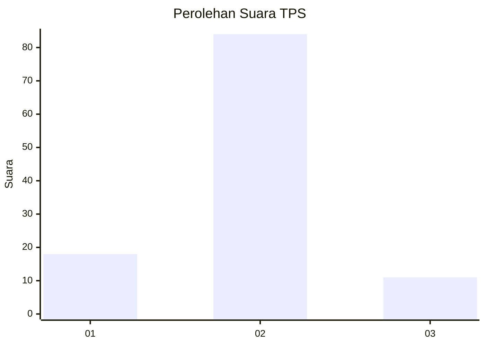
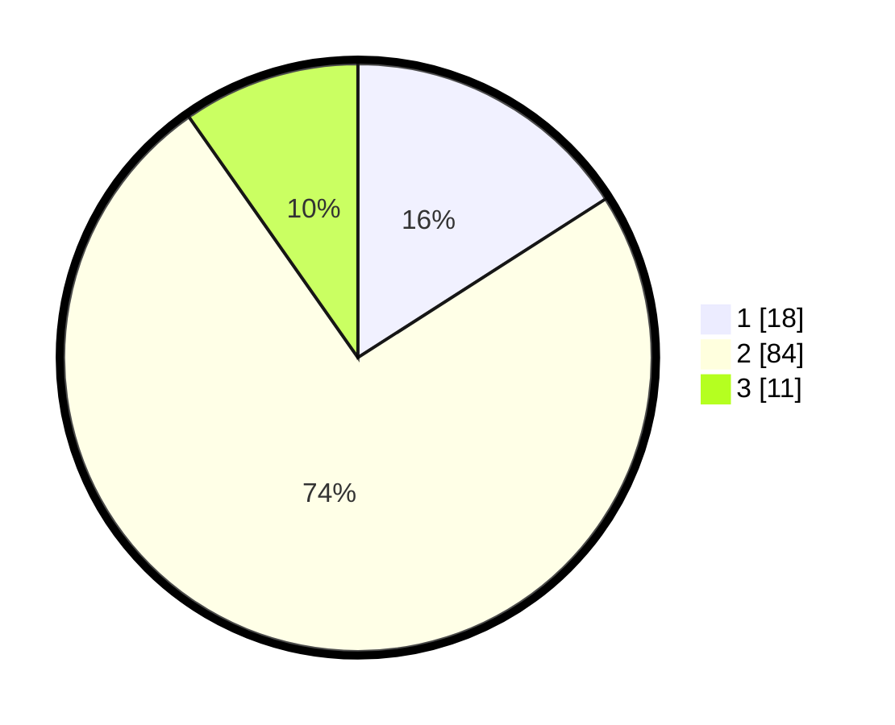

# Hasil

## Grafik

## Tabel

| No. | Nama Paslon    | Suara | Suara (raw) | Persentase |
|:--- |:-------------- | -----:| -----------:| ----------:|
| 1   | ANIES MUHAIMIN | 18    | [18][p-1]   | 15,93      |
| 2   | PRABOWO GIBRAN | 84    | [84][p-2]   | 74,34      |
| 3   | GANJAR MAHFUD  | 11    | [11][p-3]   | 9,73       |

[p-1]: https://github.com/gigit-pemilu/pemilu-2024/blob/main/pilpres/hitung-suara/sub/63-kalimantan-selatan/sub/06-hulu-sungai-selatan/sub/10-loksado/sub/2003-lumpangi/sub/004-tps/sub/paslon-1.txt
[p-2]: https://github.com/gigit-pemilu/pemilu-2024/blob/main/pilpres/hitung-suara/sub/63-kalimantan-selatan/sub/06-hulu-sungai-selatan/sub/10-loksado/sub/2003-lumpangi/sub/004-tps/sub/paslon-2.txt
[p-3]: https://github.com/gigit-pemilu/pemilu-2024/blob/main/pilpres/hitung-suara/sub/63-kalimantan-selatan/sub/06-hulu-sungai-selatan/sub/10-loksado/sub/2003-lumpangi/sub/004-tps/sub/paslon-3.txt

## Foto C Plano

https://sirekap-obj-formc.kpu.go.id/9e26/pemilu/ppwp/63/06/10/20/03/6306102003004-20240214-215758--e91e065a-cb2e-4ac2-8b3e-8c8bea795385.jpg

https://sirekap-obj-formc.kpu.go.id/9e26/pemilu/ppwp/63/06/10/20/03/6306102003004-20240215-085828--9aa762d1-cdf3-4aa1-bab1-2f676bf61094.jpg

https://sirekap-obj-formc.kpu.go.id/9e26/pemilu/ppwp/63/06/10/20/03/6306102003004-20240216-214504--e25148b6-7f88-4947-9766-82a4feba8c15.jpg

## Metadata

| Key        | Value               |
| ---------- | ------------------- |
| Time Stamp | 2024-02-16 23:30:00 |

