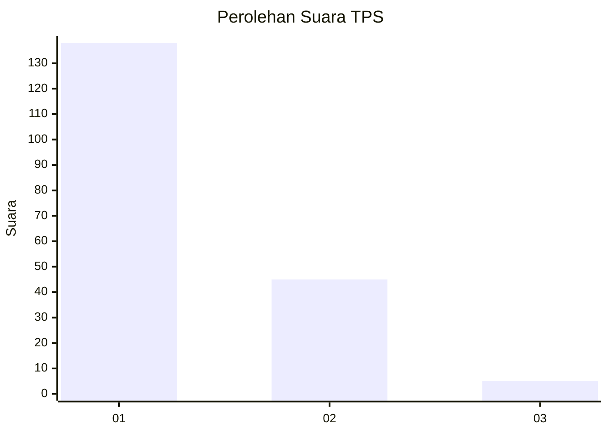
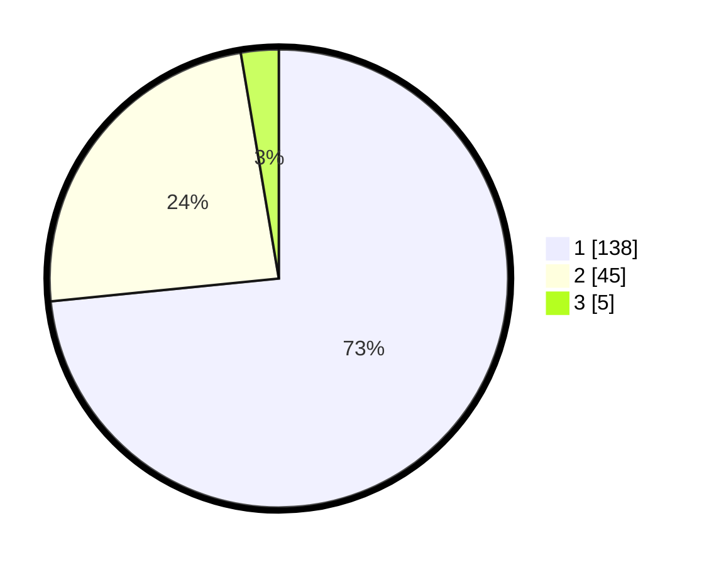

# Hasil

## Grafik

## Tabel

| No. | Nama Paslon    | Suara | Suara (raw) | Persentase |
|:--- |:-------------- | -----:| -----------:| ----------:|
| 1   | ANIES MUHAIMIN | 138   | [138][p-1]  | 73,40      |
| 2   | PRABOWO GIBRAN | 45    | [45][p-2]   | 23,94      |
| 3   | GANJAR MAHFUD  | 5     | [5][p-3]    | 2,66       |

[p-1]: https://github.com/gigit-pemilu/pemilu-2024/blob/main/pilpres/hitung-suara/sub/63-kalimantan-selatan/sub/07-hulu-sungai-tengah/sub/02-batu-benawa/sub/2010-aluan-mati/sub/002-tps/sub/paslon-1.txt
[p-2]: https://github.com/gigit-pemilu/pemilu-2024/blob/main/pilpres/hitung-suara/sub/63-kalimantan-selatan/sub/07-hulu-sungai-tengah/sub/02-batu-benawa/sub/2010-aluan-mati/sub/002-tps/sub/paslon-2.txt
[p-3]: https://github.com/gigit-pemilu/pemilu-2024/blob/main/pilpres/hitung-suara/sub/63-kalimantan-selatan/sub/07-hulu-sungai-tengah/sub/02-batu-benawa/sub/2010-aluan-mati/sub/002-tps/sub/paslon-3.txt

## Foto C Plano

https://sirekap-obj-formc.kpu.go.id/296f/pemilu/ppwp/63/07/02/20/10/6307022010002-20240219-222831--45dcecfb-7e05-4034-833f-1f723b61cc93.jpg

https://sirekap-obj-formc.kpu.go.id/296f/pemilu/ppwp/63/07/02/20/10/6307022010002-20240215-090838--a938dedd-10f5-4772-bbce-dc7e72f97777.jpg

https://sirekap-obj-formc.kpu.go.id/296f/pemilu/ppwp/63/07/02/20/10/6307022010002-20240215-091012--3b0eac33-73e6-4fff-928e-9b379851fe05.jpg

## Metadata

| Key        | Value               |
| ---------- | ------------------- |
| Time Stamp | 2024-02-19 23:00:00 |

