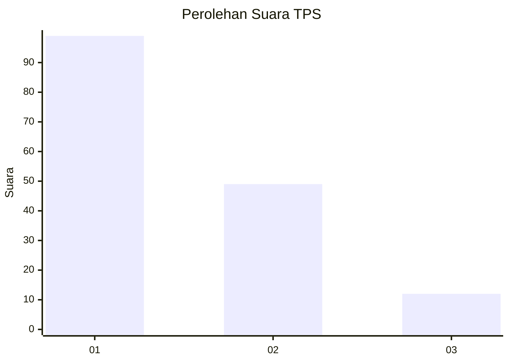
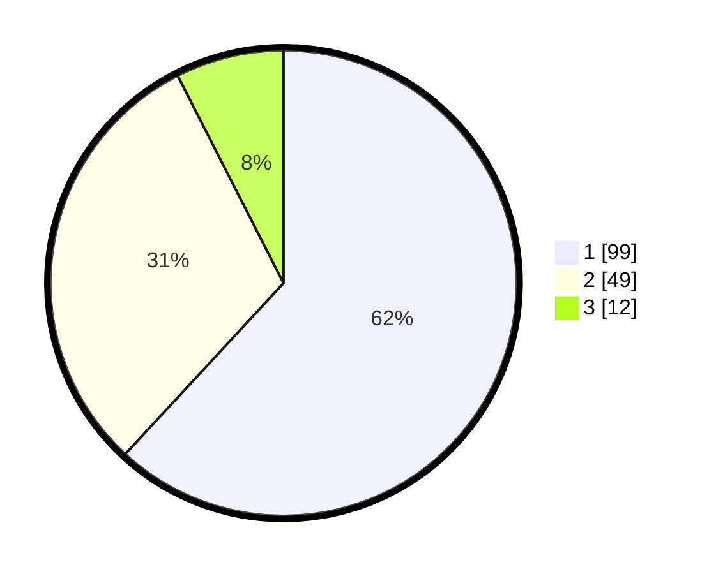

# Hasil

## Grafik

## Tabel

| No. | Nama Paslon    | Suara | Suara (raw) | Persentase |
|:--- |:-------------- | -----:| -----------:| ----------:|
| 1   | ANIES MUHAIMIN | 99    | [99][p-1]   | 61,88      |
| 2   | PRABOWO GIBRAN | 49    | [49][p-2]   | 30,63      |
| 3   | GANJAR MAHFUD  | 12    | [12][p-3]   | 7,50       |

[p-1]: https://github.com/gigit-pemilu/pemilu-2024/blob/main/pilpres/hitung-suara/sub/63-kalimantan-selatan/sub/07-hulu-sungai-tengah/sub/10-batang-alai-timur/sub/2001-batu-tangga/sub/003-tps/sub/paslon-1.txt
[p-2]: https://github.com/gigit-pemilu/pemilu-2024/blob/main/pilpres/hitung-suara/sub/63-kalimantan-selatan/sub/07-hulu-sungai-tengah/sub/10-batang-alai-timur/sub/2001-batu-tangga/sub/003-tps/sub/paslon-2.txt
[p-3]: https://github.com/gigit-pemilu/pemilu-2024/blob/main/pilpres/hitung-suara/sub/63-kalimantan-selatan/sub/07-hulu-sungai-tengah/sub/10-batang-alai-timur/sub/2001-batu-tangga/sub/003-tps/sub/paslon-3.txt

## Foto C Plano

https://sirekap-obj-formc.kpu.go.id/fffe/pemilu/ppwp/63/07/10/20/01/6307102001003-20240214-204400--a857443b-dbf6-4826-94a2-73bc079e161e.jpg

https://sirekap-obj-formc.kpu.go.id/fffe/pemilu/ppwp/63/07/10/20/01/6307102001003-20240214-204552--b7a2bd0a-b4e3-464c-b1dd-c2be6274cb94.jpg

https://sirekap-obj-formc.kpu.go.id/fffe/pemilu/ppwp/63/07/10/20/01/6307102001003-20240214-204722--d46b2cb4-fffc-4672-892b-551dfcdba51f.jpg

## Metadata

| Key        | Value               |
| ---------- | ------------------- |
| Time Stamp | 2024-02-15 00:41:44 |

