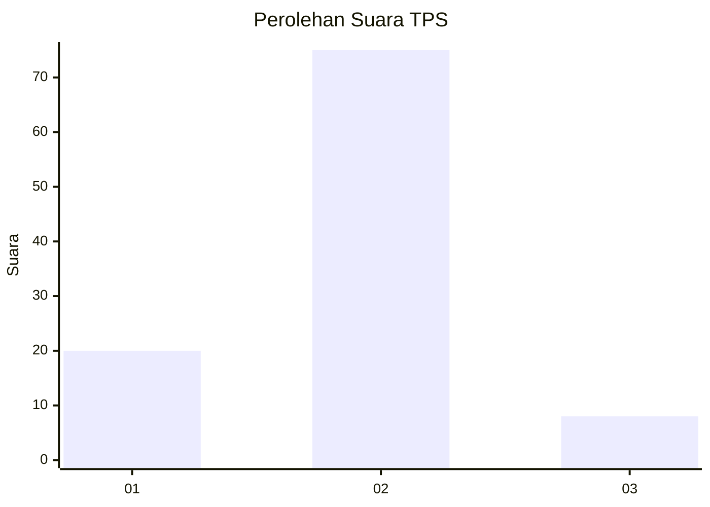
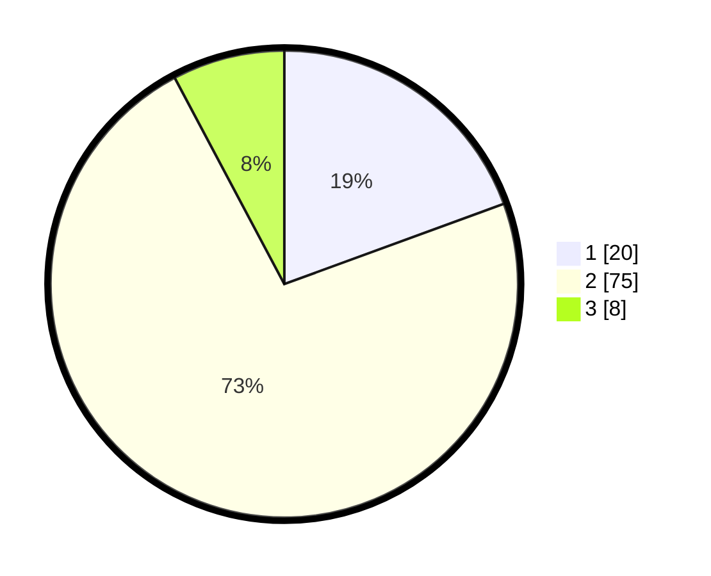

# Hasil

## Grafik

## Tabel

| No. | Nama Paslon    | Suara | Suara (raw) | Persentase |
|:--- |:-------------- | -----:| -----------:| ----------:|
| 1   | ANIES MUHAIMIN | 20    | [20][p-1]   | 19,42      |
| 2   | PRABOWO GIBRAN | 75    | [75][p-2]   | 72,82      |
| 3   | GANJAR MAHFUD  | 8     | [8][p-3]    | 7,77       |

[p-1]: https://github.com/gigit-pemilu/pemilu-2024/blob/main/pilpres/hitung-suara/sub/63-kalimantan-selatan/sub/07-hulu-sungai-tengah/sub/10-batang-alai-timur/sub/2003-pembakulan/sub/002-tps/sub/paslon-1.txt
[p-2]: https://github.com/gigit-pemilu/pemilu-2024/blob/main/pilpres/hitung-suara/sub/63-kalimantan-selatan/sub/07-hulu-sungai-tengah/sub/10-batang-alai-timur/sub/2003-pembakulan/sub/002-tps/sub/paslon-2.txt
[p-3]: https://github.com/gigit-pemilu/pemilu-2024/blob/main/pilpres/hitung-suara/sub/63-kalimantan-selatan/sub/07-hulu-sungai-tengah/sub/10-batang-alai-timur/sub/2003-pembakulan/sub/002-tps/sub/paslon-3.txt

## Foto C Plano

https://sirekap-obj-formc.kpu.go.id/d561/pemilu/ppwp/63/07/10/20/03/6307102003002-20240217-232127--9a684690-aa7a-4c39-b32b-dfa6b2ed990e.jpg

https://sirekap-obj-formc.kpu.go.id/d561/pemilu/ppwp/63/07/10/20/03/6307102003002-20240217-232145--09e3f76b-5d9e-4a60-b34a-1f7ae62175d8.jpg

https://sirekap-obj-formc.kpu.go.id/d561/pemilu/ppwp/63/07/10/20/03/6307102003002-20240217-232200--b8ed354f-8d97-4db6-9319-a06c608acc1d.jpg

## Metadata

| Key        | Value               |
| ---------- | ------------------- |
| Time Stamp | 2024-02-19 06:16:00 |

## DATA PEMILIH TETAP

Jumlah pemilih dalam DPT: **155**.
 * L: **33**.
 * P: **77**.

## DATA PENGGUNA HAK PILIH

Jumlah pengguna hak pilih dalam DPT: **101**.
 * L: **245**.
 * P: **33**.

Jumlah pengguna hak pilih dalam DPTb: **520**.
 * L: **0**.
 * P: **520**.

Jumlah pengguna hak pilih dalam DPK: **2**.
 * L: **500**.
 * P: **525**.

Jumlah pengguna hak pilih: **131**.
 * L: **48**.
 * P: **33**.

## JUMLAH SUARA SAH DAN TIDAK SAH

JUMLAH SELURUH SUARA SAH: **893**.

JUMLAH SUARA TIDAK SAH: **883**.

JUMLAH SELURUH SUARA SAH DAN SUARA TIDAK SAH: **601**.

