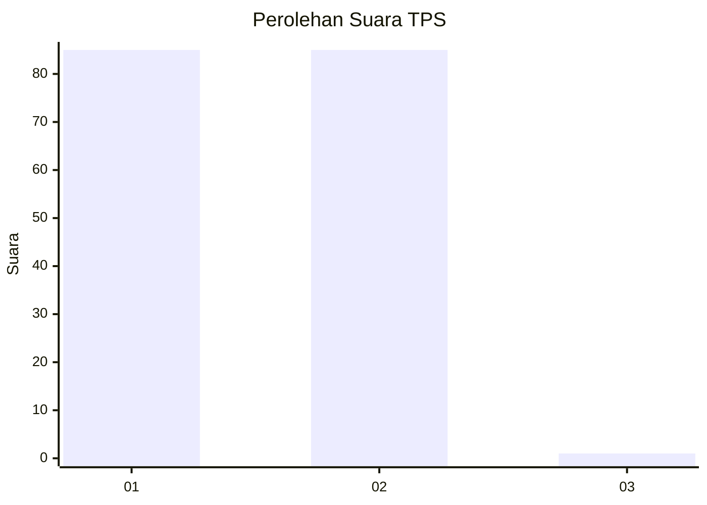
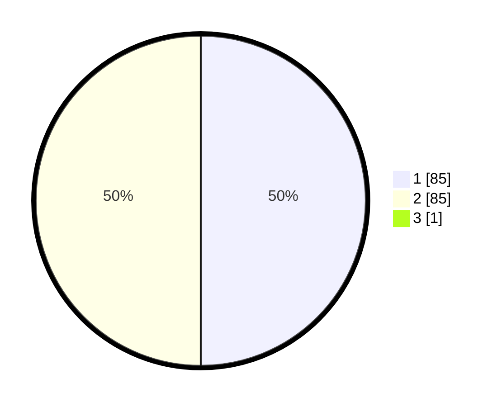

# Hasil

## Grafik

## Tabel

| No. | Nama Paslon    | Suara | Suara (raw) | Persentase |
|:--- |:-------------- | -----:| -----------:| ----------:|
| 1   | ANIES MUHAIMIN | 85    | [85][p-1]   | 49,71      |
| 2   | PRABOWO GIBRAN | 85    | [85][p-2]   | 49,71      |
| 3   | GANJAR MAHFUD  | 1     | [1][p-3]    | 0,58       |

[p-1]: https://github.com/gigit-pemilu/pemilu-2024/blob/main/pilpres/hitung-suara/sub/63-kalimantan-selatan/sub/07-hulu-sungai-tengah/sub/11-limpasu/sub/2003-limpasu/sub/002-tps/sub/paslon-1.txt
[p-2]: https://github.com/gigit-pemilu/pemilu-2024/blob/main/pilpres/hitung-suara/sub/63-kalimantan-selatan/sub/07-hulu-sungai-tengah/sub/11-limpasu/sub/2003-limpasu/sub/002-tps/sub/paslon-2.txt
[p-3]: https://github.com/gigit-pemilu/pemilu-2024/blob/main/pilpres/hitung-suara/sub/63-kalimantan-selatan/sub/07-hulu-sungai-tengah/sub/11-limpasu/sub/2003-limpasu/sub/002-tps/sub/paslon-3.txt

## Foto C Plano

https://sirekap-obj-formc.kpu.go.id/4b39/pemilu/ppwp/63/07/11/20/03/6307112003002-20240216-170824--25e004b8-e36c-44ae-9ce5-4163e9060f8c.jpg

https://sirekap-obj-formc.kpu.go.id/4b39/pemilu/ppwp/63/07/11/20/03/6307112003002-20240216-170330--ba68cef5-ee4d-47d7-bc0a-380ffc8bedc2.jpg

https://sirekap-obj-formc.kpu.go.id/4b39/pemilu/ppwp/63/07/11/20/03/6307112003002-20240214-141707--37d3c289-bc53-4a75-a50e-79a13bbf555c.jpg

## Metadata

| Key        | Value               |
| ---------- | ------------------- |
| Time Stamp | 2024-02-16 21:01:00 |

