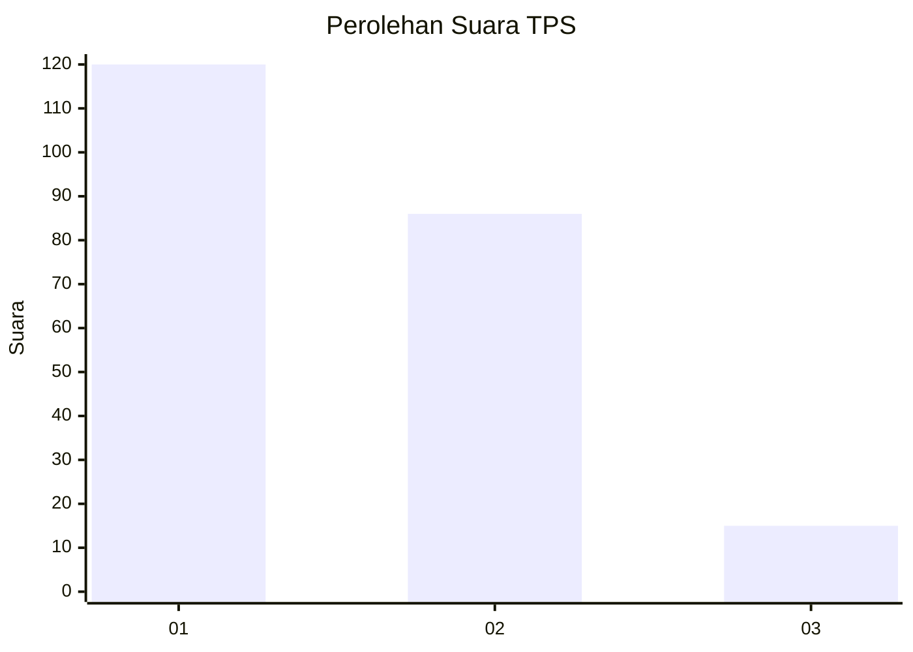
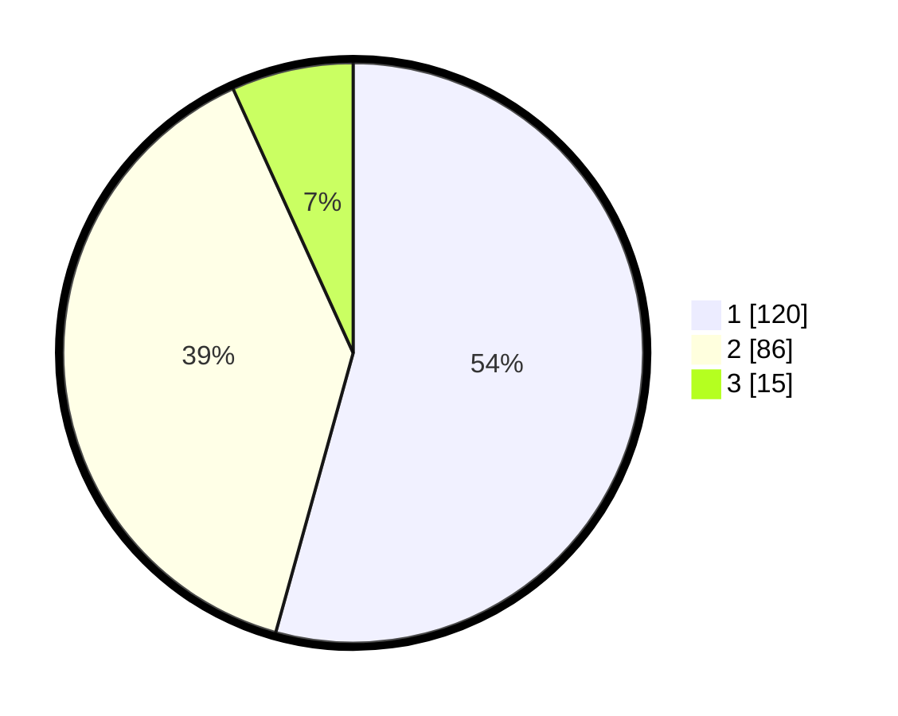

# Hasil

## Grafik

## Tabel

| No. | Nama Paslon    | Suara | Suara (raw) | Persentase |
|:--- |:-------------- | -----:| -----------:| ----------:|
| 1   | ANIES MUHAIMIN | 120   | [120][p-1]  | 54,30      |
| 2   | PRABOWO GIBRAN | 86    | [86][p-2]   | 38,91      |
| 3   | GANJAR MAHFUD  | 15    | [15][p-3]   | 6,79       |

[p-1]: https://github.com/gigit-pemilu/pemilu-2024/blob/main/pilpres/hitung-suara/sub/63-kalimantan-selatan/sub/08-hulu-sungai-utara/sub/04-amuntai-selatan/sub/2001-panyiuran/sub/001-tps/sub/paslon-1.txt
[p-2]: https://github.com/gigit-pemilu/pemilu-2024/blob/main/pilpres/hitung-suara/sub/63-kalimantan-selatan/sub/08-hulu-sungai-utara/sub/04-amuntai-selatan/sub/2001-panyiuran/sub/001-tps/sub/paslon-2.txt
[p-3]: https://github.com/gigit-pemilu/pemilu-2024/blob/main/pilpres/hitung-suara/sub/63-kalimantan-selatan/sub/08-hulu-sungai-utara/sub/04-amuntai-selatan/sub/2001-panyiuran/sub/001-tps/sub/paslon-3.txt

## Foto C Plano

https://sirekap-obj-formc.kpu.go.id/27da/pemilu/ppwp/63/08/04/20/01/6308042001001-20240216-164309--3b75af04-18b1-420e-8b66-385ebf8cf544.jpg

https://sirekap-obj-formc.kpu.go.id/27da/pemilu/ppwp/63/08/04/20/01/6308042001001-20240215-211734--e9e64091-4435-43d9-92ad-9887b8b0694b.jpg

https://sirekap-obj-formc.kpu.go.id/27da/pemilu/ppwp/63/08/04/20/01/6308042001001-20240215-211802--1b7c894f-389c-46a1-991f-9565c2637e8d.jpg

## Metadata

| Key        | Value               |
| ---------- | ------------------- |
| Time Stamp | 2024-02-19 06:16:00 |

