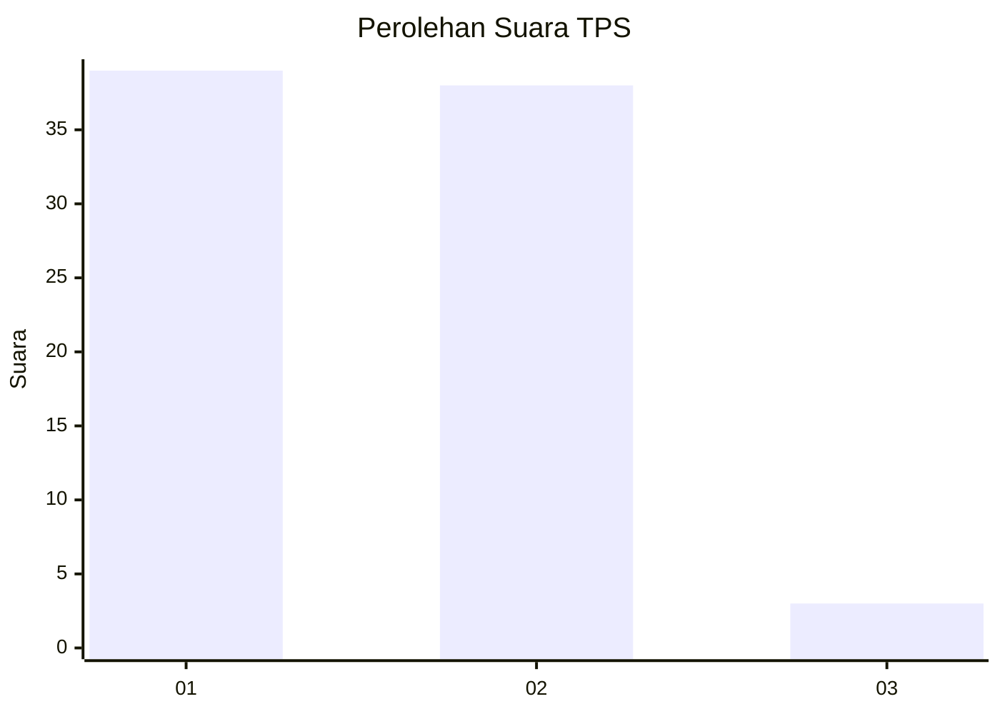
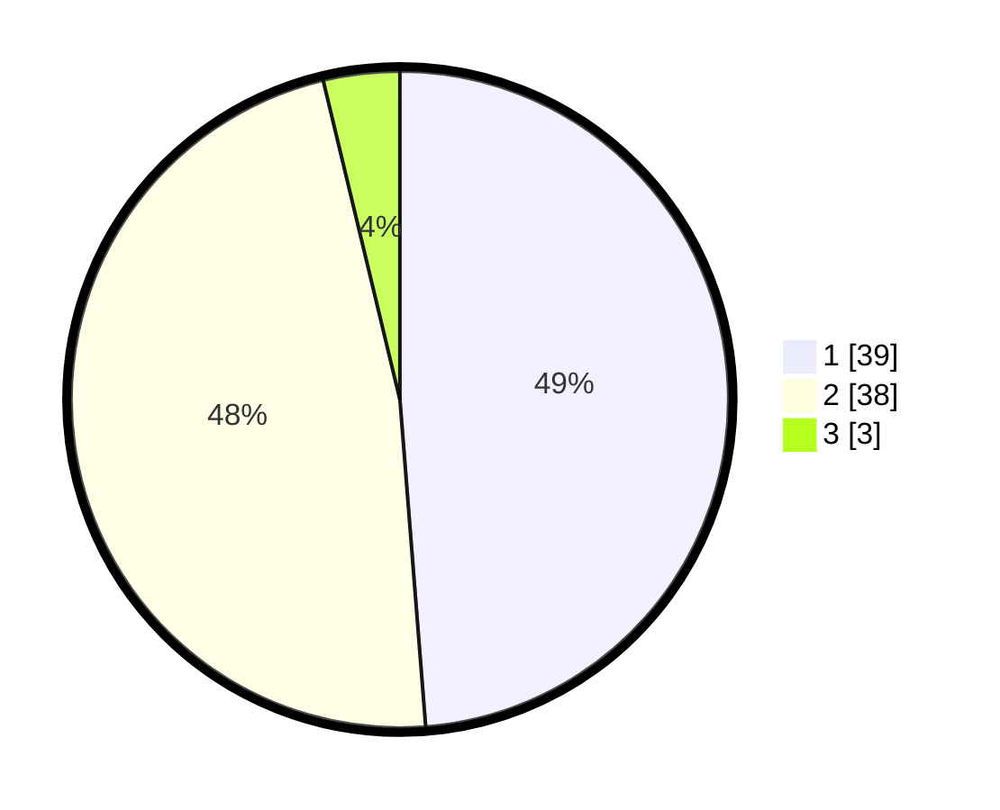

# Hasil

## Grafik

## Tabel

| No. | Nama Paslon    | Suara | Suara (raw) | Persentase |
|:--- |:-------------- | -----:| -----------:| ----------:|
| 1   | ANIES MUHAIMIN | 39    | [39][p-1]   | 48,75      |
| 2   | PRABOWO GIBRAN | 38    | [38][p-2]   | 47,50      |
| 3   | GANJAR MAHFUD  | 3     | [3][p-3]    | 3,75       |

[p-1]: https://github.com/gigit-pemilu/pemilu-2024-63-kalimantan-selatan/blob/main/pilpres/hitung-suara/sub/63-kalimantan-selatan/sub/08-hulu-sungai-utara/sub/05-amuntai-tengah/sub/1005-sungai-malang/sub/005-tps/sub/paslon-1.txt
[p-2]: https://github.com/gigit-pemilu/pemilu-2024-63-kalimantan-selatan/blob/main/pilpres/hitung-suara/sub/63-kalimantan-selatan/sub/08-hulu-sungai-utara/sub/05-amuntai-tengah/sub/1005-sungai-malang/sub/005-tps/sub/paslon-2.txt
[p-3]: https://github.com/gigit-pemilu/pemilu-2024-63-kalimantan-selatan/blob/main/pilpres/hitung-suara/sub/63-kalimantan-selatan/sub/08-hulu-sungai-utara/sub/05-amuntai-tengah/sub/1005-sungai-malang/sub/005-tps/sub/paslon-3.txt

## Foto C Plano

https://sirekap-obj-formc.kpu.go.id/9530/pemilu/ppwp/63/08/05/10/05/6308051005005-20240214-200247--d44dd1fa-a6db-40e5-a653-45fdd8502cc6.jpg

https://sirekap-obj-formc.kpu.go.id/9530/pemilu/ppwp/63/08/05/10/05/6308051005005-20240214-200348--f50c8ea7-703b-4412-8ead-fc27ac575392.jpg

https://sirekap-obj-formc.kpu.go.id/9530/pemilu/ppwp/63/08/05/10/05/6308051005005-20240214-200450--c48fad72-4e77-4141-bf28-fbb3071ce05c.jpg

## Metadata

| Key        | Value               |
| ---------- | ------------------- |
| Time Stamp | 2024-02-26 11:00:00 |

