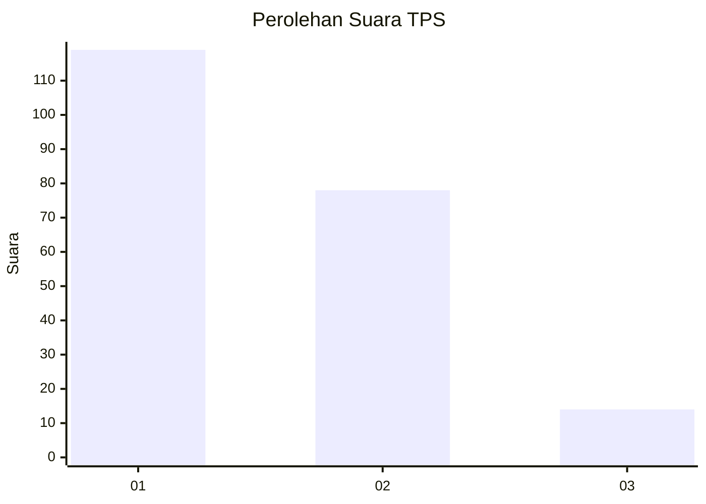
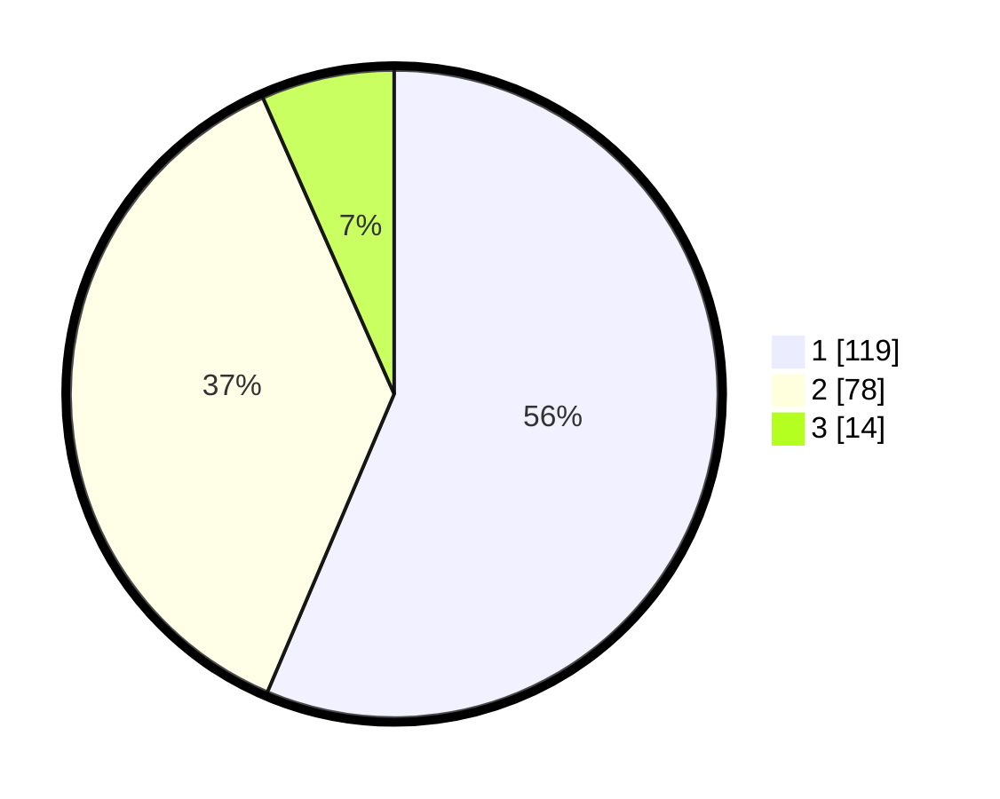

# Hasil

## Grafik

## Tabel

| No. | Nama Paslon    | Suara | Suara (raw) | Persentase |
|:--- |:-------------- | -----:| -----------:| ----------:|
| 1   | ANIES MUHAIMIN | 119   | [119][p-1]  | 56,40      |
| 2   | PRABOWO GIBRAN | 78    | [78][p-2]   | 36,97      |
| 3   | GANJAR MAHFUD  | 14    | [14][p-3]   | 6,64       |

[p-1]: https://github.com/gigit-pemilu/pemilu-2024/blob/main/pilpres/hitung-suara/sub/63-kalimantan-selatan/sub/08-hulu-sungai-utara/sub/06-amuntai-utara/sub/2004-pakacangan/sub/002-tps/sub/paslon-1.txt
[p-2]: https://github.com/gigit-pemilu/pemilu-2024/blob/main/pilpres/hitung-suara/sub/63-kalimantan-selatan/sub/08-hulu-sungai-utara/sub/06-amuntai-utara/sub/2004-pakacangan/sub/002-tps/sub/paslon-2.txt
[p-3]: https://github.com/gigit-pemilu/pemilu-2024/blob/main/pilpres/hitung-suara/sub/63-kalimantan-selatan/sub/08-hulu-sungai-utara/sub/06-amuntai-utara/sub/2004-pakacangan/sub/002-tps/sub/paslon-3.txt

## Foto C Plano

https://sirekap-obj-formc.kpu.go.id/e1bf/pemilu/ppwp/63/08/06/20/04/6308062004002-20240214-221338--d9b227f5-ceef-4c67-9aa7-9850416bbcfc.jpg

https://sirekap-obj-formc.kpu.go.id/e1bf/pemilu/ppwp/63/08/06/20/04/6308062004002-20240214-221635--e30b1ca8-bf36-4c5d-b165-2e1ce1caed6f.jpg

https://sirekap-obj-formc.kpu.go.id/e1bf/pemilu/ppwp/63/08/06/20/04/6308062004002-20240214-221814--3b76bf13-a805-4393-817d-95b5cc516c08.jpg

## Metadata

| Key        | Value               |
| ---------- | ------------------- |
| Time Stamp | 2024-02-15 15:30:25 |

