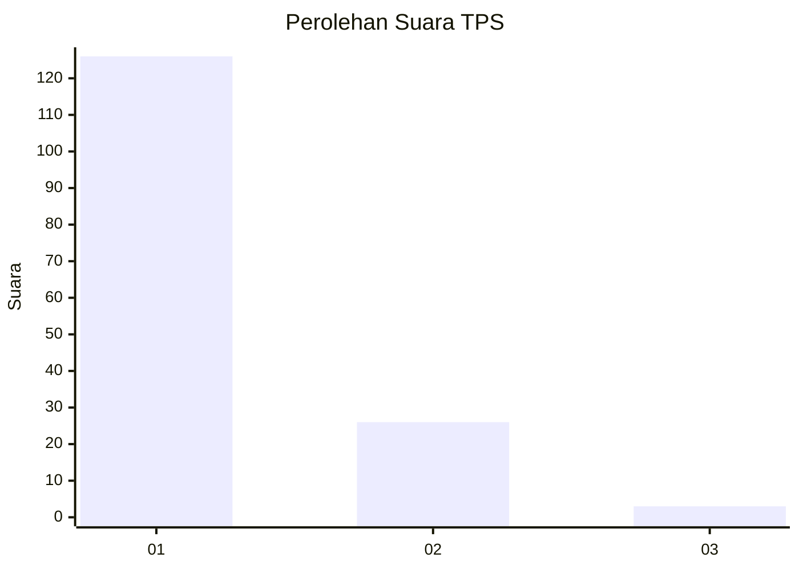
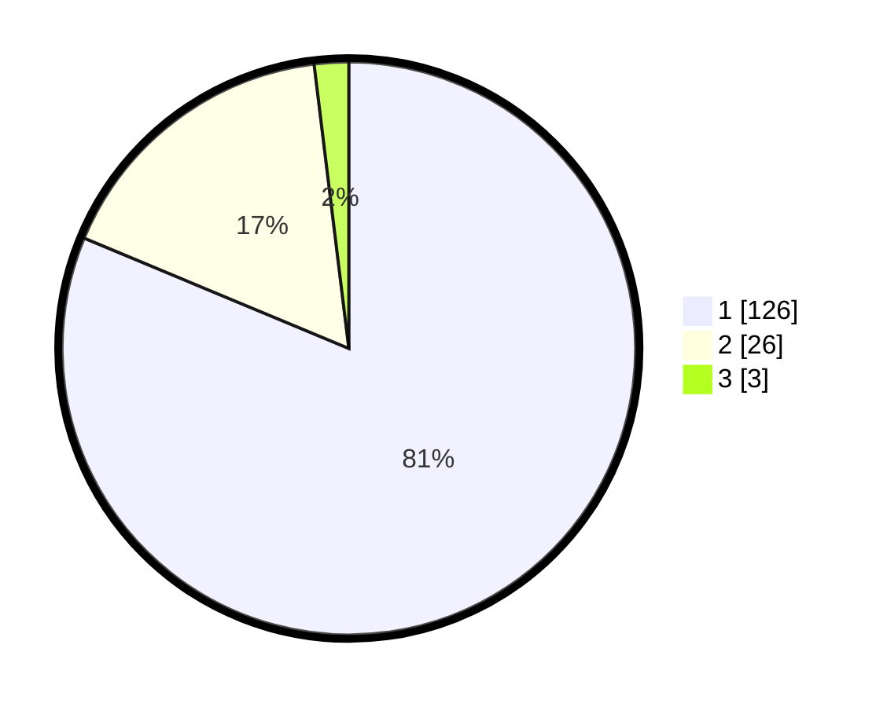

# Hasil

## Grafik

## Tabel

| No. | Nama Paslon    | Suara | Suara (raw) | Persentase |
|:--- |:-------------- | -----:| -----------:| ----------:|
| 1   | ANIES MUHAIMIN | 126   | [126][p-1]  | 81,29      |
| 2   | PRABOWO GIBRAN | 26    | [26][p-2]   | 16,77      |
| 3   | GANJAR MAHFUD  | 3     | [3][p-3]    | 1,94       |

[p-1]: https://github.com/gigit-pemilu/pemilu-2024-63-kalimantan-selatan/blob/main/pilpres/hitung-suara/sub/63-kalimantan-selatan/sub/08-hulu-sungai-utara/sub/06-amuntai-utara/sub/2029-panyaungan/sub/001-tps/sub/paslon-1.txt
[p-2]: https://github.com/gigit-pemilu/pemilu-2024-63-kalimantan-selatan/blob/main/pilpres/hitung-suara/sub/63-kalimantan-selatan/sub/08-hulu-sungai-utara/sub/06-amuntai-utara/sub/2029-panyaungan/sub/001-tps/sub/paslon-2.txt
[p-3]: https://github.com/gigit-pemilu/pemilu-2024-63-kalimantan-selatan/blob/main/pilpres/hitung-suara/sub/63-kalimantan-selatan/sub/08-hulu-sungai-utara/sub/06-amuntai-utara/sub/2029-panyaungan/sub/001-tps/sub/paslon-3.txt

## Foto C Plano

https://sirekap-obj-formc.kpu.go.id/ec96/pemilu/ppwp/63/08/06/20/29/6308062029001-20240215-034220--41dfd92d-2f41-4e40-af6c-7e756c5c86ca.jpg

https://sirekap-obj-formc.kpu.go.id/ec96/pemilu/ppwp/63/08/06/20/29/6308062029001-20240215-034243--2a743936-8d2c-478d-9504-852156a04cbe.jpg

https://sirekap-obj-formc.kpu.go.id/ec96/pemilu/ppwp/63/08/06/20/29/6308062029001-20240215-034249--3e032826-8b33-4ae8-8389-81e4b1236162.jpg

## Metadata

| Key        | Value               |
| ---------- | ------------------- |
| Time Stamp | 2024-02-24 22:31:28 |

