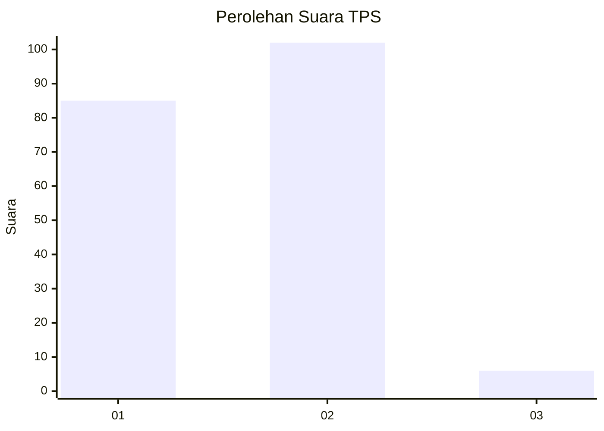
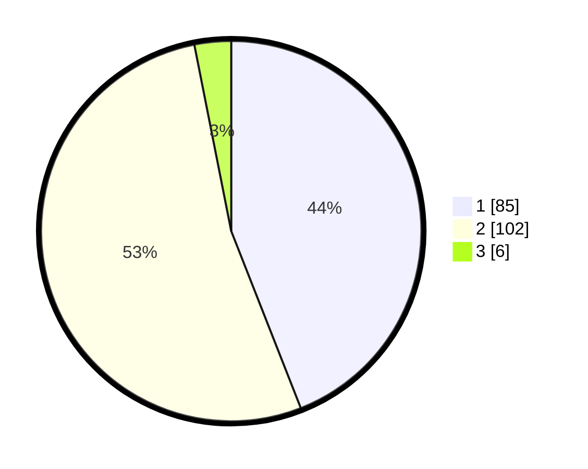

# Hasil

## Grafik

## Tabel

| No. | Nama Paslon    | Suara | Suara (raw) | Persentase |
|:--- |:-------------- | -----:| -----------:| ----------:|
| 1   | ANIES MUHAIMIN | 85    | [85][p-1]   | 44,04      |
| 2   | PRABOWO GIBRAN | 102   | [102][p-2]  | 52,85      |
| 3   | GANJAR MAHFUD  | 6     | [6][p-3]    | 3,11       |

[p-1]: https://github.com/gigit-pemilu/pemilu-2024/blob/main/pilpres/hitung-suara/sub/63-kalimantan-selatan/sub/08-hulu-sungai-utara/sub/08-haur-gading/sub/2001-palimbangan/sub/002-tps/sub/paslon-1.txt
[p-2]: https://github.com/gigit-pemilu/pemilu-2024/blob/main/pilpres/hitung-suara/sub/63-kalimantan-selatan/sub/08-hulu-sungai-utara/sub/08-haur-gading/sub/2001-palimbangan/sub/002-tps/sub/paslon-2.txt
[p-3]: https://github.com/gigit-pemilu/pemilu-2024/blob/main/pilpres/hitung-suara/sub/63-kalimantan-selatan/sub/08-hulu-sungai-utara/sub/08-haur-gading/sub/2001-palimbangan/sub/002-tps/sub/paslon-3.txt

## Foto C Plano

https://sirekap-obj-formc.kpu.go.id/1dbe/pemilu/ppwp/63/08/08/20/01/6308082001002-20240215-015029--285f71ae-fb9d-4937-8fe7-0baa15e499b4.jpg

https://sirekap-obj-formc.kpu.go.id/1dbe/pemilu/ppwp/63/08/08/20/01/6308082001002-20240215-014358--adff6430-2883-45a0-afab-95d6ed20d4f0.jpg

https://sirekap-obj-formc.kpu.go.id/1dbe/pemilu/ppwp/63/08/08/20/01/6308082001002-20240215-015107--f366add1-7328-4313-a03e-3128db94c600.jpg

## Metadata

| Key        | Value               |
| ---------- | ------------------- |
| Time Stamp | 2024-02-15 15:30:25 |

